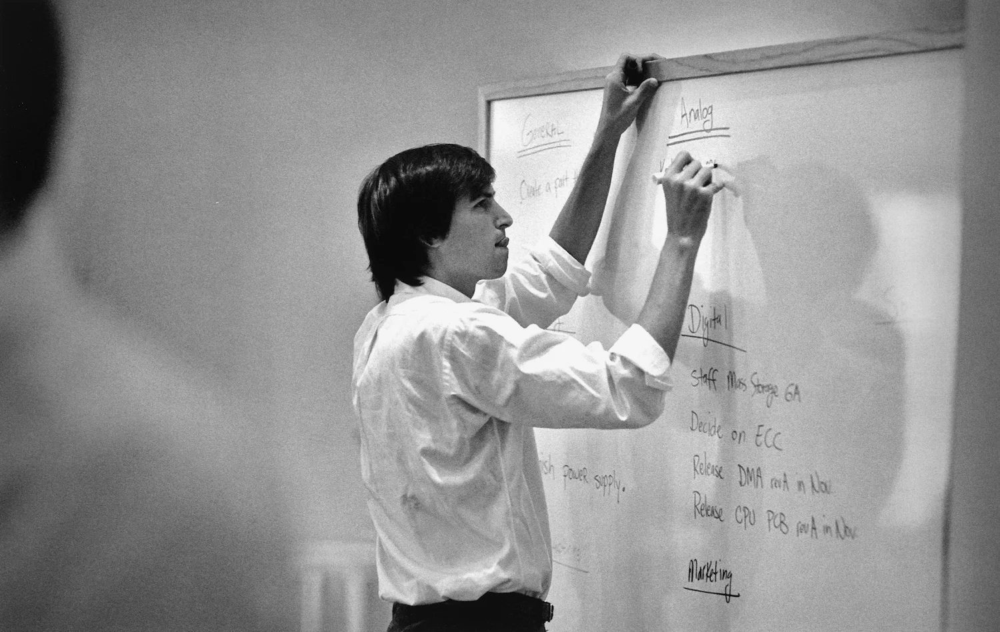
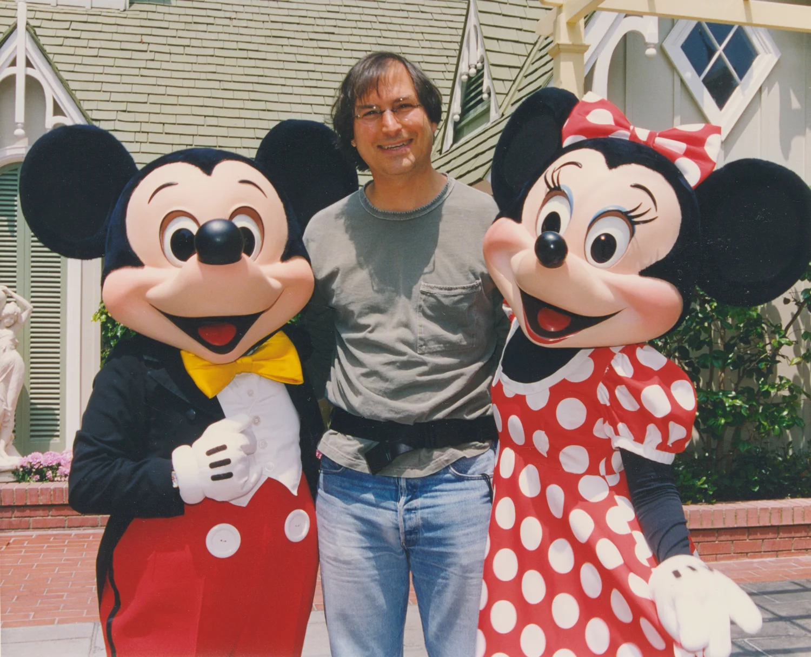

# 
Make Something Wonderful

人生不只有一条道路。人们会用与众不同的方式来表达他们对于其他人深厚的感恩，我相信其中的一种方式会是创造美好的事物，然后公之于众。
而你永远不会遇见这些人，不会和他们握手，不会聆听他们的故事或是和他们讲述你的故事。然而，通过创造一些倾注了大量心血的事物，你还是将有些东西转递出去了，这是种向其他同类表达深深感激的方法。所以我们要直面真实的自己，同时铭记哪些东西对我们来说真正重要的。

--Steve，2007

## 简介 Laurene Powell Jobs

由Leslie Berlin编辑

出于语言的准确性与隐私问题，内容有所编辑与删减。

✂ 表示部分原文句段被删减

---

## 简介 Laurene Powell Jobs

了解一个人的最佳途径就是直接听他说话，而了解Steve的最好方式就是回顾他这一生说过的和写过的话。他的话—各种演讲、采访，还有邮件—给了我们一个了解他思考方式的窗口。他是个敏锐的思考者。
书中很大一部分都反映了Steve生命的主导思想（guiding theme）：他通过融合科技与艺术让这个世界变得有意义起来；他那难以置信的、强加给自己的严谨；他对组建和引领伟大团队的执念。还有也许是最重要的，他对人生意义的洞察。
有一次Steve对一群学生说：“你们出现，有了点亮天空的机会，然后你们消失。”他讲了很多关于怎么用好我们飞逝的时间的方法，他被“成为人类进程的一部分”的观念不断推动着，被“他或者我们中的任何人可能会提升或者加快人类进程”的想法赋予活力。
能看清现状，拥有清晰的眼界，已经足够困难了，而Steve的天赋远高于此（greater still）：他能看清缺了什么、可能会有什么、一定会有什么。他的思维永远不会被现实所束缚，恰恰相反，他会想象现实少了什么，然后出发修正。他的点子并非论据，而是直觉，脱胎于真正由内而外的自由和宏大的可能性。
在字里行间，Steve起稿、完善。他犯错、成长、作出改变。但他总是一如既往保持着对可能性的感知，驱动Steve的认知：所有构成俗称“人生”的东西，都是由和我们差不多聪明能干的人造出来的；这个世界不是一成不变的—我们可以让它变得更好。我希望这些节选能让这种认知，在你心中掀起波澜。

Steve两岁的时候。他后来将计算机比喻为“思想的自行车”。

## 前言：Steve回忆他的同年和青年
Steve通常将他的个人生活视作隐私，但他时不时也会聊到在旧金山海岸长大的事。那是一段工程师和编程员开始涌进后来为人熟知的硅谷的时代。

*1995年，他口述了一段自己的历史给史密斯尼杂志社。*

我是很幸运的。我有个父亲，他叫Paul，一个很卓越的男人。他从未在高中毕业，他在二战中加入了海岸警卫队，在巴顿将军的部下摆渡军队到世界各地，我觉得他可能总是惹上麻烦，然后被降级成二等兵。他是个机械师，工作非常卖力，而且是那种自力更生的天才（kind of genius with his hands）。
他在车库里有一张工作台，在我五到六岁的时候，他在上面划了一小块地方跟我说：“Steve，这就是你的工作台了。”他给了我一些他的小工具，向我展示怎么用锤子、怎么锯、怎么造东西。那对我来说真的太棒了。他花了很多时间陪我，教我怎么做东西、怎么拆开它们和装回去。
有一门他涉及的东西是电路。他本身对电路并没有太多的了解，但他在和车子还有其他要修的东西打交道的时候，总会遇到电路。他向我展示了一些电路的基本知识，（于是）我对此变得非常有兴趣。
我在硅谷长大。我5岁那年，爸妈从旧金山搬到了山景。我爸被调走了，正好调到硅谷的正中心，所以那里附近都是工程师。那会硅谷周围还大多是果园--杏果园和李果园--真的天堂一般。我记得几乎每天的空气都格外的清，你能从山谷的一边看到另一边。那真的是世界上最美好的成长地了。
然后，有个男人和他的老婆新搬来了这条街，大概就在同一块隔了六七间房子。结果他原来是个惠普（Hewlett-Packard）的工程师、是个业余无线电爱好者而且非常懂电路。他为了认识同一块街区的孩子，用了一个奇怪的东西：他在路边放了一个碳粒式麦克风、一个电池和喇叭，你可以对着麦克风说话，然后你的声音就会通过喇叭放大。刚搬来这么做蛮奇怪的，但他就是这么做的。✂
（于是）我认识了这个叫Larry Lang的男人，他教了我很多关于电路的知识。他很棒，他以前会组装希斯套件（Heathkits）的。希斯套件真的很棒，那是你能以套件形式买到的产品，其实你买它花的钱要比买成品更贵，前提是你能买到（现成的）。希斯套件会附带详细的说明书，教你如何把东西组装在一起，所有东西会以某种方式摆好、用颜色标记好，你要自己组装这东西。
我会说，这（套件）给一个人带来了几大好处。它能让人了解成品里长什么样、工作原理是什么，因为这当中包含了一些运作原理。但或许更重要的是，它让人感觉，自己能造出在周边世界见到的东西，于是这些东西变得不再神秘。我的意思是，你在看电视，然后你会想“我还没造过一个这东西--但是我可以。希斯套件的产品目录里有这个，而我已经拼过两套了，所以我也能拼电视机。”。然后，这一切都是人工发明的，而非某人的周围突然出现这些有魔法的、他对内部一无所知的东西，这样的事实就变得明晰起来了。这给予了一种高度的自信：通过探索和学习，一个人可以理解他身边一些看上去非常复杂的东西。很幸运，我的童年就是这样的。
刚开始，上学对我来说还是蛮困难的。我的母亲在我上学之前就教我怎么读书，所以我上学之后真的只想做两件事：我想读书，因为我爱读书，还有我想去外面追蝴蝶，你懂的，做一些5岁小孩喜欢做的事情。我遇到了以前没遇到过的另一种权威，而我不喜欢这样。他们几乎真的打倒我了，只差那么一点点就打消了我的所有好奇心。
到我三年级的时候，我遇到了一位好伙伴：Rick Ferrentino，我们唯一找乐子的方式就是恶作剧。我记得学校里有一个大自行车架，大家都把自己的自行车放上去，大概有一百辆自行车--我们一次一个用我们的密码换掉别人的密码。然后有一天，我们把所有人的锁都放到了别人的车上，他们那天晚上弄到了10点，才把所有的自行车都整理出来。我们让老师们都气炸了，也好多次被学校开除。
四年级的时候，我遇到了生命中的另一位圣人。他们准备把我和Rick Ferrentino放到四年级同一个班，而校长在最后时刻说了一句：“不行，坏主意，分开他们。”于是这位Hill老师说：“我会带他们其中一个。”她教的是四年级高级班，感谢上帝，我就是那个随机被安排进班里的。他观察了我大概两周，然后过来和我说：“Steven，这么说吧，我和你做笔交易。我有个数学作业本，如果你把它带回家，不靠任何帮助自己完成，你把它带回来给我，你能做对80%，我会给你5块和一个大家伙。”她（已经）买了，然后她举到我面前--一个巨大的东西。
我看着她，“你疯了吗，女士？之前还没人这么做过！”当然我也做到了，她基本上是用糖果和金钱把我贿赂回去学习。而真正了不起的是，不久之后我就对她如此尊重，以至于那重燃了我对学习的欲望。她给了我一套制作相机的套件，我自己打磨镜头做了一台相机，那真的很棒，我想我那年学术上学到的比我一生中学到的都多。

*1984年，Steve和记者David Sheff聊了一下，作为年轻人，他和他这一代的其他人是如何开始发展自己的文化观的。*

我父母从来没有催促过我上大学，但他们总是想确保如果我想上大学，他们有资源做到。所以他们存了钱，他们真真切切牺牲了一些事，存了钱供我去里德学院（Reed College），但是...六个月后，就是，就是花掉毕生积蓄让我读完大学似乎真的很荒谬。
我对自己想做什么还不够了解。除此之外，我想到我退学之后可以再复学上课，学到同样多的东西。所以六个月后我就退学了，然后又复学了一年多一点。
我在那里呆了大约一年半，也许快两年。我非常享受。那是我人生中的一段艰难时期，但我很享受。我不知道我这一生想要做什么。里德是一个非常热情的地方，这里的人非常聪明——每个人都想改变世界，但不知道怎么实现。 ✂
七十年代初是东方神秘主义涌入美国海岸的时期。 我们有源源不断的人流穿过里德，并在里德停留。 从 Timothy Leary、Richard Alpert 到 Gary Snyder，每个人都喜欢这样。 于是，关于生命和存在的真相的学术质疑不断涌现。 ✂
我们始终背负着六十年代的理想主义。我认识的大多数同龄人已经将这种理想主义深埋心中。他们内心有这种理想主义，但他们也对自己45岁时在天然食品店柜台后面工作保留一定的谨慎态度，也就是他们看到的一些年长朋友（在做的）—— 本身并不是坏事，但如果这不是你真正打算做的事或你真正想做的事，那就不好了。
因此，理想主义形成了，但也有一种感觉，即必须有一种更成功的方式来实现某些理想主义。

*史蒂夫还回忆了离开里德学院后在加利福尼亚和印度的时光。*

因为决定想要去旅行，我回到了（旧金山湾区），但我缺乏必要的资金。
这里是加州，你可以买到斯坦福大学新鲜制作的LSD。晚上你可以和你的女朋友还有任何有意义的人一起去海滩睡一觉。你可以……直到我去了那些地方，我才真正意识到加利福尼亚州与美国中部，甚至在某种程度上，东海岸，有多么不同。直到二十岁出头我才去过这些地方。加州有一种实验性的感觉，还有一种开放的感觉——开放和新的可能性——直到我去了其他地方我才真正意识到这一点。
所以我回来找工作，我在报纸上看到了一则广告，[...]说是成为一名工程师的同时能享受乐趣。听起来很有趣，所以我打了电话。那是（视频游戏制造商）Atari。我填了一份申请表，列出了我做过的所有事情，人事部的女士说：“别打电话给我们，我们会打电话给你！”后来我的运气让我的简历送到了Al Alcorn手上，他当时是 Atari 的工程副总裁。第二天他打电话给我雇用了我，这很棒。 [...]我在那里呆了不到一年，他们在欧洲发售了几款存在技术问题的游戏。我想到了如何修好问题的办法，但需要有人去那里修。
于是我自告奋勇了；他们问我愿不愿意去，我说我当然愿意，但我想在在那里的时候请一会假。他们同意了，我最终到达了瑞士，并从苏黎世飞往新德里。我在印度呆了一段时间。我迷迷糊糊地，算是总结了一下（我的印度之旅）。任何人很难在一页纸上总结他们生活中有意义的经历。我的意思是，如果我是 `William Faulkner`，我也许能为你做到这一点，可惜我不是。
回来时受到的文化冲击比过去时要更加猛烈。（回到加利福尼亚后）我只想找一片草地坐着。我不想开车、我不想去旧金山，或者做所有这些事情，我就是不想。所以大约三个月我都没有这么做。我只是看书和坐着。当你对一个地方很陌生时，你会注意到一些事情，而当你变得熟悉时，你很快就会不再注意到这些事情。美国在我生平第一次变得这么陌生，而我看到了以前从未见过的东西。所以在那三个月里，我试着去关注他们，因为我知道渐渐地，一点一点地，我又会对这里越来越熟悉。

Steve的护照，1973年春，彼时他18岁。

他1974年写给朋友的一封信：“别浪费生命”

---

## 第一部分，1976-1985
*“很多人将大量的爱倾注进了这些产品。”*

---

1976 年，当 Steve 和他的朋友 Steve Wozniak （Woz）开始在乔布斯的家庭车库里组装后来被称为 Apple I 的产品，“计算机”这个词让人想起由专业程序员照管的笨重机器。 一家公司 —— IBM —— 主导了这个行业。但 Steve 和 Woz 是新一代创意思想家、工程师和爱好者中的一员，他们试图构建他们可以自己编程的小型廉价的机器。
苹果公司成立时，Steve 21岁，早熟但缺乏经验且没有礼貌。在苹果公司的第一次董事会会议上，他赤着双脚搭在会议室的桌子上，很快就遭到了董事会主席的斥责。公司伴随 Apple II 的面世迎来突破：这是一款开箱即用的机器，带有磁带存储和内置彩色屏幕。一年之内，苹果公司就成为美国发展最快的公司之一，而当 Steve 年满 30 岁时，他已成为一家财富 500 强公司的门面形象。
在苹果内部，他的想法和热情鼓舞人心，但 Steve 的管理风格却存在争议。他的职责几乎每年都会发生变化，因为他被分配到不同的项目和团队或从中调离。他开始与他亲自挑选的首席执行官， John Sculley ，发生冲突。1985 年 9 月，苹果董事会解雇了 Steve 。
后来，当 Steve 谈到在苹果公司的第一年时，他专注于一件事：Macintosh，这是他和一个团结的团队于 1984 年向世界推出的计算机。对 Steve 来说，Macintosh 就是技术应有的样子。它精简而实用，简单而复杂，是一种提高创造力和生产力的工具。
Steve 相信，在另一个时代，Macintosh 团队的成员可能是作家、音乐家或艺术家。 “人们的感受投入的热情与诗人或画家的完全没有区别。”他说。他称他们的工作是一种爱的形式，他们的产品是“给（除了专家以外）剩下的人用的计算机”，配有鼠标和箭头键，桌面图标而不是编程命令，并且在启动时显示的，取代闪烁的光标的是：一个微笑。
Macintosh 还是 Steve 第一次领导团队开发他认为改变了世界的产品的见证。 “它引发了一场革命，” 二十三年后，当另一项改变世界的创新产品 iPhone 推出时，Steve 回忆道。“我记得在推出 Mac 的前一周，我们聚在一起说，‘每台电脑都是这样运转的，无可反驳。你可以反驳（电脑都变成这样）需要多长时间，但你无法反驳这个事实。”

---

### Steve 讲到创造苹果
*1984年，Steve 回忆苹果背后的友谊*
我十三岁的时候在朋友的车库里认识了 Woz ,我想他大约十八岁。[...]他搬到了我一个名叫 Bill Fernandez 的朋友家那条街，我就在 Bill 家。一天晚上，我们正在做一个项目到很晚，沃兹刚好路过。我们最后聊了几个小时，我对他印象深刻，我认为他很棒，他很有幽默感[...]而且我们（对电子产品）都很有兴趣，这将我们联系在一起，尽管我们在其他方面都完全不同。✂
我们有点像各自轨道上的两颗行星，时不时相互交叉。只要我们都还活着，我们就彼此相连。

*1996 年，也就是苹果公司庆祝成立 20 周年之际，史蒂夫回忆少年时期造电脑的爱好如何转变为一门事业。*

我们（ Woz 和我）造一台电脑的原因是我们想要一台，但我们买不起。当时的电脑要几千美元，而我们只是两个年轻人。我们开始尝试造，并在硅谷周围尽可能地找零件。经过几次尝试，我们终于组装出了 Apple I 。我们所有的朋友也都想要，他们也想要组装 Apple I 。可事实证明，手工组装一台大约需要五十个小时，那占了我们所有的业余时间，因为大家不太擅长组装，所以沃兹和我帮他们组装。
我们认为，如果我们能制造所谓的印刷电路板，你只需插零件，而不用整个东西都用手工焊接，我们就可以将组装时间从大约五十小时缩短到大约一个小时。沃兹卖掉了他的惠普计算器，我卖掉了我的大众微型巴士，我们凑到了足够的钱付给别人帮我们设计一块印刷电路板。我们的目标是将原始的印刷电路板卖给我们的朋友，赚够钱来赎回我们的计算器和交通费用。
然后就是，一家当时位于 Mountain View（山景城）的早期的计算机（商店），事实上是世界上第一家计算机商店，说：“好吧，我要买五十台这样的计算机，但我想要完全组装好的。” 这是我们从未想到过的转折。
我们买了组装一百台计算机的零件，装了 50 台然后交付，得到了现金报酬，然后跑回去付钱给卖给我们零件的人。然后我们就遇到了经典的马克思经济危机，即我们的利润不是流动的，而是放在地上的 50 台计算机中。
我们觉得有必要开始学习销售和分销了，这样我们才可以卖掉这50台电脑，收回我们的钱。我们就是这样进入这个行业的。我们把我们的想法（计算机）带到了几家公司，其中一家是沃兹工作过的公司（HP），另一家是我当时工作过的公司（雅达利）。两家公司都没有兴趣追求这一目标，所以我们创办了自己的公司。

---

1976年在苹果工作

Steve 放在办公室的一个手提箱

里面是一套 Apple I

苹果的第一封粉丝来信，一张电脑屏幕的拍立得

1977年，Steve 在展示 Apple II 的原型机

### New Yorker 的采访
“这是一台听话的（domesticated）电脑。”

*Steve 首次在全国性刊物上亮相是在1977年的一期 The New Yorker 杂志上。杂志派了一位记者到在纽约大剧场举办的首届年度个人电脑展览会。当时的大多数人都没见过个人电脑。*

在一个写着“Apple Computer, Inc.（苹果电脑公司）”的摊位，我们停下来和这位负责的年轻人聊了一下，他介绍自己是公司的副总裁 Steven Jobs。Jobs 先生对展览的人流量感到很满意。 “多希望我还没长大的时候，我们已经拥有这些私人机器，”他说。“在过去的十年里，人们通过媒体听到了关于计算机的各种事情。据说，计算机已经控制了他们生活的各个方面。然而即便如此，大多数成年人并不知道计算机到底是什么，也不知道它能做和不能做什么。
“现在，人们第一次可以真正用一台好音响的价钱买一台电脑，和它交互，并了解关于它的一切。这就像拆开一台1955年的雪佛兰汽车，或者相机。全国有数千人在上摄影课程，可他们永远不会成为专业摄影师，他们只是想了解摄影的过程是咋样的，电脑也是一样的道理。
“1976年，我们在 Los Altos （洛斯阿尔托斯）的一个车库里创办了一家小型个人电脑公司。现在我们是世界上最大的个人电脑公司。我们生产我们眼中的个人电脑中的劳斯莱斯。这是一台听话的计算机，人们以为会看到闪烁的灯光，但大家发现它看起来就像一台连到合适的屏幕能够彩色显示的便携式打字机。
“它向人们产生反馈，而用户也很狂热。我们总是被问到它能做什么，它可以做很多事情，但在我看来，它现在真正做的事情是教人们如何对计算机进行编程。”
想起 Jobs 先生希望自己在成长过程中拥有这样的机器，我们问他是否介意告诉我们他的年龄。
“二十二”，Jobs 先生说。

---

1977年苹果两次超出总部的规模。

1981年和 Apple II 合照，同年 IBM 推出了他们的个人电脑。

Steve 是个狂热的摄影爱好者。

为了激发设计灵感，他把自己的摩托车放在苹果的门厅。

### 在Aspen（亚斯本）国际设计大会上的演讲
“电脑和社会在进行第一次约会。”

1983年6月15日，苹果发布 Lisa 电脑5个月以后，Steve 在 Aspen，Colorade（科罗拉多州，亚斯本）和设计师们的年度聚会上发言。
你们中有多少人超过三十六岁？ 你们出生在计算机发明之前，计算机已经有三十六年历史了。我认为当我们回顾过去时，历史的时间轴上将会有一小部分，一个非常有意义的部分。你们中的很多人都是电视一代的产物，我几乎就是电视一代的产物，但在某种程度上开始成为计算机一代的产物。
但现在长大的孩子们绝对会是计算机一代的产物，在他们的一生里，计算机将成为主要的交流媒介，就像电视取代广播，甚至是书籍一样。
你们中有多少人拥有苹果电脑？有人吗？或者其它任何个人电脑？
呃哦。
你们中有多少人使用过、或见过过、或类似的东西？好的。✂
电脑真的很蠢。它们非常简单，但速度非常快。我们为这些小型微处理器--甚至这些巨型 Cray-1 超级计算机--所必须提供的原始指令，是最琐碎的指令。他们在那里接收些数据，从这里接收一个数字，将两个数字加在一起，然后测试它是否大于零。这是你能想象到的最平凡的事情。
但关键是：假如我的移动速度比这里所有人都快一百倍。一眨眼的功夫，我就可以跑到那里，抓起一束春天的鲜花，然后跑回这里，打响指。你们都会认为我是魔术师。但我基本上做的都是一系列非常简单的指令：跑出去，抓一些花，跑回来，打响指。但我可以做的如此之快，以至于你会认为魔术显灵了。
电脑也一样。它每秒可以执行大约一百万条指令。因此，我们倾向于认为发生了一些神奇的事情，事实上，这只是一系列简单的指令。✂
我来这里的一个原因是：我需要你的帮助。 如果你见过电脑，它们看起来就像垃圾。所有伟大的产品设计师都在设计汽车或建筑，但他们中几乎没有人在设计电脑。想象一下，今年我们将售出 300 万台电脑，86 年将售出 1000 万台，无论它们看起来像一坨屎还是看起来很棒，不管它看起来是什么样子，都会被人们吹嘘，而且不需要花费更多的钱就能让它们看起来很棒。它们会走进每个人的办公场所、学习场所还有家里。我们有机会能在那里放一个伟大的东西--（反之）如果我们不这样做，我们就会为那些地方再增加一个垃圾。
到 86、87 年的样子，人们和这些机器互动的时间就会比现在与汽车互动的时间还要多。人们每天将花费两到三个小时和这些机器互动，比他们在车里的时间还要久。因此，工业设计、软件设计以及人们与这些事物的交互方式就必须像我们今天对汽车的考量一样--多少也得多一点。
只要你环顾四周，就会发现大多数汽车并不是在美国设计的。电视？音频产品？手表、相机、自行车、计算器，只要是你能想到的：我们生活中的大多数物品都不是在美国设计的，我们已经搞砸了。从工业角度来看，我们已经搞砸了，因为我们已经把市场输给了外国竞争对手，设计上我们也搞砸了。
我认为，我们有机会通过这种八十年代面世的新的电脑技术--电脑和全社会在八十年代第一次约会。我们有机会让电脑变好看，我们有机会通过物体本身的设计来传达一些东西。✂
当我还在上学的时候，我认识几位很棒的老师和很多平庸的老师。让我免于牢狱之灾的可能就是书籍。我能独立阅读亚里士多德或柏拉图的著作。书是一件了不起的事情，它从源头直接到达目的地，中间没有任何中间环节。
问题是，你不能直接问亚里士多德问题。但是我觉得，我们往后看五十到一百年的样子，如果我们真的可以造出这些机器来捕捉潜在的精神，或者一组潜在的规则，或者一种看待世界的潜在方式，那么，当下一个亚里士多德出现时，也许他或她的一生都会随身带着一台电脑，然后输入东西。也许有一天，在这个人死后，我们就可以问这台机器，“嘿，亚里士多德会说什么？那这个呢？”也许我们不会得到正确的答案，又或许我们会。这对我来说真的很令人兴奋。这就是我做我正在做的事情的原因之一。
然后，你们想谈谈什么？

*Steve 在会议的两个环节回答问题*

这些计算机如何协同工作？他们应该是像人们一样协作的，有时他们协作得很好，有时又协作得不怎么样。✂
现在的状况是，有几个装置，人们将它们连接在一起。其中最引人注目的一个装置在 Xerox Palo Alto 研究中心，简称 PARC 。他们将大约百来台计算机连接到所谓的局域网上，也就是一条来回传输信息的电缆。[…]
然后有趣的事情来了：有二十个人对排球感兴趣，于是就有了排球分发列表，然后当下周的排球比赛发生变化时，你会写一份快速备忘录，然后发到排球分发列表，然后是中餐烹饪清单。不久之后，存在的名单就比人还多了。
然后就会产生非常非常有趣的现象：因为我认为当我们开始将这些东西（计算机）连在一起时，这就是会发生的事情：它们将促进沟通，并促进拥有的特殊兴趣人们聚集在一起。
我们大约还要五年时间，才能真正解决将这些办公室里的电脑连在一起的问题。我们大约还要十到十五年的时间才能解决将它们在家里连接在一起的问题。很多人都在努力解决这个问题，但这是一个非常棘手的问题。
现在，苹果的策略非常简单。我们想做的，是将一台非常出色的计算机融入一本你随身携带的书里，只要二十分钟你就能学会怎么用它。这就是我们想做的，我们希望在这十年内做到这一点。我们非常想通过自带的无线电链路来实现这一点，这样你就不用连任何东西 -- 你可以和所有这些更大的数据库和其他计算机进行通信。我们现在不知道该怎么做，从技术上来说（现在）不可能实现的。✂
我们在试着摆脱编程（命令行），我们也必须摆脱编程，因为人们不想给电脑编程，人们只是想用电脑。✂
我们（苹果公司）认为，出于某种疯狂的原因，我们在正确的时间、正确的地方作出了一些贡献。我的意思是，我们中的大多数人没有制造我们穿的衣服，我们没有烹饪或种植我们吃的食物，我们说的是别人开发的语言，我们使用的是别人开发的数学，我们在不断地索取。
在人类经验的长河中做出贡献的能力是非常巧妙的。我认为你们每个人都知道，在未来十年我们都有机会真正做到这一点，然后我们（会）回顾过去--我们这样做也很有趣--我们会回顾过去然后说，“天哪，我们也是其中的一部分！”✂
我们都始于虚无。因此，无论什么时候白手起家，你总是可以力争最好，你没有什么可以失去的。然后的事情就是--当你得到一些东西时，很容易进入“安分守己”模式，变得保守，然后投票给 Ronnie ( Ronald Reagan，罗纳德·里根，被认为是美国最杰出的保守派人物之一)。因此，我们要做的就是让那个美妙的时代成真，这段我们正身处的、没有进入那种保守状态的时代。✂
我没法告诉为什么你现在需要一台家用电脑，人们问我：“我为什么要在家里买一台电脑？”
我就会说：“嗯...为了学习一下，为了跑一些有趣的模拟。如果你有孩子，他们应该用它来学习识字。他们值得一些好的教育软件，尤其当他们还这么年轻。
“你可以和这些资源接轨，然后做任何你想做的事情，比如认识女生？我不确定。可除此之外，现在还没有充分的理由在你家买一台。但会有的，会有的。” ✂
我不觉得钱是苹果员工的驱动力。我不认为（驱动力）是钱，而是你觉得自己拥有公司的一部分，而这就是他丫的你的公司，如果你看到什么...我们总是和大家说，“你首先为苹果工作，然后才是为你的老板。”我们对此都感受颇深。✂
当有一百万人使用某个东西的时候，创造力就真正开始以大规模快速出现。[…]我们需要像 Lisa （计算机）这样的革命，但我们也需要推出数百万台设备，好推动世界进步--因为我们发现世界非常好进步。

### 讲到 Macintosh
*当 Steve 与记者 David Sheff 反思 Macintosh 的重要性时，Macintosh 问世还不到一年，但显然已经做好了要颠覆个人电脑行业的准备。*
我喜欢的一件事是用 Macintosh，你可以写 Times Roman 或者 Helvetica 格式的备忘录，或者如果你想给派对增添一点乐子，或者说排球公告，你可以用古英语写。或者你可以使用非常严肃的字体来表达非常严肃的事情，你还可以表达自己。
这有点像 1844 ，电报被发明那年，那是通信领域的一个惊人突破。事实上，你可以在某个下午在纽约往旧金山发消息。有些人谈到在美国的每张桌子上都放一台电报机以提高生产力。
但这是行不通的。它行不通的原因是你必须学习这一系列奇怪的咒语--这里说的是摩斯电码，还有点和破折号--才能收发电报。学习使用摩斯电码要花大约四十个小时。大多数人永远不会学怎么用摩斯电码。
幸运的是，在 1870 年代，Alexander Graham Bell 申请了电话专利--这是通信领域的又一重大突破，其功能基本相同，但人们已经知道如何使用它。它最巧妙的地方在于，除了让你可以用文字交流之外，它还可以让你唱歌，它让你能够表达简单语言以外的其它信息（话里有话）。
如今我们又碰到同样的情况了。有人说我们需要在美国的每张桌子上都配备一台 IBM PC 以提高生产力，可这是行不通的，这次你必须学习的特殊咒语是 "/qz" 之类的。 大多数人不会学习 "/qz" ，就像他们不会学习摩尔斯电码一样。
这就是 Macintosh 的意义所在：这是我们行业的第一部“电话”。但对我来说最巧妙的是，就像电话到电报一样，麦金塔让你可以唱歌：它允许您使用特殊字体、它可以让您制作绘图和图片、或者将其他人的画或图片合并到您的文档里。
即使在商界，你也能看到五页的备忘录被压缩成一页，因为会有一张图片来表述关键概念，于是，到处乱飞的纸张越来越少，沟通质量也越来越高。
而且更有趣的是，人们总是有这样一种误解，认为有的人在家里很灵光、有趣，上班的时候突然变得非常沉闷、无聊和严肃，但这其实不存在的。因此，如果我们能够再次将博雅精神注入到这个非常严肃的商业领域，我认为这将是一个有价值的贡献。

---

1983年，苹果在夏威夷的销售报告会。

在纽约 IBM 办公楼外

---

### 对 Apple 员工的演讲
“ George Orwell 关于1984的描述会成真吗？”

*1983年10月，Steve 在苹果的销售会上发布 Macintosh 电脑和它那标志性的广告，这个广告随后在1984年的超级碗比赛上播出。*

大家好，我是 Steve Jobs 。
1958 年，IBM 放弃了收购一家年轻的、羽翼未丰的公司的机会，这家公司发明了一种叫静电复印的新技术。两年后，Xerox（施乐）诞生。从那时起，IBM 就一直在自责。
十年后，六十年代末。DEC 公司还有其他公司发明了小型电脑。IBM 认为小型电脑太小，无法进行严肃计算工作，因此对他们的业务来说并不重要。在 IBM 最终进入小型电脑市场之前，DEC 已成长为一家价值数亿美元的公司。
十年后的七十年代末。1977 年，苹果公司，一家位于西海岸的新兴公司，发明了 Apple II，我们今天所知的第一台个人电脑。IBM 认为个人计算机太小，无法进行严肃的计算，对他们的业务也不重要。
八十年代初，1981年，Apple II 已成为世界上最受欢迎的电脑，苹果已经成长为一家价值 3 亿美元的公司，成为美国商业史上增长最快的公司，有超过 50 家竞争对手争夺份额。IBM 于 81 年 11 月推出 IBM PC 进入个人电脑市场。
1983 年，Apple 和 IBM 成为业界最强大的竞争者，1983 年各自销售了价值约 10 亿美元的个人电脑。1984 年，两家公司将分别投资超过 5000 万美元用于研发，另外投资 5000 万美元用于电视广告，总计约 10 亿美元的四分之一。
洗牌正在如火如荼地进行，一家大公司破产，其他公司也濒临破产。1983 年的行业总损失甚至超过了 Apple 和 IBM 的个人电脑利润总和。
现在是 1984 年，IBM 似乎想全拿走，苹果被认为是与 IBM 竞争的唯一希望。最初张开双臂欢迎 IBM 的经销商，现在在担心由 IBM 主导和控制的未来，越来越多人绝望地回归苹果，将其视为能够确保他们未来自由的唯一力量。
IBM 想要全拿走，并将枪口瞄准了他们控制行业的最后一个障碍：苹果。蓝色巨人会主宰整个计算机行业吗？ [观众：不！] 整个信息时代？ [观众：不！]  George Orwell 关于 1984 年的描述会成真吗？
*[ Steve 开始播放“1984”广告。 该广告由 Ridley Scott（《异形》之父）执导，描绘了一个反乌托邦的奥威尔世界。在一个场景中，人们穿着灰色衣服，剃着光头，面无表情地坐在大屏幕前，独裁者在屏幕上胡言乱语。一名身穿鲜红色运动短裤和麦金塔衬衫的女士冲进房间，向屏幕扔出锤子，将其摧毁。广告以这样的承诺结尾：“1 月 24 日，苹果电脑将推出 Macintosh。然后你会明白为什么 1984 年不会变成 ‘1984’。” ]*
[观众席响起热烈的掌声和叫喊声；声音平息，Steve 继续。] 这个广告将在麦金塔推出前一周投放，今天，我们的广告代理公司 Chiat/Day 就在这里。负责人 Jay Chiat 来了，Lee Clow 和 Steve Hayden 也在这里，他们负责撰写文案和创意。
你可能--我猜他们听到了你的想法。

---

在 Macintosh 发布之前享受着难得的休息。

1984年，在新奥尔良参加销售会议后精疲力竭。

1984 年，Steve 在伍德赛德的家中为《时代》杂志拍摄照片。

停下来观察被使用中的 Macintosh 电脑。

---

### Michael Moritz 的访谈
“当你犯错误时，你的审美就会变得更好。”

*1984 年 5 月，史蒂夫和即将转行成为风险投资家的记者迈克尔·莫里茨 (Michael Moritz) 在 Steve 在苹果的办公室发表了演讲。他们涵盖了广泛的主题，包括 Steve 对产品设计的想法。*

Steve Jobs：我们设计 Mac 的时候，我出去四处考察了 Cuisinarts。这就是我的 Cuisinart 周。
Michael Moritz：就没有其他某些产品（影响过你）吗？ 比如说，从七十年代末或者其它什么时候（的产品）。
SJ：嗯，我们一生都被汽车围绕着。我从来都不是一个汽车爱好者，但我一直很喜欢大众甲壳虫。事实上，我也一直很喜欢大众货车。（影响我的）只有一堆小东西：酒标、画廊里的画作，都是些简单的东西，没有什么非常深刻的东西，只是很多很多的小事情。我不觉得我的审美和其他很多人的有太大不同，不同的是，我只是非常执着想要把事情做得尽可能好，这是唯一的区别。
MM：是的，我觉得你在谦虚。
SJ：对的，在你犯错误的同时，事物也在变得完善。我有可能会犯很多错误，在你犯错误的同时，你的审美也在变得更好。但真正重要的是：如果你要做点什么，并不需要花费很多精力——而且很少需要花很多钱——就能将这件事做得很棒。所需要的只是多一点时间，也没有太多。还有这样做的意愿，愿意坚持下去直到做好这件事的意愿。
但美学呢？ 我认为美学很像唱歌。 Joanie Baez 有一把动听的嗓音，但她的声音之所以好听，并不是因为她的声音本身就好听，而是因为她听力非常好。她可以听某人讲话三十秒，然后几乎完美地模仿他的声音。她的耳朵真是棒极了。我认为，同样地，达成良好的美学效果仅仅来自于你的眼睛，一种你所见，而不是你所做的本能。✂
SJ：我想打造比当今市场上任何产品都小的产品。当你把东西变得更小时，意味着你就能让它们做到更高精度。很显然，手表就是一个完美的例子。它很漂亮，但精度就得和物体本身一样细，所以你要把它做得非常精细。随着我们的产品变得更小，我们有机会做到这一点。所以，当然，我希望一切都变小。
我还认为能够随身携带产品真是太好了。就算它们不便于携带，能够有一个手柄告诉大家，“把我搬起来，想把我搬到哪就搬到哪”，是非常好的。将它们从一个房间带到另一个房间，或从一个办公室带到另一个办公室。丽莎太重了，无法在周末从一个办公室搬到另一个办公室，从一个房间搬到另一个房间，或者在周末搬回家。所以这引申出一个问题，“我们如何找到一种方法，将相同的功能打包成我们可以随身携带的东西--当然了，变得更小--并且能够更精确地表现自己的形态？” 这就是我们未来的发展方向。✂
MM：怎么样的情况更糟糕？令人反感的设计，还是说太多了，以至于没法一一列举？
SJ：嗯...比方说三年前的随便一辆车，又比方说如今的大多数汽车，任何东西。看看房间里四周的东西：桌子、椅子，全都很丑。你可以问我，那我在这个办公室做什么？但反正，大多数东西都不是很好。
电话就是一个完美的例子，唯一一款好用的电话是最初的电话和 Trimline，Trimline 是唯一像样的。大家做的新东西都只是垃圾。✂︎
SJ：（在苹果）我们只是变得越来越简单，非常非常简单，简单的。✂︎
SJ：您见过 Page Mill 路上HP的大楼吗？原来的那栋？它们真的很整洁，他们有扇形屋顶，面向北边的玻璃，如果你愿意的话，你还能在上面装太阳能集热器，（整栋建筑）脱颖而出。他们在楼里建了一整面玻璃墙，人们可以在那里工作，他们让大量的自然光流入建筑，反正很多（自然光）。
（苹果的）建筑物的问题是没有光。就是，你在外面呆了五分钟，然后走进这里，这里真的很黑，你什么也看不见。我们有点像生活在这些小小的洞穴里。
我只想要大量的自然光。✂︎
MM：（在“1984”广告里）有关“老大哥”的一切东西是不是都和 IBM 的东西有关？或者会不会有些外人很快就能理解的内容，而你们并不打算——
SJ：否认？
MM：否认。
SJ：嗯，我认为，对此最好的回应是我在《财富》杂志里的回应，“如果在 1984 年看到老大哥让很多人想到了 IBM，那就说明这更多是 IBM 的形象问题，而不是我们故意的（将 IBM 类比成老大哥）。”
事实上：当然，我们看到了这个类比。我认为我们说的是两件事，我们要说的第一件事是，（广告里）计算机的形象，就像一群集中的人控制着非常强大的机器来跟踪我们，这是我们心中标志性的恐惧——我们在点评我们所害怕的文化性的恐惧。
当然，你肯定能看到它与 IBM 的相似之处，除非你是个白痴。

---

Steve 在双排扣西装外套下穿着牛仔裤

---

### 和 Newsweek 的采访
“我想造点东西。”

*在与首席执行官 John Sculley 的权力斗争中失败后，Steve 于 1985 年 9 月离开了苹果。这次离开官方上算是辞职，但史蒂夫认为这是一种背叛。几周后，他接受《新闻周刊》（Newsweek）采访。*

Newsweek：当你听到（苹果）董事会（要起诉你）的决定时，你有何反应？这些人是您认识并长期共事的人。
Steve Jobs：是的，我的意思是，（即便）在我最疯狂的想象中，我也不曾想过这一切会有如此疯狂的结局。我曾希望我的生活会像一幅有趣的挂毯的质量一样，我和苹果的故事在其中交织：我会在那里呆一段时间，也许我会离开并做一些其他的事情来做出自己的贡献，但依然和苹果有联系，然后可能会回来并停留很长一段时间，然后又去做其他事情，但事实如你所知的，并非如此。我度过了一生中最美好的十年，对任何事情都不后悔。✂︎
就我个人而言，我想造一些东西。我三十岁了，我还没准备好成为一名行业专家。今年夏天，我收到了三份教授的邀请，我告诉所有的大学，我认为我会变成糟糕的教授。我最擅长做的，是找到一群有才华的人，与他们共事。我尊重苹果的发展方向。但对我来说[…]
SJ：虽然外界用数字来评判成败，但我的标准可能与此大不相同。我的标准可能是从现在开始设计的每台计算机都必须至少与 Macintosh 一样好。 ✂︎
SJ：我过去常常去上班，到达那里后，我会打一两个电话，查看一些邮件。 但是，现在是六月、七月，大多数公司管理报告都不再从我的办公桌上流过。 有些人可能会在停车场看到我的车并过来表示同情。
我会感到沮丧，三四个小时后就回家，非常沮丧。 我这样做了几次，我认为这在心理上是不健康的。 所以我就不再进去了。你知道，没有人真正想念我。
问：你觉得他们夺走了你的公司吗？
SJ：对我来说，苹果存在于其员工的精神，以及他们开展业务的理念和目标。因此，如果苹果变成了一个将电脑视作商品、浪漫消失的地方，人们忘记电脑是人类最不可思议的发明，那么我会觉得我失去了苹果。但如果我在一百万英里之外，所有这些员工仍然有这些感觉，并且他们仍在努力制造下一台伟大的个人电脑，那么我会觉得我的基因仍然在那里。✂
SJ：最困难的五天中，有一天是 John（苹果首席执行官 John Sculley）在分析师会议上说我未来不会再担任任何职位那天，一周后他在另一场分析师会议上又说了一遍。他没有直接对我说；而是对媒体这么说。可能有人打了你的腹部，让你喘不过气来，无法呼吸。如果你放松，你就会再次开始呼吸，这就是我整个夏天的感受。我必须做的就是努力放松。这挺难的，但我在树林里散步了很多次，也没怎么和人交谈。✂
问：你说过（自己）很难相处，性格粗暴。你是否在某些方面导致了自己的垮台？
SJ：你要知道，我不是一个六十二岁、一生到处周游的政治家。所以我确信，在我二十五岁的时候，如果我能回去，也知道我现在所知道的，我可以处理得更好，也相信三十五岁的时候，我能面对 1985 年的情况说出同样的话，我的信念非常坚定--总而言之，我其实挺喜欢自己的，我并不急于改变。
Q：但是这段经历有改变你吗？
SJ：哦，这--对的，我认为我从中成长，我认为我从中学到了很多东西。我还不确定怎么做或做什么。 但是，是的，我有这种感觉。 我并不（感到）苦毒； 我并不苦涩。✂
问：媒体上有很多关于您对佛教、素食主义的兴趣。
SJ：当我们陷入主义时。
问：主义。你还对那些事情感兴趣吗？
SJ：嗯，我不知道该说什么。我的意思是，我不吃肉，而我每个星期天我也不去教堂。
问：他们说您曾想过去日本并在寺院里静坐。
SJ：是的，是的。我很高兴我没有这么做。 我知道这听起来真的非常老套。但我觉得我是一个美国人，我出生在这里，世界的命运现在掌握在美国手中。我确实有这样的感觉。你知道的，我将在这里过我的生活，并尽我所能提供帮助。

---

大约 1985 年左右的 Steve。

---

## 第二部分，1985-1996
*“如果不摔倒几次，你就永远无法实现你想要的目标。”*

---

Steve 离开苹果后的几年是他职业生涯中最艰难的时期，也是最具成长性的时期。
他决心建立一家新的伟大的计算机公司，与 Macintosh 团队的几名成员一起创办了 NeXT。“我们会犯一大堆错误，但至少它们会是新的、创造性的错误，”他预测道。
大约在同一段时间，Steve 向一家名为皮克斯的小公司投资了 1000 万美元。这是一家小型计算机图形公司，刚刚从电影制片人 George Lucas 的帝国中分离出来。Pixar 的技术专长吸引了 Steve；其最初的产品是一款高端图形计算机，售价超过 10 万美元。 NeXT 和 Pixar 很快就陷入了麻烦。NeXT 计算机系统于 1988 年首次亮相，功能强大，充满了史蒂夫钟爱的人文气息。它具有视觉冲击力、使用起来直观、内置高品质音频和莎士比亚全集。但它上市较晚且价格昂贵，所以销量不佳。NeXT 推出六年后，除了 Steve 之外，整个创始团队都辞职了。
与此同时，Pixar 靠销售电脑和软件勉强维持生计，后来又开始制作广告动画。该公司还制作了令 Steve 着迷的获奖短片。这种利用技术来讲述精彩故事的做法体现了他最喜欢的事情之一：技术与人文学科的交叉点。这些短片激发了 Steve 的热情，让他不断给 Pixar 开出一张张支票，最终投资了约 6000 万美元。
但正如 Steve 所说，这些电影只是“背景”，而不是公司的焦点。他将 Pixar 的早期商业策略描述为“找个办法来付账单”，后来他推测公司当时没有崩溃的唯一原因是领导团队“都会感到沮丧……但不是我们所有人都会感到沮丧。”
如果这些年来他有时似乎对技术的可能性感到失望——“这些东西不会改变世界。 事实并非如此，”他以一种不同寻常的悲观情绪告诉记者——他的世界也在扩展到他的工作之外。 他珍惜自己的隐私，谈到自己的公众形象时说：“我认为它是我众所周知的双胞胎兄弟。 这不是我。”
Steve 学会了如何磨练一家公司的本质，即使那样很痛苦。他将NeXT的重心转移到销售软件上。这种转变意味着关闭一家工厂，裁掉NeXT 530名员工中的200多人。与此同时，Pixar 剥离了广告和硬件业务，并与迪士尼达成协议，所有这些都是为了追求一个有时看起来不可能实现的梦想:制作完全由电脑制作的动画长片。
在经历了近十年的艰辛之后，经过精简的NeXT和 Pixar 都取得了意想不到的成功。1995年底，皮克斯在首次公开募股的同月首映了《玩具总动员》。一年后，需要操作系统软件的苹果以4.27亿美元收购了NeXT。“如果你仔细观察，” Steve 喜欢说，“大多数一夜成名的人都花了很长时间。”

---

### Steve 谈启动 NeXT
*创办 NeXT 几周后，Steve 接受《新闻周刊》采访，谈论了对公司的最初见解。*
我一直在阅读一些关于生物化学、重组DNA的文献。（我最近认识了）Paul Berg ，他是某些重组技术的发明者。我打电话给他，我说：“你还记得我。 我对这些东西一无所知，但我有很多关于它是如何工作的问题，我很乐意与你共进午餐。” 于是我们在斯坦福吃午饭。他向我展示他们如何进行基因修复。事实上，它很简单，也很简洁。它听起来很像计算机科学中的一些概念。所以他正在解释他如何在潮湿的实验室中进行实验，这些实验需要一两周或三周的时间才能进行。我问他：“你为什么不在电脑上模拟这些呢？ 它不仅可以让你更快地进行实验，而且有一天，全国每个微生物学新生都可以使用 Paul Berg 重组软件。”于是他的眼睛就亮了。那是一顿具有里程碑意义的午餐。因为那是我开始真正思考这些事情，并让我又有了动力的时候。

---

### 关于成为 Pixar 大股东
*1996 年，即皮克斯发行《玩具总动员》并举行 IPO 的第二年，Steve 回顾了最初吸引他加入公司的工作和想法。*
1985 年，我遇到了 Ed Catmull ，他当时负责卢卡斯影业的计算机部门。 […] 我一生的大部分时间都与图形有关。尽管大多数人不记得了，Apple II 是您可以使用的第一台真正的彩色计算机。显然，麦金塔电脑是图形设备，LaserWriter 是图形软件，但这些都是二维的。我们在 Apple 做过一些 3D 工作，我当然了解这个领域，但 Ed 和他的团队所做的事情远远领先于我见过的任何人所做的任何事情。

---

### 关于早期的 Pixar
2003 年，Disney 和 Pixar 就工作室的未来进行深入谈判，Steve 向电影制片人 Leslie Iwerks 讲述了皮克斯的起步事宜。
Pixar 早期的策略是：找方法付账单。在后台，我们正在开发动画软件，John （Lasseter）正在制作《玩具总动员》的一系列短片。但我们只是在努力支付账单并争取时间，结果这个策略真的行不通。如果你回头看看，我们可能会更好地只资助动画工作，而不是试图通过这些其他产品（例如皮克斯图像计算机和软件）来支付账单，但这是我们为了让公司继续运转所做的最好的尝试。最后，我还是写了支票来维持公司的运转——这种情况基本上持续了十年。✂
你可以从一开始就看到（Pixar 动画短片）中的魔力。 对于 Pixar 的其他技术，您必须是专家才能理解它。 （……但是）你不需要了解任何有关技术的知识就可以欣赏这部电影。它令人难以置信地耳目一新，确实为我们指明了通往我们想去的地方的道路。我们不想让人们相信我们的技术很棒——我们知道它很棒，我们希望利用我们的技术制造出一些东西，让任何人都不需要了解任何技术就能爱上它，这就是我们最终所做的。

---

成为 Pixar 大股东之前不久。

NeXT 计划占领教育市场。

NeXT 对周四会议的短暂禁令。

1987 年，评测 NeXT 电脑的泡沫塑料模型。

在 Menlo Park 的 NeXT 公司野餐中休息。

---

### 给 NeXT 员工的电子邮件
“Pixar 引领时代！”

发件人：Steve Jobs
收件人：NeXT
题目：美好的一天半
日期：1989年3月30日，上午8:08

很好，我们又成功了。祝贺所有人为团队做出的切实努力。而且，Pixar 做到了。

告诉一声那些昨晚没有观看奥斯卡颁奖典礼的人，Pixar 凭借计算机生成的电影《铁皮玩具》赢得了动画短片类别的奖项

《铁皮玩具》是第一部获奖的计算机生成电影，并且正在与几部非常优秀的传统动画（非计算机动画）电影竞争！

计算机图形行业刚刚实现了一个重要的里程碑，而皮克斯正处于领先地位！

---

### 在里德大学的演讲
“品格不是在顺境中塑造的，而是在逆境中。”

*1991 年 8 月 27 日，Steve 在母校里德学院迎来新生时，NeXT 电脑销量不佳，Pixar 刚刚进行了一轮裁员。*

谢谢大家。这对我来说意义重大。正如你们很多人都知道的那样，我是一位独特的里德学院校友。我从未从里德大学毕业——尽管我认为这并不意味着我有什么不同寻常。
但也许更不寻常的是：我在里德学院呆了一个学期后就花光了钱，所以我退学了。但后来我又回来呆了一年半，所以，我实际上是自愿来到这里的，这有些不寻常。我在这里有一些经历--我相信你们中的许多人在大一和在这里度过的岁月里都会有这些经历--这些经历一直伴随着我一生。为了向大家讲述，我正在回忆其中的一些内容。
请记住，我现在比你年长得多。我一直认为人的自我意识的火花大约在十五岁或十六岁的时候就开始萌芽。因此，如果我们将年龄标准化为十五岁或十六岁，那么作为新生，你们中的大多数人都是两岁、三岁或四岁，我二十岁左右。 因此，这或许可以让我们了解多年后重返里德大学的感受。有一些事情一直萦绕在我的脑海里，我想传递给大家，也许这些事情可能会有一些价值。第一个是，正如你们很快就会看到的那样，我被迫去参加人文学科讲座——似乎每天都如此，我跟随斯维塔夫斯基教授学习莎士比亚。当时我觉得这些都是毫无意义的，甚至有些残酷的尝试。我可以向你保证，随着时间的流逝，我感谢上帝让我在这里经历了这些。它对我所做的一切都提供了帮助，尽管我当时从未想到过。
我记得里德的第二个经历是饥饿，每时每刻都记得。这里的食堂很快把我变成吃素的。我没有那么多钱，所以我会收集可乐瓶带到商店，看看有什么办法吃上饭。我发现最便宜的吃饭方式是罗马餐。你们听说过这个吗？ 就是麦片。它是由哈佛大学的一位教授发明的，他是一位历史学教授，有一天他想知道罗马军团在征服和掠夺这些村庄时随身携带了什么食物，通过研究发现是罗马餐。您可以在当地商店购买，这是最便宜的生活方式。于是我靠罗马餐度过了好几个月。
而且，我们中的几个人在几天没吃东西后，会在周日搭便车穿过城镇到 Hare Krishna 神庙，在那里他们会为所有来访的人提供食物。通过实践，我们发现了到达的最佳时机——在他们特定的宗教仪式之后、呈上食物之前。 由于几天没吃东西，我们会吃很多东西，有时还会留下来，因为我们无法动弹。
第二天早上，他们会在凌晨四点叫醒我们，因为这是他们去寺庙采花以纪念 Krishna 的时间。所以他们会在黎明前带着我们到附近去——在那里他们会从邻居那里偷花。住在 Hare Krishna 神庙附近的人们很快就意识到了他们的掠夺行为，并会一大早就起床看守他们的花坛。因此，他们必须在庙宇周围走更远的范围。在与这些人相处一段时间后，我注意到他们的一些其他行为。他们以前把香卖给当地的百货公司，然后再偷回来，这样百货公司就能买更多的香，生意就会兴隆。他们的道德准则告诉他们，这很好，任何为 Krishna 服务的事情都很好。在与他们的互动中，我认为我比在校园里学到的更多关于情境道德的知识。
我想为你们讲述的最后一次经历是：有一个人--我想他今天就在这里--名叫 Jack Dudman，他曾经是学校的院长。当我在这里的时候，他是我生命中的英雄之一，因为当我不付钱住在校园里时，Jack Dudman 视而不见；当我以非正式学生身份上课、交学费时，他也视而不见。很多时候，当我走投无路的时候，杰克会和我一起去散步，散步结束后，我会在我破烂的外套口袋里发现一张二十美元的钞票，而杰克在散步全程前后绝口不提。
我从 Jack Dudman 和这所学校的人们那里学到的关于慷慨的知识，比我一生中在其他地方学到的还要多。所以我想感谢这个社区，因为我在这里学到的东西一直陪伴着我。品格不是在顺境中塑造的，而是在逆境中；不是在富足的时候，而是在逆境的时候--这所学校似乎设法培养了这种逆境精神，我认为确实培养了一些品格。所以，感谢你们教会我如何保持渴望，以及如何让渴望伴随我一生。
非常感谢。

---

Steve 有时会与 Bill Clinton 总统通电话。

1995年，《玩具总动员》上映，皮克斯公司首次公开募股。

1995 年，皮克斯与迪士尼重新谈判交易时间期间。

---

### 史蒂夫、英特尔首席执行官安迪·格鲁夫和一名英特尔工程师之间的电子邮件交流
*“我已经180度地改变了我的位置。”*

随着 Pixar 成为图形领域的领导者，Steve 和他的导师，英特尔首席执行官安迪·格罗夫讨论了英特尔如何向皮克斯学习。当一位英特尔工程师试图跟进时，史蒂夫拒绝了。

发件人：[英特尔1号工程师]
收件人：Steve Jobs
抄送: Andy Grove
题目：Pixar-3D图形
日期：1995年9月22日，下午2:04

Steve，
Andy 让我研究一下我们应该做些什么来显著提高英特尔架构平台的3D图形性能。他表示，你和 Pixar 的一些关键人物，比如 Ed Catmull，对我们应该在这个领域做些什么有很多很好的想法。实际上，我几个月前就联系过Ed，但他实在太忙了，没法承诺9月之后再见面。你知道，我在英特尔负责微处理器。
我已经找到了几个关键的英特尔3D专家。其中一名工程师是一年前从Sun公司来的。我想和你、卡特穆尔以及我和我们的图形专家开个会(在Next、英特尔或皮克斯)，讨论一下你们的想法，制定出我们的行动计划。我下周在东京，但会在10月2日星期一回到办公室。我会让我的管理员联系你们办公室安排会议。
谢谢。
[工程师1]

发件人：Steve Jobs
收件人：[1号工程师]
抄送: Andy Grove
题目：Pixar-3D图形
日期：1995年9月23日，下午7:11

[1号工程师]，
皮克斯确实拥有能够使英特尔处理器以更高的性能和质量渲染3D图形的知识。这些“秘密”肯定会进入英特尔未来的通用处理器硬件。
我们相信，这种单一的能力是英特尔在消费市场上大幅扩大个人电脑市场份额的关键——通过显著超越专用游戏机(世嘉、任天堂、Playstation等)的图形能力。
Pixar 的秘密是通过10年或更长时间的大量投资发明的，我们高度重视它们。即使没有处理器上的秘密，皮克斯也可以通过在软件中实现这些秘密来获得显著的竞争优势和差异化。披露实现高质量、高性能的图像“正确”的方式，皮克斯会在这方面输给任何竞争对手，那些自己没有做任何工作的对手。因此，需要进行补偿。
为了让皮克斯向英特尔披露和授权其机密，英特尔打算给皮克斯什么?

Steve

发件人：[英特尔1号工程师]
收件人：Steve Jobs
抄送: Andy Grove
题目：Pixar-3D图形
日期：1995年9月25日，上午11:22

Steve,
我们非常想开会，但我会根据你的意见把会议搁置。我们与许多关键人物讨论了改进微处理器性能的想法，目的是使整个行业受益，每个人都将受益。在过去，我们没有为我们的微处理器的好想法签订过任何财务协议，未来也没有这样的打算。
[工程师1]

发件人：Steve Jobs
收件人：[1号工程师]
抄送: Andy Grove
题目：回复：Pixar-3D图形
日期：1995年9月25日，下午5:29

这种方法在过去并没有很好地让你受益，正如你们糟糕的图形架构和性能所证明的那样。也许你应该考虑为将来改变它……

Steve

发件人：Steve Jobs
收件人：Andy Grove
题目：回复：Pixar-3D图形
日期：1995年9月25日，下午10:27

Andy,
也许只是我这么想，但考虑到英特尔(他的?)过去在理解计算机图形架构问题方面的糟糕表现……我觉得[工程师1]的做法非常傲慢。
如果我要赚上亿的钱，我肯定会愿意为钱能买到的最好的建议付钱……
无论如何，这不是推销;我只是想让你知道我的想法，一如既往。

此致，
Steve

发件人：Andy Grove
收件人：Steve Jobs
题目：回复[2]：Pixar-3D图形
日期：1995年9月26日，下午3:12

Steve,
在这一点上，我坚定地站在[工程师1]这一边。他非常认真地对待你提出的帮助我们的提议，聚集了最好的技术人员，一切准备就绪，而你却在讨论中引入一个全新的因素:钱。
这个话题你和我已经谈过很多次了;你从未暗示过这是一次商业交易。我把你帮助我们的提议完全当作是帮助，而不是商业关系。
您可能还记得，我不时地提出与您的业务有关的建议。例子包括将NextStep移植到486(这我们也感兴趣)，以及我向您的员工介绍如何重新定位NextStep。我并不是说这些东西的价值可以与你在图形方面的专业知识相媲美，但我给了我所拥有的，对我看到你面临的问题进行了一些思考——我从来没有想过要为此收费。在我看来，这就是友好的公司(和朋友)为彼此所做的。从长远来看，这些东西会相互抵消。
我很遗憾你不是这么想的。我们之间（关系）的情况会更糟，
整个行业也将如此。

致意,
a

发件人：Steve Jobs
收件人：Andy Grove
题目：回复[2]：Pixar-3D图形
日期：1995年10月1日，下午3:50

Andy,
我有许多缺点，但其中不会有忘恩负义。而且，我同意你的观点，“从长远来看，这些东西会相互抵消。”
因此，我的立场发生了180度的转变--我们将无偿帮助[工程师1]使他的处理器更好地处理3D图形。请让[工程师1]给我打电话，一旦皮克斯的技术人员做完电影的事情有空了，我们就安排一次会议。
谢谢你让我认清情况。
Steve

---

### 致皮克斯员工的电子邮件
“致1.75亿美元和后面更多的!”

发件人：Steve Jobs
收件人：Pixar
题目：《玩具总动员》票房超1.5亿！！
日期：1995年10月1日，下午3:50

昨天，《玩具总动员》在美国国内票房收入突破1.5亿美元——距离突破1亿美元仅13天!!
《玩具总动员》是假日季无可争议的大片，超过了包括《勇敢者游戏》、《新岳父大人2》、《待到梦醒时分》，当然还有《小狗波图》在内的所有其他电影。《玩具总动员》甚至可能超过1995年的票房领头羊《永远的蝙蝠侠》(1.84亿美元)和《阿波罗13号》(1.72亿美元)，成为1995年最成功的电影。
《玩具总动员》已经成为史上第三大最成功的动画长片，超越了除《阿拉丁》(2.17亿美元)和《狮子王》(3.12亿美元)之外的所有迪士尼经典影片。
到1.75亿美元甚至更多!
祝贺团队,
Steve

---

### Terry Gross 的采访
*“我一直试图教导自己的一件事就是不要害怕失败。”*

1996年，史蒂夫和“Fresh Air”电台主持人 Terry Gross 回顾了他在苹果公司的时光，展望了计算机行业的未来。在皮克斯发布《玩具总动员》并成功进行首次公开募股后不久，他们进行了会谈。与此同时，NeXT仍在苦苦挣扎。
Terry Gross:你认为在不久的将来，在你现在正在开发的软件的帮助下，网络会发生怎样的变化?
Steve Jobs:我认为大多数大公司和中型公司(甚至小公司)都开始将网络视为最终的直接面向客户的分销链，绕过所有中间商，直接从供应商到消费者。这是一个非常强大的理念。我喜欢的一件事是，一个非常小的公司，如果他们在他们的网站上投入的多，在网上看起来就像一个非常大的公司一样强大和可靠。事实上，一些小公司能更时髦，更快地跟上网络，所以他们现在看起来比一些大公司要好。这将是一种非常平衡的现象，但我认为网上会卖出大量的商品和服务，或者至少通过网络，会产生对这些东西的需求。

TG:在不久的将来，除了能够通过网络以一种更完整的方式购物之外，你认为网络还会有什么发展?

SJ:不仅仅是消费商品和服务，更是在消费信息。我的意思是，你会发现，当我想知道硅谷正在上映的电影时，我只用去当地的网站上看。这比浏览报纸要快得多，也比打电话给剧院等要快得多。我们越来越多地在网上消费信息。我最近刚买了一台索尼，一款新的索尼摄像机。我上了索尼的网页，找到了他们提供的所有产品，然后从网页上挑选了我想要的一款，我甚至还没有打电话到商店去找它。让我买那东西的需求来自索尼的网页。我想我们会看到越来越多这样的例子。你将会在网上消费信息或寻找信息，然后做大量和你生活中做的事、或者你要买的有关的决定。

TG:去商店买软件的想法也会过时吗?你认为我们会从网上下载软件吗?

SJ:当然。是的，毫无疑问，这肯定会发生，我认为这将在未来24个月内发生。现在有一些软件仍然很大。现在，网络对企业的输入输出都非常快，但对消费者家庭的输出仍然没有那么快。对于购买大型软件，例如CD-ROM游戏和其他东西，它们在一段时间内仍然会在物理媒体上分发，但是当消费者的输出变得更快时，可能在不久的将来有电缆调制解调器（可以做到高网速），那么它也可能完全电子化。

TG:告诉我除了零售业，你对网络还有什么看法?

SJ:现在网络上发生着很多事情，让人们能够获得以前从未有过的信息。当然，它的作用是让一些特定团体聚集在一起。举个例子，我认识一些中风患者，他们上网发现现在有几个网页专门为中风患者提供信息，在那里他们可以了解一些最新的治疗方法。他们可以学习预防措施，最新的预防建议，诸如此类的东西。这些东西以前也不存在。✂︎

TG:你是否认为当你被赶出苹果时，人们会唱衰你?我是说，你现在取得了巨大的成功。

SJ:哦，天哪，我不知道。我相信很多人都这样做了，那其实没事。你可以想象，那是一段非常痛苦的时光。

TG:什么，被迫离开你创建的公司吗?

SJ:哦，当然。那是一段非常痛苦的时期，但你要勇往直前，努力从中吸取教训。我一直试图教导自己的一件事就是不要害怕失败。当你遇到不成功的事情时，很多时候，人们的反应是非常保护自己，不想再狠狠跌倒。我认为这是一个很大的错误，因为在实现目标的过程中，如果你不摔几次重的，你就永远不能实现你想要的。我试着不害怕失败，事实上，离开苹果后我失败了很多次。

TG:你对苹果现在所面临的问题感到惊讶吗?还是说你已经预见到了?

SJ:我尽量不过多谈论苹果。我想说的是，在我离开苹果的那天，我们已经领先微软十年了。在科技行业，十年的领先优势真的很难实现。这种情况时有发生，也许一家公司每隔几十年就会出现一次，无论是施乐还是IBM的大型机。苹果的图形用户界面就是这样。苹果的问题在于他们停下了创新。如果你看看今天出货的Mac电脑，它与我离开的那天有25%的不同，这对十年和数十亿美元的研发来说是不够的。
这并不是说微软在抄袭Mac方面有多聪明或多聪明，而是说Mac在接下来的十年里一直坐以待毙（sitting duck）。这就是苹果的问题，他们的差异消失了。不像康柏，或其他在英特尔-微软标准领域的公司，他们只要…康柏只要比竞争对手好5%就能让每个人都想买他们的电脑。
苹果必须做到50%或100%更好，因为当你购买一些稍微偏离主流的东西时，你就承担了风险，你希望通过承担风险获得更大的回报。[...] 这种差异并没有完全消失，但在很大程度上已经消失了。这就是苹果现在所处的困境。这就是为什么苹果削减成本和其他措施不会是解决问题的良方。苹果的解决之道是通过创新走出目前的困境。苹果还有很多优秀的人才，他们有能力在合适的领导下做到这一点，而这正是苹果所缺少的。

TG:一些Mac用户担心Mac操作系统会像Beta视频被VHS淘汰一样被淘汰。你觉得呢?

乔布斯:我认为在苹果合适的领导下，这种情况不会发生，但我认为我们必须拭目以待。

TG:你在乎吗?你认为你对苹果，这个你们共同创建的公司的未来，还会有多大的参与和投入?

SJ:每次Mac出货我都很高兴。还有人给我发邮件，告诉我他们有多喜欢自己的Mac电脑。这有点……你该怎么解释呢?就像你爱上的第一个人。你知道吗?这就像你的初恋，永远不会有第二个。就我而言，我们在一起十年了，这是很长的一段时间。但是，如果你继续你的生活，你不可能一直爱着你的第一个女朋友。对吧?✂︎

TG:如果没有苹果，你认为现在的电脑会是什么样子?这是一个机会，我想，能回答一个很自私的答案。但是，我真的很好奇你是怎么想的。

SJ:我通常相信，如果一群人在一定的时间里没有做一些事情，过了几年以后，时间会催生出另一群人来完成类似的事情。我们碰巧在正确的时间，正确的地点，和正确的一群人在一起。我们做了一些很棒的工作。我为苹果团队在我任职期间所做的工作感到无比自豪。我个人认为，我们的主要贡献与一些人可能认为的有所不同。我认为我们的主要贡献是将人文学科的观点引入到计算机的使用中。

TG:是的，解释一下你的意思。

SJ:我的意思是，如果你真的考虑到麦金塔的易用性，它背后的驱动动机不仅是给人们带来易用性，这样更多的人就可以用电脑做一些非传统的事情；而且还有给人们带来漂亮的字体和排版。它是为了给人们带来图形，不是为了绘制层流计算（科学计算），而是为了让他们看到漂亮的照片，或图片，或艺术品，等等，帮助他们潜在地交流他们在做什么。我们的目标是带着人文科学的观点和人文科学的观众引见到传统上非常极客的技术和非常极客的观众。

TG:是什么让你认为变得更人文是前进的方向?

SJ:因为在我的观点和我成长的方式中，科学和计算机科学是一门文科。它是每个人都应该知道如何使用的东西，至少，在他们的生活中利用它。它不应该是被贬低到角落里5%的东西。这是每个人都应该接触的东西，每个人都应该掌握，在某种程度上，这就是我们如何看待计算，或者这些计算设备的。

TG:你认为这个概念最终会在整个行业流行起来吗?

SJ:这就是苹果的种子：为我们普通人制造电脑。我认为在苹果，人文主义的观点仍然存在。我不太确定它是否在其他地方生活。我的意思是，我认为微软花了十年时间来复刻（copy）Mac的一个原因是，他们没有真正了解Mac的核心。

TG:你认为PC，正如我们所知道的，正处于改变的道路上吗？

SJ:这是个很重大的问题。我认为我们所知道的PC还将存在一段时间，但问题的核心是，我们是否进入了一个时间窗口，我们可能会看到第一批成功的后PC设备？个人数字助理(pda)曾试图做到这一点，但以失败告终。
下一个尝试，我认为，将是这些非常低成本的互联网内容消费设备。有没有人能做一个300美元的盒子，一边连接到你的电视，另一边连接到ISDN或电缆调制解调器，让你花300美元，在你的电视上拥有网络浏览器，并访问整个互联网?我认为这是完全可能的，我认为我们很快就会看到这些设备，希望围绕这些设备会有创新的营销和分销套路，这样很多人就可以突然在他们的客厅里有一个互联网浏览器。我认为这将是非常令人兴奋的，我认为这可能是第一个真正的后PC市场的开始。

TG:我知道在苹果，至少在早期，有一种非常非正式的、非公式化的氛围。我想知道，在苹果公司的企业生活方式中，你是否学到了什么是有效的，什么是无效的，并将其应用到你现在的公司，NeXT和皮克斯。

SJ:嗯，我不知道集体生活方式是怎样的。我的意思是，苹果是一家公司；我们非常清楚这一点。我们非常渴望赚钱，这样我们就可以继续投资我们喜欢的东西。我想说苹果是一种集体生活方式，但它与我所见过的其他集体生活方式有一些非常大的不同。第一个是真正的信仰：想法不受组织阶层的限制。换句话说，伟大的想法可能来自任何地方，我们最好以一种更平等的方式对待人们，就想法的来源而言。
在苹果公司，很多伟大的创意都是自下而上的。我们雇佣真正优秀的人，给他们空间去完成伟大的作品。很多公司—我知道这听起来很疯狂—但很多公司都不这么做。他们雇佣别人然后告诉他们该做什么。我们雇了人来告诉我们该怎么做。我们觉得我们付了他们这么多钱，他们的工作就是想办法告诉我们该怎么做。这造就了一种非常不同的企业文化，比等级制度更加融洽。

SJ:是这样的，我们当时很年轻，大多数人都没有结婚，所以他们可以每天工作15个小时。通常来说，你工作不是为了养活你。多数情况下，你的工作就是你的生命。

TG:没错。你觉得你已经改变了吗?这还是你的生活吗?

SJ:我觉得这仍然是我的生活，但不是我生活的全部。虽然比例不高，但我仍然不...我从没有认为我的工作和生活是不同的。它们是一样的。以前它占我生活的99%，现在可能只占我生活的50%。

---

### 给 NeXT 员工的电子邮件
“白宫”

发件人：Steve Jobs
收件人：[NeXT 同事们]
题目：白宫
日期：1996年8月2日，下午4:17

我在白宫给你们发的这封邮件！

Steve

---

Steve 的计算尺。它诞生在电子计算器出现之前。

1996年:在他童年的家中，苹果公司就是在那里成立的。

史蒂夫在 Palo Alto 高中演讲的笔记。

---

### 在帕洛阿尔托高中的演讲
“你用心去做的事情会让你的生活变得更加丰富。”

*1996年6月，史蒂夫在帕洛阿尔托高中毕业典礼上致辞。*

今天，我应邀在这里向你们，还有大多数情况下，也向你们的父母致辞，因为你们即将离开高中，独自进入这个世界。我应该传授你们一些智慧和建议，你可能会在你的旅途中记起来。
我要对你们这些学生说，而不是对你们的父母说。我这样做是正确的，因为我唯一的智慧来自我的年岁；你的父母年纪和我一样大，而且肯定比我聪明得多。
请认识到这个世界神奇、神秘和艺术的一面。生活中最重要的事情不是那些以目标为导向的、物质主义的东西，那些每个人、每件事都试图说服你去争取的东西，你们大多数人深知这一点。回想一下这个春天--过去的三四个月--当你高中毕业的时候，知道你明年要去哪里，并开始真正对你将遇到的世界有强烈的直觉。也许你会看到自己在巴黎的形象，在艺术家的工作室里雕刻，夕阳照在玻璃窗上；也许你在印度，经营着一家为贫困儿童服务的医院。清晨，你听到远处露天市场的喧闹声；也许你看到自己在录音室里为你的专辑录制曲目；也许你会看到自己一个人在4点租来的房间里。
不管那是什么，我敢打赌你们中的许多人都有一些这样直观的感觉，关于你的一生中可以做什么。这些感觉是非常真实的，如果得到培养，就会绽放出奇妙而神奇的光芒。记住这些直观感受的一个好方法是在日落时独自散步，多花点时间看看天。我们从来没有被教导去倾听、去发展和培养我们的直觉。但如果你真的注意到这些微妙的见解，你就能让它们成真。
人们会带着各种理由来告诉你为什么你不应该做这些事情:
你不能靠写歌谋生。(啊对，问问鲍勃·迪伦就知道了。)
在印度帮助孩子是件好事，但你需要为现实生活做好准备。(问问特蕾莎修女就知道了。)
你的生活可以做得更多。(你可以听到阿尔伯特·爱因斯坦的父母鼓励他去找一份真正的工作，当时他在瑞士专利局做一份低级工作，而不是在大学教书，这样他就可以熬夜研究他的新想法。)
如果你没有这些被称为梦想的感觉，那么你就麻烦了。在你“花”四年或更长的时间朝着你内心可能希望或不希望你走的方向前进之前，你需要重新抓住它们。
做一个有创造力的人。创造力等于将以前不相关的经验和其他人看不到的见解联系起来。你必须拥有（经验和见解）才能建立联系。有创造力的人会因为他们只是在传递他们“看到”的东西而感到内疚。你怎样获得更多样化的体验？不是走和别人一样的路...
给你们举个例子。我上的是俄勒冈州波特兰市的一所小型文理学院，名叫里德学院(Reed college)。当时，它是美国书法复兴运动的中心。在我离开大学之前，我选修了一门书法课程，在我18岁的时候，我接触到了一个关于排版、平面布局、字体设计等的全新世界。从这种技能或知识中赚取任何收入是不可能的，我的一些朋友嘲笑我浪费时间和才能去学习如何用“花哨的字母”写作。
然而，几年后，当我们在设计麦金塔电脑时，正是同样的经历和见解促使我坚持要找到一种方法，使用比例间距字体，并提供一系列字体--从本质上讲，给计算机世界带来一个比以往更丰富的排版世界。这也引出了激光打印机的诞生，这样人们就可以以他们本该有的质量打印这些信件。这为“桌面出版”奠定了基础。我可以实诚地告诉你:如果我舍弃了书法课，去上一门更“实质性”的经济学或工程学课程，在苹果的这一切都不会发生。
因此，要成为一个有创造力的人，你需要通过探索你过去经验之外的未知道路来“哺育”或“投资”自己。寻找自己的新维度--尤其是那些带有浪漫气息的维度。
但是谁也无法事先知道哪条路会通向哪里，在某种程度上，这就是它的美妙之处。你唯一能做的就是相信，你用心去做的一些事情会让你的生活变得更加丰富，它会的。你会对自己的本能和直觉有更坚定的信任。
不要当作一种职业。“事业”是大多数梦想和直觉的敌人，也是人类发明的最危险、最令人窒息的概念之一。职业是一个概念，指的是一个人在职业生涯的训练和实践中应该如何在各个阶段取得进步。
这里有一些大问题。首先也是最重要的是，你的工作是不同的，与你生活的其他部分是分开的。如果你对你的生活和工作都充满激情，这是不可行的，他们或多或少要取舍掉一个。这是一种更好的生活方式。
随着你面对现实世界，风险系数也会下降。许多人找到了他们认为安全的避风港(律师和会计师)，但10年或15年后才醒悟过来，发现他们付出了代价。
让你的业余爱好成为你的职业。做你喜欢的工作。
旅程就是回报。当你到达彩虹的尽头，得到一罐金子的时候，人们会认为你已经成功了。但是他们错了。奖赏其实在于穿越彩虹的过程。对我来说，要得到了一罐(字面上的)金子很容易。但如果你得到了那罐金子，而你已经知道那不是奖励，你就会去寻找另一条彩虹。
把你的生活想象成一道彩虹划过这个世界的地平线。你出现了，得到在天空中闪耀一下的机会，然后你就消失了。每个人的彩虹的两端是出生和死亡，我们都要独自经历过这两件事。然而，大多数你们这个年龄的人都没有想过这些事情，更不用说在别人身上看到了。你们中有多少人看过另一个人的诞生？这是一个奇迹。你们中有多少人目睹过人类的死亡？这是一个我们无法理解的谜。没有一个活着的人知道“我们”死时或死后会发生什么。有人这样认为，有人那样认为，但没有人真正知道。重复一遍，大多数你们这个年龄的人都没有想过这些事情，就好像我们庇护你们不去想它们，害怕死亡的想法会以某种方式伤害到你们。对我来说恰恰相反：知道自己的弧线会落下，让我想在天空中闪耀。不是为了别人，而是为了自己，为了我所知道自己正在离开的路。
回到现在，随着你活在天空中自己的弧线里，你会希望尽可能少留下遗憾。记住，后悔不同于错误。错误是那些你做过却希望可以重来的事情。在某些情况下，你是一个傻瓜(通常与女人有关)。在另一些情况下，你会感到害怕。在另一些情况下，你伤害了别人。有些错误很严重，有些则不然。但只要你的意图是纯粹的，他们几乎在某种程度上都是充实的。所以错误是你做过的、你希望你能回去重蹈覆辙的事情。
遗憾往往是你没有做过而又希望自己做过的事情。我到现在还后悔高中没亲南希·金尼曼。谁知道会发生什么?也许她也后悔了……

---

### 关于 Pixar 的采访
“把这些故事融入文化……是一个难得的机会。”

*1996年11月22日，史蒂夫聊了皮克斯的领导、他对工作室未来的战略，以及为下一代创作故事的特权。*

Q:你作为个人(学习成为一名电影制作人)和作为一名商人，需要做哪些事情才能让公司发展到今天这一步？

Steve Jobs: Pixar 是一个工作室。我不是电影人。我不导演我们的电影。我想做的是帮助创造一个环境，让所有这些了不起的人能拍电影。这个行业中有个非常独特的现象，那就是最优秀的创意人才只会去几个地方工作：迪士尼、皮克斯，可能还有梦工厂。同样，计算机图形学领域最优秀的计算机科学家也只会去少数几个地方工作。皮克斯是其中之一，但大多数工作室不是，因为他们没有(我们的)技术文化水平。我认为皮克斯是世界上唯一一个能够同时从这两个领域聘请到最优秀人才的地方。我们花了十年的时间想要找到一种方法让他们一起工作，这并不容易，因为好莱坞文化和硅谷文化是非常不同的。我们认为我们已经从两者中选择了最好的。✂

Q:我听说皮克斯没有合同，这和很多好莱坞电影的制作不同。这背后的哲学是什么？

SJ:在这种文化融合中，我们遇到的一件事是，好莱坞文化和硅谷文化各自使用不同的模式留住员工。好莱坞用的是棍子，也就是合同；硅谷用胡萝卜，也就是股票期权。我们对这两方面都进行了非常详细的研究：经济上，心理上和文化上。你最终会有什么样的文化?
虽然有很多理由会想要在电影拍摄期间把你的员工锁起来，因为如果有人离开，你就知道你有危险了，同样的危险也存在于硅谷。在一个工程项目中，你不想失去人员，但(硅谷)设法发展出了合同以外的另一种系统。在这种情况下，我们更喜欢硅谷模式：给大家公司的股票，这样我们都有相同的目标，那就是创造股东价值。
