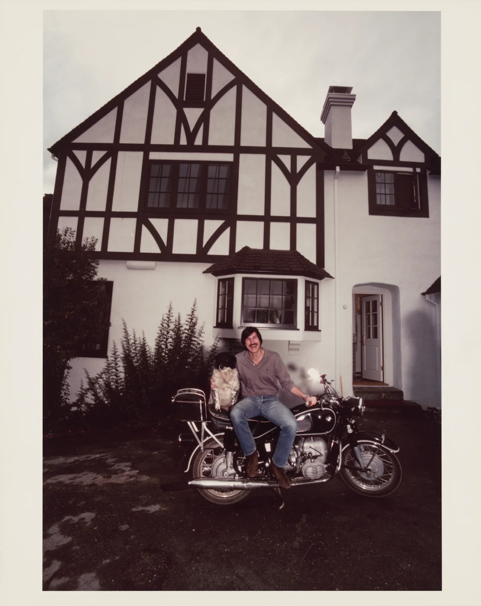
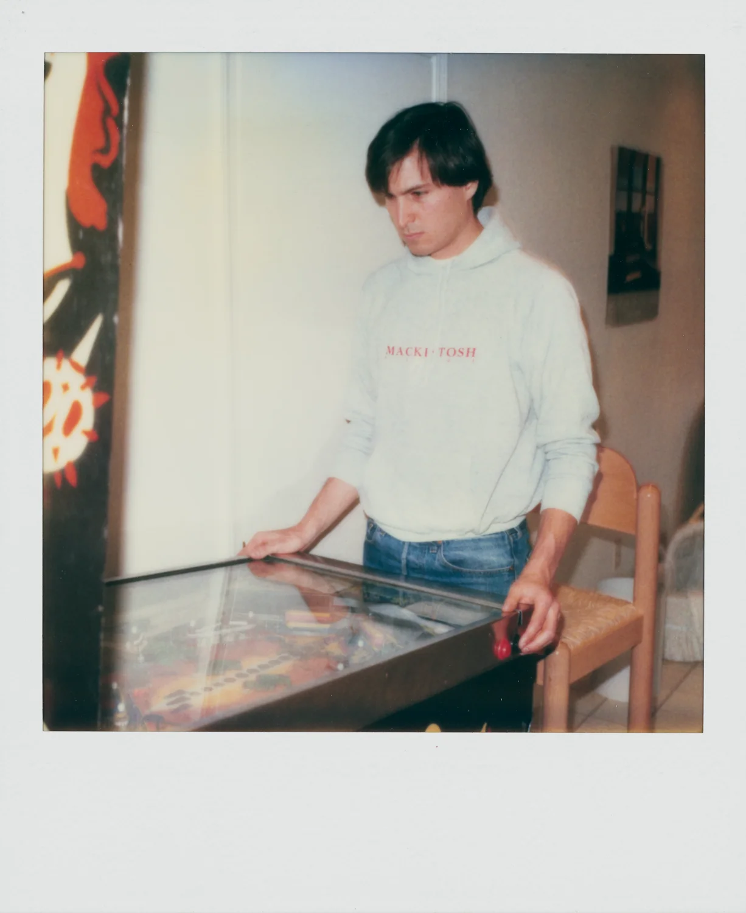
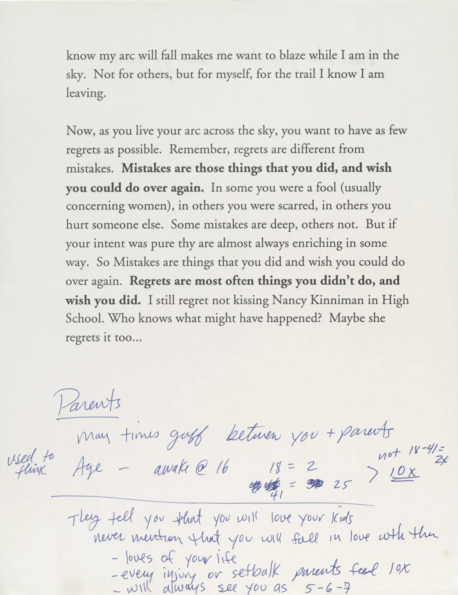
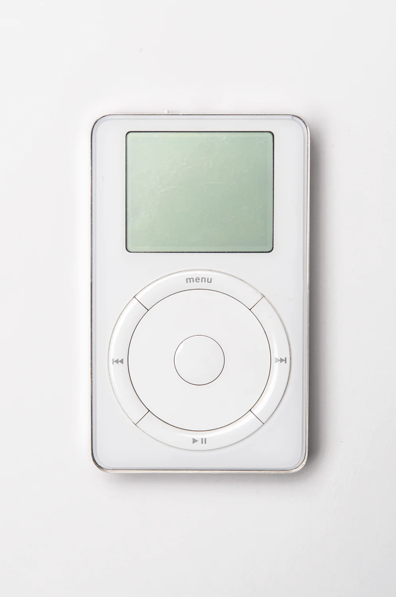
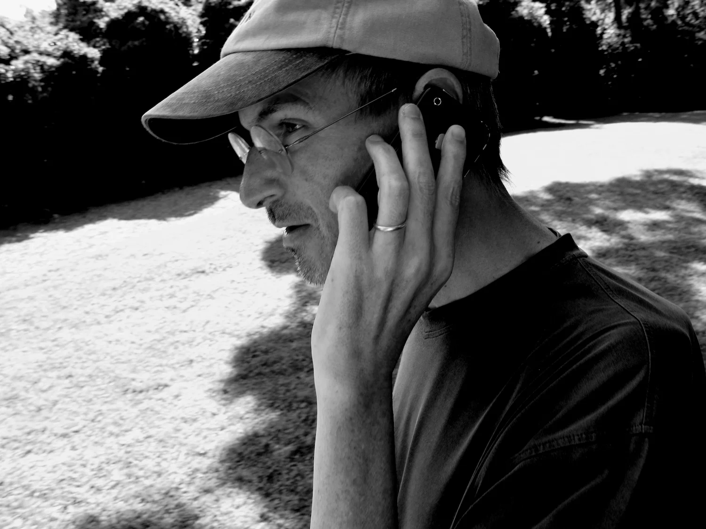

# 
创造美好

## 
史蒂夫·乔布斯的自述

---

人生不只有一条道路。人们会用与众不同的方式来表达他们对于其他人深厚的感恩，我相信其中的一种方式会是创造美好的事物，然后公之于众。
而你永远不会遇见这些人，不会和他们握手，不会聆听他们的故事或是和他们讲述你的故事。然而，通过创造一些倾注了大量心血的事物，你还是将有些东西转递出去了，这是种向其他同类表达深深感激的方法。所以我们要直面真实的自己，同时铭记哪些东西对我们来说真正重要的。

——史蒂夫，2007

---

## 序 劳伦·鲍威尔·乔布斯

由莱斯利·柏林编辑

出于语言的准确性与隐私问题，内容有所编辑与删减。

✂ 表示部分原文句段被删减

---

## 序 劳伦·鲍威尔·乔布斯

了解一个人的最佳途径就是直接听他说话，而了解史蒂夫的最好方式就是回顾他这一生说过的和写过的话。他的话—各种演讲、采访，还有邮件—给了我们一个了解他思考方式的窗口。他是个敏锐的思考者。
书中很大一部分都反映了史蒂夫生命的主导思想（guiding theme）：他通过融合科技与艺术让这个世界变得有意义起来；他那难以置信的、强加给自己的严谨；他对组建和引领伟大团队的执念。还有也许是最重要的，他对人生意义的洞察。
有一次史蒂夫对一群学生说：“你们出现，有了点亮天空的机会，然后你们消失。”他讲了很多关于怎么用好我们飞逝的时间的方法，他被“成为人类进程的一部分”的观念不断推动着，被“他或者我们中的任何人可能会提升或者加快人类进程”的想法赋予活力。
能看清现状，拥有清晰的眼界，已经足够困难了，而史蒂夫的天赋远高于此（greater still）：他能看清缺了什么、可能会有什么、一定会有什么。他的思维永远不会被现实所束缚，恰恰相反，他会想象现实少了什么，然后出发修正。他的点子并非论据，而是直觉，脱胎于真正由内而外的自由和宏大的可能性。
在字里行间，史蒂夫起稿、完善。他犯错、成长、作出改变。但他总是一如既往保持着对可能性的感知，驱动史蒂夫的认知：所有构成俗称“人生”的东西，都是由和我们差不多聪明能干的人造出来的；这个世界不是一成不变的—我们可以让它变得更好。我希望这些节选能让这种认知，在你心中掀起波澜。

史蒂夫两岁的时候。他后来将计算机比喻为“思想的自行车”。

## 前言：史蒂夫回忆他的童年和青年
史蒂夫通常将他的个人生活视作隐私，但他时不时也会聊到在旧金山海岸长大的事。那是一段工程师和编程员开始涌进后来为人熟知的硅谷的时代。

*1995年，他口述了一段自己的历史给史密斯尼杂志社。*

我是很幸运的。我有个父亲，他叫Paul，一个很卓越的男人。他从未在高中毕业，他在二战中加入了海岸警卫队，在巴顿将军的部下摆渡军队到世界各地，我觉得他可能总是惹上麻烦，然后被降级成二等兵。他是个机械师，工作非常卖力，而且是那种自力更生的天才（kind of genius with his hands）。
他在车库里有一张工作台，在我五到六岁的时候，他在上面划了一小块地方跟我说：“史蒂夫，这就是你的工作台了。”他给了我一些他的小工具，向我展示怎么用锤子、怎么锯、怎么造东西。那对我来说真的太棒了。他花了很多时间陪我，教我怎么做东西、怎么拆开它们和装回去。
有一门他涉及的东西是电路。他本身对电路并没有太多的了解，但他在和车子还有其他要修的东西打交道的时候，总会遇到电路。他向我展示了一些电路的基本知识，（于是）我对此变得非常有兴趣。
我在硅谷长大。我5岁那年，爸妈从旧金山搬到了山景。我爸被调走了，正好调到硅谷的正中心，所以那里附近都是工程师。那会硅谷周围还大多是果园——杏果园和李果园——真的天堂一般。我记得几乎每天的空气都格外的清，你能从山谷的一边看到另一边。那真的是世界上最美好的成长地了。
然后，有个男人和他的老婆新搬来了这条街，大概就在同一块隔了六七间房子。结果他原来是个惠普（Hewlett-Packard）的工程师、是个业余无线电爱好者而且非常懂电路。他为了认识同一块街区的孩子，用了一个奇怪的东西：他在路边放了一个碳粒式麦克风、一个电池和喇叭，你可以对着麦克风说话，然后你的声音就会通过喇叭放大。刚搬来这么做蛮奇怪的，但他就是这么做的。✂
（于是）我认识了这个叫Larry Lang的男人，他教了我很多关于电路的知识。他很棒，他以前会组装希斯套件（Heathkits）的。希斯套件真的很棒，那是你能以套件形式买到的产品，其实你买它花的钱要比买成品更贵，前提是你能买到（现成的）。希斯套件会附带详细的说明书，教你如何把东西组装在一起，所有东西会以某种方式摆好、用颜色标记好，你要自己组装这东西。
我会说，这（套件）给一个人带来了几大好处。它能让人了解成品里长什么样、工作原理是什么，因为这当中包含了一些运作原理。但或许更重要的是，它让人感觉，自己能造出在周边世界见到的东西，于是这些东西变得不再神秘。我的意思是，你在看电视，然后你会想“我还没造过一个这东西——但是我可以。希斯套件的产品目录里有这个，而我已经拼过两套了，所以我也能拼电视机。”。然后，这一切都是人工发明的，而非某人的周围突然出现这些有魔法的、他对内部一无所知的东西，这样的事实就变得明晰起来了。这给予了一种高度的自信：通过探索和学习，一个人可以理解他身边一些看上去非常复杂的东西。很幸运，我的童年就是这样的。✂
刚开始，上学对我来说还是蛮困难的。我的母亲在我上学之前就教我怎么读书，所以我上学之后真的只想做两件事：我想读书，因为我爱读书，还有我想去外面追蝴蝶，你懂的，做一些5岁小孩喜欢做的事情。我遇到了以前没遇到过的另一种权威，而我不喜欢这样。他们几乎真的打倒我了，只差那么一点点就打消了我的所有好奇心。
到我三年级的时候，我遇到了一位好伙伴：里克·费伦蒂诺，我们唯一找乐子的方式就是恶作剧。我记得学校里有一个大自行车架，大家都把自己的自行车放上去，大概有一百辆自行车——我们一次一个用我们的密码换掉别人的密码。然后有一天，我们把所有人的锁都放到了别人的车上，他们那天晚上弄到了10点，才把所有的自行车都整理出来。我们还在老师的抽屉里放鞭炮，也好多次被学校开除。
四年级的时候，我遇到了生命中的另一位圣人。他们准备把我和里克·费伦蒂诺放到四年级同一个班，而校长在最后时刻说了一句：“不行，这是个坏主意，分开他们。”于是这位Hill老师说：“我会带他们其中一个。”她教的是四年级高级班，感谢上帝，我就是那个随机被安排进班里的。他观察了我大概两周，然后过来和我说：“小史，这么说吧，我和你做笔交易。我有个数学作业本，如果你把它带回家，不靠任何帮助自己完成，你把它带回来给我，你能做对80%，我会给你5块和一个大家伙。”她（已经）买了，然后她举到我面前——一个巨大的东西。
我看着她，“你疯了吗，女士？之前还没人这么做过！”当然我也做到了，她基本上是用糖果和金钱把我贿赂回去学习。而真正了不起的是，不久之后我就对她如此尊重，以至于那重燃了我对学习的欲望。她给了我一套制作相机的套件，我自己打磨镜头做了一台相机，那真的很棒，我想我那年学术上学到的比我一生中学到的都多。

*1984年，史蒂夫和记者David Sheff聊了一下，作为年轻人，他和他这一代的其他人是如何开始发展自己的文化观的。*

我父母从来没有催促过我上大学，但他们总是想确保如果我想上大学，他们有资源做到。所以他们存了钱，他们真真切切牺牲了一些事，存了钱供我去里德学院（Reed College），但是...六个月后，就是，就是花掉毕生积蓄让我读完大学似乎真的很荒谬。
我对自己想做什么还不够了解。除此之外，我想到我退学之后可以再复学上课，学到同样多的东西。所以六个月后我就退学了，然后又复学了一年多一点。
我在那里呆了大约一年半，也许快两年。我非常享受。那是我人生中的一段艰难时期，但我很享受。我不知道我这一生想要做什么。里德是一个非常热情的地方，这里的人非常聪明——每个人都想改变世界，但不知道怎么实现。 ✂
七十年代初是东方神秘主义涌入美国海岸的时期。 我们有源源不断的人流穿过里德，并在里德停留。 从蒂莫西·利里、理查德·阿尔珀特到加里·施耐德，每个人都喜欢这样。 于是，关于生命和存在的真相的学术质疑不断涌现。 ✂
我们始终背负着六十年代的理想主义。我认识的大多数同龄人已经将这种理想主义深埋心中。他们内心有这种理想主义，但他们也对自己45岁时在天然食品店柜台后面工作保留一定的谨慎态度，也就是他们看到的一些年长朋友（在做的）—— 本身并不是坏事，但如果这不是你真正打算做的事或你真正想做的事，那就不好了。
因此，理想主义形成了，但也有一种感觉，即必须有一种更成功的方式来实现某些理想主义。

*史蒂夫还回忆了离开里德学院后在加利福尼亚和印度的时光。*

因为决定想要去旅行，我回到了（旧金山湾区），但我缺乏必要的资金。
这里是加州，你可以买到斯坦福大学新鲜制作的LSD。晚上你可以和你的女朋友还有任何有意义的人一起去海滩睡一觉。你可以……直到我去了那些地方，我才真正意识到加利福尼亚州与美国中部，甚至在某种程度上，东海岸，有多么不同。直到二十岁出头我才去过这些地方。加州有一种实验性的感觉，还有一种开放的感觉——开放和新的可能性——直到我去了其他地方我才真正意识到这一点。
于是我回来找工作，我在报纸上看到了一则广告，[...]说是成为一名工程师的同时能享受乐趣。听起来很有趣，所以我打了电话。那是（视频游戏制造商）Atari。我填了一份申请表，列出了我做过的所有事情，人事部的女士说：“别打电话给我们，我们会打电话给你！”后来我的运气让我的简历送到了Al Alcorn手上，他当时是 Atari 的工程副总裁。第二天他打电话给我雇用了我，这很棒。 [...]我在那里呆了不到一年，他们在欧洲发售了几款存在技术问题的游戏。我想到了如何修好问题的办法，但需要有人去那里修。
于是我自告奋勇了；他们问我愿不愿意去，我说我当然愿意，但我想在在那里的时候请一会假。他们同意了，我最终到达了瑞士，并从苏黎世飞往新德里。我在印度呆了一段时间。
我迷迷糊糊地，算是总结了一下（我的印度之旅）。任何人很难在一页纸上总结他们生活中有意义的经历。我的意思是，如果我是威廉·福克纳，我也许能为你做到这一点，可惜我不是。
回来时受到的文化冲击比过去时要更加猛烈。（回到加利福尼亚后）我只想找一片草地坐着。我不想开车、我不想去旧金山，或者做所有这些事情，我就是不想。
所以大约三个月我都没有这么做。我只是看书和坐着。当你对一个地方很陌生时，你会注意到一些事情，而当你变得熟悉时，你很快就会不再注意到这些事情。美国在我生平第一次变得这么陌生，而我看到了以前从未见过的东西。所以在那三个月里，我试着去关注他们，因为我知道渐渐地，一点一点地，我又会对这里越来越熟悉。

---

史蒂夫的护照，1973年春，彼时他18岁。

他1974年写给朋友的一封信：“别浪费生命”

---

## 第一部分，1976-1985
*“很多人将大量的爱倾注进了这些产品。”*

---

1976 年，当史蒂夫和他的朋友史蒂夫Wozniak （Woz）开始在乔布斯家的车库里组装后来被称为 Apple I 的产品，“计算机”这个词让人想起由专业程序员照管的笨重机器。 一家公司 —— IBM —— 主导了这个行业。但史蒂夫和 Woz 是新一代创意思想家、工程师和爱好者中的一员，他们试图构建他们可以自己编程的小型廉价的机器。
苹果公司成立时，史蒂夫21岁，早熟但缺乏经验且没有礼貌。在苹果公司的第一次董事会会议上，他赤着双脚搭在会议室的桌子上，很快就遭到了董事会主席的斥责。公司伴随 Apple II 的面世迎来突破：这是一款开箱即用的机器，带有磁带存储和内置彩色屏幕。一年之内，苹果公司就成为美国发展最快的公司之一，而当史蒂夫年满 30 岁时，他已成为一家财富 500 强公司的门面形象。
在苹果内部，他的想法和热情鼓舞人心，但史蒂夫的管理风格却存在争议。他的职责几乎每年都会发生变化，因为他被分配到不同的项目和团队或从中调离。他开始与他亲自挑选的首席执行官， John Sculley ，发生冲突。1985 年 9 月，苹果董事会解雇了史蒂夫。
后来，当史蒂夫谈到在苹果公司的第一年时，他专注于一件事：Macintosh，这是他和一个团结的团队于 1984 年向世界推出的计算机。对史蒂夫来说，Macintosh 就是技术应有的样子。它精简而实用，简单而复杂，是一种提高创造力和生产力的工具。
史蒂夫相信，在另一个时代，Macintosh 团队的成员可能是作家、音乐家或艺术家。 “人们的感受投入的热情与诗人或画家的完全没有区别。”他说。他称他们的工作是一种爱的形式，他们的产品是“给（除了专家以外）剩下的人用的计算机”，配有鼠标和箭头键，桌面图标而不是编程命令，并且在启动时显示的，取代闪烁的光标的是：一个微笑。
Macintosh 还是史蒂夫第一次领导团队开发他认为改变了世界的产品的见证。 “它引发了一场革命，” 二十三年后，当另一项改变世界的创新产品 iPhone 推出时，史蒂夫回忆道。“我记得在推出 Mac 的前一周，我们聚在一起说，‘每台电脑都是这样运转的，无可反驳。你可以反驳（电脑都变成这样）需要多长时间，但你无法反驳这个事实。”

---

### 史蒂夫讲到创立苹果
*1984年，史蒂夫回忆苹果背后的友谊*
我十三岁的时候在朋友的车库里认识了 Woz ,我想他大约十八岁。[...]他搬到了我一个名叫 Bill Fernandez 的朋友家那条街，我就在 Bill 家。一天晚上，我们正在做一个项目到很晚，沃兹刚好路过。我们最后聊了几个小时，我对他印象深刻，我认为他很棒，他很有幽默感[...]而且我们（对电子产品）都很有兴趣，这将我们联系在一起，尽管我们在其他方面都完全不同。✂
我们有点像各自轨道上的两颗行星，时不时相互交叉。只要我们都还活着，我们就彼此相连。

*1996 年，也就是苹果公司庆祝成立 20 周年之际，史蒂夫回忆少年时期造电脑的爱好如何转变为一门事业。*

我们（ Woz 和我）造一台电脑的原因是我们想要一台，但我们买不起。当时的电脑要几千美元，而我们只是两个年轻人。我们开始尝试造，并在硅谷周围尽可能地找零件。经过几次尝试，我们终于组装出了 Apple I 。我们所有的朋友也都想要，他们也想要组装 Apple I 。可事实证明，手工组装一台大约需要五十个小时，那占了我们所有的业余时间，因为大家不太擅长组装，所以沃兹和我帮他们组装。
我们认为，如果我们能制造所谓的印刷电路板，你只需插零件，而不用整个东西都用手工焊接，我们就可以将组装时间从大约五十小时缩短到大约一个小时。沃兹卖掉了他的惠普计算器，我卖掉了我的大众微型巴士，我们凑到了足够的钱付给别人帮我们设计一块印刷电路板。我们的目标是将原始的印刷电路板卖给我们的朋友，赚够钱来赎回我们的计算器和交通费用。
然后就是，一家当时位于 Mountain View（山景城）的早期的计算机（商店），事实上是世界上第一家计算机商店，说：“好吧，我要买五十台这样的计算机，但我想要完全组装好的。” 这是我们从未想到过的转折。
我们买了组装一百台计算机的零件，装了 50 台然后交付，得到了现金报酬，然后跑回去付钱给卖给我们零件的人。然后我们就遇到了经典的马克思经济危机，即我们的利润不是流动的，而是放在地上的 50 台计算机中。
我们觉得有必要开始学习销售和分销了，这样我们才可以卖掉这50台电脑，收回我们的钱。我们就是这样进入这个行业的。我们把我们的想法（计算机）带到了几家公司，其中一家是沃兹工作过的公司（HP），另一家是我当时工作过的公司（雅达利）。两家公司都没有兴趣追求这一目标，所以我们创办了自己的公司。

---

在从事 Apple I（的研发），1976年

史蒂夫放在办公室的一个手提箱

里面是一套 Apple I

苹果的第一封粉丝来信，一张电脑屏幕的拍立得

1977年，史蒂夫在展示 Apple II 的原型机

### New Yorker 的采访
“这是一台听话的（domesticated）电脑。”

*史蒂夫首次在全国性刊物上亮相是在1977年的一期 The New Yorker 杂志上。杂志派了一位记者到在纽约大剧场举办的首届年度个人电脑展览会。当时的大多数人都没见过个人电脑。*

在一个写着“Apple Computer, Inc.（苹果电脑公司）”的摊位，我们停下来和这位负责的年轻人聊了一下，他介绍自己是公司的副总裁史蒂夫·乔布斯。乔布斯先生对展览的人流量感到很满意。 “多希望我还没长大的时候，我们已经拥有这些私人机器，”他说。“在过去的十年里，人们通过媒体听到了关于计算机的各种事情。据说，计算机已经控制了他们生活的各个方面。然而即便如此，大多数成年人并不知道计算机到底是什么，也不知道它能做和不能做什么。
“现在，人们第一次可以真正用一台好音响的价钱买一台电脑，和它交互，并了解关于它的一切。这就像拆开一台1955年的雪佛兰汽车，或者相机。全国有数千人在上摄影课程，可他们永远不会成为专业摄影师，他们只是想了解摄影的过程是咋样的，电脑也是一样的道理。
“1976年，我们在 Los Altos （洛斯阿尔托斯）的一个车库里创办了一家小型个人电脑公司。现在我们是世界上最大的个人电脑公司。我们生产我们眼中的个人电脑中的劳斯莱斯。这是一台听话的计算机，人们以为会看到闪烁的灯光，但大家发现它看起来就像一台连到合适的屏幕能够彩色显示的便携式打字机。
“它向人们产生反馈，而用户也很狂热。我们总是被问到它能做什么，它可以做很多事情，但在我看来，它现在真正做的事情是教人们如何对计算机进行编程。”
想起乔布斯先生希望自己在成长过程中拥有这样的机器，我们问他是否介意告诉我们他的年龄。
“二十二”，乔布斯先生说。

---

1977年苹果两次超出总部的规模。

1981年和 Apple II 合照，同年 IBM 推出了他们的个人电脑。

史蒂夫是个狂热的摄影爱好者。

为了激发设计灵感，他把自己的摩托车放在苹果的门厅。

### 在Aspen（亚斯本）国际设计大会上的演讲
“电脑和社会在进行第一次约会。”

1983年6月15日，苹果发布 Lisa 电脑5个月以后，史蒂夫在 Aspen，Colorade（科罗拉多州，亚斯本）和设计师们的年度聚会上发言。

你们中有多少人超过三十六岁？ 你们出生在计算机发明之前，计算机已经有三十六年历史了。我认为当我们回顾过去时，历史的时间轴上将会有一小部分，一个非常有意义的部分。你们中的很多人都是电视一代的产物，我几乎就是电视一代的产物，但在某种程度上开始成为计算机一代的产物。
但现在长大的孩子们绝对会是计算机一代的产物，在他们的一生里，计算机将成为主要的交流媒介，就像电视取代广播，甚至是书籍一样。
你们中有多少人拥有苹果电脑？有人吗？或者其它任何个人电脑？
呃哦。
你们中有多少人使用过、或见过过、或类似的东西？好的。✂
电脑真的很蠢。它们非常简单，但速度非常快。我们为这些小型微处理器——甚至这些巨型 Cray-1 超级计算机——所必须提供的原始指令，是最琐碎的指令。他们在那里接收些数据，从这里接收一个数字，将两个数字加在一起，然后测试它是否大于零。这是你能想象到的最平凡的事情。
但关键是：假如我的移动速度比这里所有人都快一百倍。一眨眼的功夫，我就可以跑到那里，抓起一束春天的鲜花，然后跑回这里，打响指。你们都会认为我是魔术师。但我基本上做的都是一系列非常简单的指令：跑出去，抓一些花，跑回来，打响指。但我可以做的如此之快，以至于你会认为魔术显灵了。
电脑也一样。它每秒可以执行大约一百万条指令。因此，我们倾向于认为发生了一些神奇的事情，事实上，这只是一系列简单的指令。✂
我来这里的一个原因是：我需要你的帮助。 如果你见过电脑，它们看起来就像垃圾。所有伟大的产品设计师都在设计汽车或建筑，但他们中几乎没有人在设计电脑。想象一下，今年我们将售出 300 万台电脑，86 年将售出 1000 万台，无论它们看起来像一坨屎还是看起来很棒，不管它看起来是什么样子，都会被人们吹嘘，而且不需要花费更多的钱就能让它们看起来很棒。它们会走进每个人的办公场所、学习场所还有家里。我们有机会能在那里放一个伟大的东西——（反之）如果我们不这样做，我们就会为那些地方再增加一个垃圾。
到 86、87 年的样子，人们和这些机器互动的时间就会比现在与汽车互动的时间还要多。人们每天将花费两到三个小时和这些机器互动，比他们在车里的时间还要久。因此，工业设计、软件设计以及人们与这些事物的交互方式就必须像我们今天对汽车的考量一样——多少也得多一点。
只要你环顾四周，就会发现大多数汽车并不是在美国设计的。电视？音频产品？手表、相机、自行车、计算器，只要是你能想到的：我们生活中的大多数物品都不是在美国设计的，我们已经搞砸了。从工业角度来看，我们已经搞砸了，因为我们已经把市场输给了外国竞争对手，设计上我们也搞砸了。
我认为，我们有机会通过这种八十年代面世的新的电脑技术——电脑和全社会在八十年代第一次约会。我们有机会让电脑变好看，我们有机会通过物体本身的设计来传达一些东西。✂
当我还在上学的时候，我认识几位很棒的老师和很多平庸的老师。让我免于牢狱之灾的可能就是书籍。我能独立阅读亚里士多德或柏拉图的著作。书是一件了不起的事情，它从源头直接到达目的地，中间没有任何中间环节。
问题是，你不能直接问亚里士多德问题。但是我觉得，我们往后看五十到一百年的样子，如果我们真的可以造出这些机器来捕捉潜在的精神，或者一组潜在的规则，或者一种看待世界的潜在方式，那么，当下一个亚里士多德出现时，也许他或她的一生都会随身带着一台电脑，然后输入东西。也许有一天，在这个人死后，我们就可以问这台机器，“嘿，亚里士多德会说什么？那这个呢？”也许我们不会得到正确的答案，又或许我们会。这对我来说真的很令人兴奋。这就是我做我正在做的事情的原因之一。
然后，你们想谈谈什么？

*史蒂夫在会议的两个环节回答问题*

这些计算机如何协同工作？他们应该是像人们一样协作的，有时他们协作得很好，有时又协作得不怎么样。✂
现在的状况是，有几个装置，人们将它们连接在一起。其中最引人注目的一个装置在 Xerox Palo Alto 研究中心，简称 PARC 。他们将大约百来台计算机连接到所谓的局域网上，也就是一条来回传输信息的电缆。[…]
然后有趣的事情来了：有二十个人对排球感兴趣，于是就有了排球分发列表，然后当下周的排球比赛发生变化时，你会写一份快速备忘录，然后发到排球分发列表，然后是中餐烹饪清单。不久之后，存在的名单就比人还多了。
然后就会产生非常非常有趣的现象：因为我认为当我们开始将这些东西（计算机）连在一起时，这就是会发生的事情：它们将促进沟通，并促进拥有的特殊兴趣人们聚集在一起。
我们大约还要五年时间，才能真正解决将这些办公室里的电脑连在一起的问题。我们大约还要十到十五年的时间才能解决将它们在家里连接在一起的问题。很多人都在努力解决这个问题，但这是一个非常棘手的问题。
现在，苹果的策略非常简单。我们想做的，是将一台非常出色的计算机融入一本你随身携带的书里，只要二十分钟你就能学会怎么用它。这就是我们想做的，我们希望在这十年内做到这一点。我们非常想通过自带的无线电链路来实现这一点，这样你就不用连任何东西 —— 你可以和所有这些更大的数据库和其他计算机进行通信。我们现在不知道该怎么做，从技术上来说（现在）不可能实现的。✂
我们在试着摆脱编程（命令行），我们也必须摆脱编程，因为人们不想给电脑编程，人们只是想用电脑。✂
我们（苹果公司）认为，出于某种疯狂的原因，我们在正确的时间、正确的地方作出了一些贡献。我的意思是，我们中的大多数人没有制造我们穿的衣服，我们没有烹饪或种植我们吃的食物，我们说的是别人开发的语言，我们使用的是别人开发的数学，我们在不断地*索取*。
在人类经验的长河中*作出贡献*的能力是非常巧妙的。我认为你们每个人都知道，在未来十年我们都有机会真正做到这一点，然后我们（会）回顾过去——我们这样做也很有趣——我们会回顾过去然后说，“天哪，我们也是其中的一部分！”✂
我们都始于虚无。因此，无论什么时候白手起家，你总是可以力争最好，你没有什么可以失去的。然后的事情就是——当你得到一些东西时，很容易进入“安分守己”模式，变得保守，然后投票给 Ronnie ( Ronald Reagan，罗纳德·里根，被认为是美国最杰出的保守派人物之一)。因此，我们要做的就是让那个美妙的时代成真，这段我们正身处的、没有进入那种保守状态的时代。✂
我没法告诉为什么你现在需要一台家用电脑，人们问我：“我为什么要在家里买一台电脑？”
我就会说：“嗯...为了学习一下，为了跑一些有趣的模拟。如果你有孩子，他们应该用它来学习识字。他们值得一些好的教育软件，尤其当他们还这么年轻。
“你可以和这些资源接轨，然后做任何你想做的事情，比如认识女生？我不确定。可除此之外，现在还没有充分的理由在你家买一台。但会有的，会有的。” ✂
我不觉得钱是苹果员工的驱动力。我不认为（驱动力）是钱，而是你觉得自己拥有公司的一部分，而这就是他丫的你的公司，如果你看到什么...我们总是和大家说，“你首先为苹果工作，然后才是为你的老板。”我们对此都感受颇深。✂
当有一百万人使用某个东西的时候，创造力就真正开始以大规模快速出现。[…]我们需要像 Lisa （计算机）这样的革命，但我们也需要推出数百万台设备，好推动世界进步——因为我们发现世界非常好进步。

### 谈到 Macintosh
*当史蒂夫与记者 David Sheff 反思 Macintosh 的重要性时，Macintosh 问世还不到一年，但显然已经做好了要颠覆个人电脑行业的准备。*
我喜欢的一件事是用 Macintosh，你可以写 Times Roman 或者 Helvetica 格式的备忘录，或者如果你想给派对增添一点乐子，或者说排球公告，你可以用古英语写。或者你可以使用非常严肃的字体来表达非常严肃的事情，你还可以表达自己。
这有点像 1844 ，电报被发明那年，那是通信领域的一个惊人突破。事实上，你可以在某个下午在纽约往旧金山发消息。有些人谈到在美国的每张桌子上都放一台电报机以提高生产力。
但这是行不通的。它行不通的原因是你必须学习这一系列奇怪的咒语——这里说的是摩斯电码，还有点和破折号——才能收发电报。学习使用摩斯电码要花大约四十个小时。大多数人永远不会学怎么用摩斯电码。
幸运的是，在 1870 年代，Alexander Graham Bell 申请了电话专利——这是通信领域的又一重大突破，其功能基本相同，但人们已经知道如何使用它。它最巧妙的地方在于，除了让你可以用文字交流之外，它还可以让你唱歌，它让你能够表达简单语言以外的其它信息（话里有话）。
如今我们又碰到同样的情况了。有人说我们需要在美国的每张桌子上都配备一台 IBM PC 以提高生产力，可这是行不通的，这次你必须学习的特殊咒语是 "/qz" 之类的。 大多数人不会学习 "/qz" ，就像他们不会学习摩尔斯电码一样。
这就是 Macintosh 的意义所在：这是我们行业的第一部“电话”。但对我来说最巧妙的是，就像电话到电报一样，麦金塔让你可以唱歌：它允许您使用特殊字体、它可以让您制作绘图和图片、或者将其他人的画或图片合并到您的文档里。
即使在商界，你也能看到五页的备忘录被压缩成一页，因为会有一张图片来表述关键概念，于是，到处乱飞的纸张越来越少，沟通质量也越来越高。
而且更有趣的是，人们总是有这样一种误解，认为有的人在家里很灵光、有趣，上班的时候突然变得非常沉闷、无聊和严肃，但这其实不存在的。因此，如果我们能够再次将博雅精神注入到这个非常严肃的商业领域，我认为这将是一个有价值的贡献。

---

1983年，苹果在夏威夷的销售报告会

在纽约 IBM 办公楼外

---

### 对 Apple 员工的演讲
“ George Orwell 关于1984的描述会成真吗？”

*1983年10月，史蒂夫在苹果的销售会上发布 Macintosh 电脑和它那标志性的广告，这个广告随后在1984年的超级碗比赛上播出。*

大家好，我是史蒂夫·乔布斯。
1958 年，IBM 放弃了收购一家年轻的、羽翼未丰的公司的机会，这家公司发明了一种叫静电复印的新技术。两年后，Xerox（施乐）诞生。从那时起，IBM 就一直在自责。
十年后，六十年代末。DEC 公司还有其他公司发明了小型电脑。IBM 认为小型电脑太小，无法进行严肃计算工作，因此对他们的业务来说并不重要。在 IBM 最终进入小型电脑市场之前，DEC 已成长为一家价值数亿美元的公司。
十年后的七十年代末。1977 年，苹果公司，一家位于西海岸的新兴公司，发明了 Apple II，我们今天所知的第一台个人电脑。IBM 认为个人计算机太小，无法进行严肃的计算，对他们的业务也不重要。
八十年代初，1981年，Apple II 已成为世界上最受欢迎的电脑，苹果已经成长为一家价值 3 亿美元的公司，成为美国商业史上增长最快的公司，有超过 50 家竞争对手争夺份额。IBM 于 81 年 11 月推出 IBM PC 进入个人电脑市场。
1983 年，Apple 和 IBM 成为业界最强大的竞争者，1983 年各自销售了价值约 10 亿美元的个人电脑。1984 年，两家公司将分别投资超过 5000 万美元用于研发，另外投资 5000 万美元用于电视广告，总计约 10 亿美元的四分之一。
洗牌正在如火如荼地进行，一家大公司破产，其他公司也濒临破产。1983 年的行业总损失甚至超过了 Apple 和 IBM 的个人电脑利润总和。
现在是 1984 年，IBM 似乎想全拿走，苹果被认为是与 IBM 竞争的唯一希望。最初张开双臂欢迎 IBM 的经销商，现在在担心由 IBM 主导和控制的未来，越来越多人绝望地回归苹果，将其视为能够确保他们未来自由的唯一力量。
IBM 想要全拿走，并将枪口瞄准了他们控制行业的最后一个障碍：苹果。蓝色巨人会主宰整个计算机行业吗？ [观众：不！] 整个信息时代？ [观众：不！]  George Orwell 关于 1984 年的描述会成真吗？
*[史蒂夫开始播放“1984”广告。 该广告由 Ridley Scott（《异形》之父）执导，描绘了一个反乌托邦的奥威尔世界。在一个场景中，人们穿着灰色衣服，剃着光头，面无表情地坐在大屏幕前，独裁者在屏幕上胡言乱语。一名身穿鲜红色运动短裤和麦金塔衬衫的女士冲进房间，向屏幕扔出锤子，将其摧毁。广告以这样的承诺结尾：“1 月 24 日，苹果电脑将推出 Macintosh。然后你会明白为什么 1984 年不会变成 ‘1984’。” ]*
[观众席响起热烈的掌声和叫喊声；声音平息，史蒂夫继续。] 这个广告将在麦金塔推出前一周投放，今天，我们的广告代理公司 Chiat/Day 就在这里。负责人 Jay Chiat 来了，Lee Clow 和史蒂夫Hayden 也在这里，他们负责撰写文案和创意。
你可能——我猜他们听到了你的想法。

---

在 Macintosh 发布之前享受着难得的休息

1984年，在新奥尔良参加销售会议后精疲力竭

1984 年，史蒂夫在伍德赛德的家中为《时代》杂志拍摄照片

停下来观察被使用中的 Macintosh 电脑

---

### Michael Moritz 的访谈
“随着你犯错误，你的审美会变得越来越好。”

*1984 年 5 月，史蒂夫和即将转行成为风险投资家的记者迈克尔·莫里茨 (Michael Moritz) 在史蒂夫在苹果的办公室发表了演讲。他们涵盖了广泛的主题，包括史蒂夫对产品设计的想法。*

史蒂夫·乔布斯：我们设计 Mac 的时候，我出去四处考察了 Cuisinarts。这就是我的 Cuisinart 周。
Michael Moritz：就没有其他某些产品（影响过你）吗？ 比如说，从七十年代末或者其它什么时候（的产品）。
SJ：嗯，我们一生都被汽车围绕着。我从来都不是一个汽车爱好者，但我一直很喜欢大众甲壳虫。事实上，我也一直很喜欢大众货车。
（影响我的）只有一堆小东西：酒标、画廊里的画作，都是些简单的东西，没有什么非常深刻的东西，只是很多很多的小事情。我不觉得我的审美和其他很多人的有太大不同，不同的是，我只是非常执着想要把事情做得尽可能好，这是唯一的区别。
MM：是的，我觉得你谦虚了。
SJ：对的，在你犯错误的同时，事物也在变得完善。我有可能会犯很多错误，在你犯错误的同时，你的审美也在变得更好。但真正重要的是：如果你要做点什么，并不需要花费很多精力——而且很少需要花很多钱——就能将这件事做得很棒。所需要的只是多一点时间，也没有太多。还有这样做的意愿，愿意坚持下去直到做好这件事的意愿。
但美学呢？ 我认为美学很像唱歌。 Joanie Baez 有一把动听的嗓音，但她的声音之所以好听，并不是因为她的声音本身就好听，而是因为她听力非常好。她可以听某人讲话三十秒，然后几乎完美地模仿他的声音。她的耳朵真是棒极了。我认为，同样地，达成良好的美学效果仅仅来自于你的眼睛，一种你所见，而不是你所做的本能。✂
SJ：我想打造比当今市场上任何产品都小的产品。当你把东西变得更小时，意味着你就能让它们做到更高精度。很显然，手表就是一个完美的例子。它很漂亮，但精度就得和物体本身一样细，所以你要把它做得非常精细。随着我们的产品变得更小，我们有机会做到这一点。所以，当然，我希望一切都变小。
我还认为能够随身携带产品真是太好了。就算它们不便于携带，能够有一个手柄告诉大家，“把我搬起来，想把我搬到哪就搬到哪”，是非常好的。将它们从一个房间带到另一个房间，或从一个办公室带到另一个办公室。丽莎太重了，无法在周末从一个办公室搬到另一个办公室，从一个房间搬到另一个房间，或者在周末搬回家。所以这引申出一个问题，“我们如何找到一种方法，将相同的功能打包成我们可以随身携带的东西——当然了，变得更小——并且能够更精确地表现自己的形态？” 这就是我们未来的发展方向。✂
MM：怎么样的情况更糟糕？令人反感的设计，还是说太多了，以至于没法一一列举？
SJ：嗯...比方说三年前的随便一辆车，又比方说如今的大多数汽车，任何东西。看看房间里四周的东西：桌子、椅子，全都很丑。你可以问我，那我在这个办公室做什么？但反正，大多数东西都不是很好。
电话就是一个完美的例子，唯一一款好用的电话是最初的电话和 Trimline，Trimline 是唯一像样的。大家做的新东西都只是垃圾。✂︎
SJ：（在苹果）我们只是变得越来越简单，非常非常简单，简单的。✂︎
SJ：您见过 Page Mill 路上HP的大楼吗？原来的那栋？它们真的很整洁，他们有扇形屋顶，面向北边的玻璃，如果你愿意的话，你还能在上面装太阳能集热器，（整栋建筑）脱颖而出。他们在楼里建了一整面玻璃墙，人们可以在那里工作，他们让大量的自然光流入建筑，反正很多（自然光）。
（苹果的）建筑物的问题是没有光。就是，你在外面呆了五分钟，然后走进这里，这里真的很黑，你什么也看不见。我们有点像生活在这些小小的洞穴里。
我只想要大量的自然光。✂︎
MM：（在“1984”广告里）有关“老大哥”的一切东西是不是都和 IBM 的东西有关？或者会不会有些外人很快就能理解的内容，而你们并不打算——
SJ：否认？
MM：否认。
SJ：嗯，我认为，对此最好的回应是我在《财富》杂志里的回应，“如果在 1984 年看到老大哥让很多人想到了 IBM，那就说明这更多是 IBM 的形象问题，而不是我们故意的（将 IBM 类比成老大哥）。”
事实上：当然，我们看到了这个类比。我认为我们说的是两件事，我们要说的第一件事是，（广告里）计算机的形象，就像一群集中的人控制着非常强大的机器来跟踪我们，这是我们心中标志性的恐惧——我们在点评我们所害怕的文化性的恐惧。
当然，你肯定能看到它与 IBM 的相似之处，除非你是个白痴。

---

史蒂夫在双排扣西装外套下穿着牛仔裤

---

### 和 Newsweek 的采访
“我想造点东西。”

*在与首席执行官 John Sculley 的权力斗争中失败后，史蒂夫于 1985 年 9 月离开了苹果。这次离开官方上算是辞职，但史蒂夫认为这是一种背叛。几周后，他接受《新闻周刊》（Newsweek）采访。*

Newsweek：当你听到（苹果）董事会（要起诉你）的决定时，你有何反应？这些人是您认识并长期共事的人。
史蒂夫·乔布斯：是的，我的意思是，（即便）在我最疯狂的想象中，我也不曾想过这一切会有如此疯狂的结局。我曾希望我的生活会像一幅有趣的挂毯的质量一样，我和苹果的故事在其中交织：我会在那里呆一段时间，也许我会离开并做一些其他的事情来做出自己的贡献，但依然和苹果有联系，然后可能会回来并停留很长一段时间，然后又去做其他事情，但事实如你所知的，并非如此。我度过了一生中最美好的十年，对任何事情都不后悔。✂︎
就我个人而言，我想造一些东西。我三十岁了，我还没准备好成为一名行业专家。今年夏天，我收到了三份教授的邀请，我告诉所有的大学，我认为我会变成糟糕的教授。我最擅长做的，是找到一群有才华的人，与他们共事。我尊重苹果的发展方向。但对我来说，你知道的，我想造点东西。如果在那里没有我创造东西的地方，那么我会像前两次一样。我会创造自己的地方。你知道，当苹果公司刚开始时，我在车库里做到了这一点，当Mac开始时，我在象征性的车库里做到了这一点。✂︎
SJ：虽然外界用数字来评判成败，但我的标准可能与此大不相同。我的标准可能是从现在开始设计的每台计算机都必须至少与 Macintosh 一样好。 ✂︎
SJ：我过去常常去上班，到达那里后，我会打一两个电话，查看一些邮件。 但是，现在是六月、七月，大多数公司管理报告都不再从我的办公桌上流过。 有些人可能会在停车场看到我的车并过来表达同情。
然后我会觉得沮丧，三四个小时后再回家，非常沮丧。 我这样做了几次，我认为这在心理上是不健康的。 所以我就不再进去了。你知道的，没有人真正想念我。
问：你会觉得他们夺走了你的公司吗？
SJ：对我来说，苹果存在于其员工的精神，以及他们开展业务的理念和目标。因此，如果苹果变成了一个将电脑视作商品、浪漫消失的地方，人们忘记电脑是人类最不可思议的发明，那么我会觉得我失去了苹果。但如果我在一百万英里之外，所有这些员工仍然有这些感觉，并且他们仍在努力制造下一台伟大的个人电脑，那么我会觉得我的基因仍然在那里。✂
SJ：最困难的五天中，有一天是 John（苹果首席执行官 John Sculley）在分析师会议上说我未来不会再担任任何职位那天，一周后他在另一场分析师会议上又说了一遍。他没有直接对我说；而是对媒体这么说。可能有人打了你的腹部，让你喘不过气来，无法呼吸。如果你放松，你就会再次开始呼吸，这就是我整个夏天的感受。我必须做的就是努力放松。这挺难的，但我在树林里散步了很多次，也没怎么和人交谈。✂
问：你说过（自己）很难相处，性格粗暴。你是否在某些方面导致了自己的垮台？
SJ：你要知道，我不是一个六十二岁、一生到处周游的政治家。所以我确信，在我二十五岁的时候，如果我能回去，也知道我现在所知道的，我可以处理得更好，也相信三十五岁的时候，我能面对 1985 年的情况说出同样的话，我的信念非常坚定——总而言之，我其实挺喜欢自己的，我并不急于改变。
Q：但是这段经历有改变你吗？
SJ：哦，这——对的，我认为我从中成长，我认为我从中学到了很多东西。我还不确定怎么做或做什么。 但是，是的，我有这种感觉。 我并不（感到）苦； 我并不苦。✂
问：媒体上有很多关于您对佛教、素食主义的兴趣（的报道）。
SJ：当我们陷入各种主义时。
问：主义。你还对那些事情感兴趣吗？
SJ：嗯，我不知道该说什么。我的意思是，我不吃肉，而我每个星期天我也不去教堂。
问：他们说您曾想过去日本并在寺院里静坐。
SJ：是的。我很高兴我没有这么做。 我知道这听起来真的非常老套。但我觉得我是一个美国人，我出生在这里，世界的命运现在掌握在美国手中。我确实有这样的感觉。你知道的，我将在这里过我的生活，并尽我所能提供帮助。

---

大约 1985 年左右的史蒂夫。

---

## 第二部分，1985-1996
*“如果不摔倒几次，你就永远无法实现你想要的目标。”*

---

史蒂夫离开苹果后的几年是他职业生涯中最艰难的时期，也是最具成长性的时期。
他决心建立一家新的伟大的计算机公司，与麦金塔团队的几名成员一起创办了 NeXT。“我们会犯一大堆错误，但至少它们会是新的、创造性的错误，”他预测道。
大约在同一段时间，史蒂夫向一家名为皮克斯的小公司投资了 1000 万美元。这是一家小型计算机图形公司，刚刚从电影制片人乔治·卢卡斯的帝国中分离出来。皮克斯的技术专长吸引了史蒂夫；其最初的产品是一款高端图形计算机，售价超过 10 万美元。 
可 NeXT 和皮克斯很快就陷入了麻烦。NeXT 计算机系统于 1988 年首次亮相，功能强大，充满了史蒂夫钟爱的人文气息。它具有视觉冲击力、使用起来直观、内置高品质音频和莎士比亚全集。但它上市较晚且价格昂贵，所以销量不佳。NeXT 推出六年后，除了史蒂夫之外，整个创始团队都辞职了。
与此同时，皮克斯靠销售电脑和软件勉强维持生计，后来又开始制作广告动画。该公司还制作了令史蒂夫着迷的获奖短片。这种利用技术来讲述精彩故事的做法体现了他最喜欢的事情之一：技术与人文学科的交叉点。这些短片激发了史蒂夫的热情，让他不断给皮克斯开出一张张支票，最终投资了约 6000 万美元。
但正如史蒂夫所说，这些电影只是“背景”，而不是公司的焦点。他将皮克斯的早期商业策略描述为“找个办法来付账单”，后来他推测公司当时没有崩溃的唯一原因是领导团队“都会感到沮丧……但不是我们所有人都会感到沮丧。”
如果这些年来他有时似乎对技术的可能性感到失望——“这些东西不会改变世界。 事实并非如此，”他以一种不同寻常的悲观情绪告诉记者——他的世界也在扩展到他的工作之外。 他珍惜自己的隐私，谈到自己的公众形象时说：“我认为它是我众所周知的双胞胎兄弟。 这不是我。”
史蒂夫学会了如何磨练一家公司的本质，即使那样很痛苦。他将 NeXT 的重心转移到销售软件上。这种转变意味着关闭一家工厂，裁掉NeXT 530名员工中的200多人。与此同时，皮克斯剥离了广告和硬件业务，并与迪士尼达成协议，所有这些都是为了追求一个有时看起来不可能实现的梦想:制作完全由电脑制作的动画长片。
在经历了近十年的艰辛之后，经过精简的 NeXT 和皮克斯都取得了意想不到的成功。1995年底，皮克斯在首次公开募股的同月首映了《玩具总动员》。一年后，需要操作系统软件的苹果以4.27亿美元收购了 NeXT 。“如果你仔细观察，”史蒂夫喜欢说，“大多数一夜成名的人都花了很长时间。”

---

### 史蒂夫谈启动 NeXT
*创办 NeXT 几周后，史蒂夫接受《新闻周刊》采访，谈论了对公司的最初见解。*
我一直在阅读一些关于生物化学、重组DNA的文献。（我最近认识了）Paul Berg ，他是某些重组技术的发明者。我打电话给他，我说：“你还记得我。 我对这些东西一无所知，但我有很多关于它是如何工作的问题，我很乐意与你共进午餐。” 于是我们在斯坦福吃午饭。他向我展示他们如何进行基因修复。事实上，它很简单，也很简洁。它听起来很像计算机科学中的一些概念。所以他正在解释他如何在潮湿的实验室中进行实验，这些实验需要一两周或三周的时间才能进行。我问他：“你为什么不在电脑上模拟这些呢？ 它不仅可以让你更快地进行实验，而且有一天，全国每个微生物学新生都可以使用 Paul Berg 重组软件。”于是他的眼睛就亮了。那是一顿具有里程碑意义的午餐。因为那是我开始真正思考这些事情，并让我又有了动力的时候。

---

### 关于成为皮克斯的大股东
*1996 年，即皮克斯发行《玩具总动员》并举行 IPO 的第二年，史蒂夫回顾了最初吸引他加入公司的工作和想法。*
1985 年，我遇到了 Ed Catmull ，他当时负责卢卡斯影业的计算机部门。 […] 我一生的大部分时间都与图形有关。尽管大多数人不记得了，Apple II 是您可以使用的第一台真正的彩色计算机。显然，麦金塔电脑是图形设备，LaserWriter 是图形软件，但这些都是二维的。我们在 Apple 做过一些 3D 工作，我当然了解这个领域，但 Ed 和他的团队所做的事情远远领先于我见过的任何人所做的任何事情。

---

### 关于早期的皮克斯
2003 年，迪士尼和皮克斯就工作室的未来进行深入谈判，史蒂夫向电影制片人 Leslie Iwerks 讲述了皮克斯的起步事宜。
皮克斯早期的策略是：找方法付账单。在幕后，我们正在开发动画软件，John （Lasseter）正在制作《玩具总动员》的一系列短片。但我们只是在努力支付账单并争取时间，结果这个策略真的行不通。如果你回头看看，我们可能会更好地只资助动画工作，而不是试图通过这些其他产品（例如皮克斯图像计算机和软件）来支付账单，但这是我们为了让公司继续运转所做的最好的尝试。最后，我还是写了支票来维持公司的运转——这种情况基本上持续了十年。✂
你可以从一开始就看到（皮克斯动画短片）中的魔力。 对于皮克斯的其他技术，您必须是专家才能理解它。 （……但是）你不需要了解任何有关技术的知识就可以欣赏这部电影。它令人难以置信地耳目一新，确实为我们指明了通往我们想去的地方的道路。我们不想让人们相信我们的技术很棒——我们知道它很棒，我们希望利用我们的技术制造出一些东西，让任何人都不需要了解任何技术就能爱上它，这就是我们最终所做的。

---

成为皮克斯大股东之前不久

NeXT 计划占领教育市场

NeXT 对周四会议的短暂禁令

1987 年，评测 NeXT 电脑的泡沫塑料模型

在 Menlo Park 的 NeXT 公司野餐中休息

---

### 给 NeXT 员工的电子邮件
“皮克斯引领时代！”

发件人：史蒂夫·乔布斯
收件人：NeXT
主题：美好的一天半
日期：1989年3月30日，上午8:08

很好，我们又成功了。祝贺所有人为团队做出的切实努力。而且，皮克斯做到了。

告诉一声那些昨晚没有观看奥斯卡颁奖典礼的人，皮克斯凭借计算机生成的电影《铁皮玩具》赢得了动画短片类别的奖项。

《铁皮玩具》是第一部获奖的计算机生成电影，并且正在与几部非常优秀的传统动画（非计算机动画）电影竞争！

计算机图形行业刚刚实现了一个重要的里程碑，而皮克斯正处于领先地位！

---

### 在里德大学的演讲
“品格不是在顺境中塑造的，而是在逆境中。”

*1991 年 8 月 27 日，史蒂夫在母校里德学院迎来新生时，NeXT 电脑销量不佳，皮克斯刚刚进行了一轮裁员。*

谢谢大家。这对我来说意义重大。正如你们很多人都知道的那样，我是一位独特的里德学院校友。我从未从里德大学毕业——尽管我认为这并不意味着我有什么不同寻常。
但也许更不寻常的是：我在里德学院呆了一个学期后就花光了钱，所以我退学了。但后来我又回来呆了一年半，所以，我实际上是自愿来到这里的，这有些不寻常。我在这里有一些经历——我相信你们中的许多人在大一和在这里度过的岁月里都会有这些经历——这些经历一直伴随着我一生。为了向大家讲述，我正在回忆其中的一些内容。
请记住，我现在比你年长得多。我一直认为人的自我意识的火花大约在十五岁或十六岁的时候就开始萌芽。因此，如果我们将年龄标准化为十五岁或十六岁，那么作为新生，你们中的大多数人都是两岁、三岁或四岁，我二十岁左右。 因此，这或许可以让我们了解多年后重返里德大学的感受。有一些事情一直萦绕在我的脑海里，我想传递给大家，也许这些事情可能会有一些价值。第一个是，正如你们很快就会看到的那样，我被迫去参加人文学科讲座——似乎每天都如此，我跟随斯维塔夫斯基教授学习莎士比亚。当时我觉得这些都是毫无意义的，甚至有些残酷的尝试。我可以向你保证，随着时间的流逝，我感谢上帝让我在这里经历了这些。它对我所做的一切都提供了帮助，尽管我当时从未想到过。
我记得里德的第二个经历是饥饿，每时每刻都记得。这里的食堂很快把我变成吃素的。我没有那么多钱，所以我会收集可乐瓶带到商店，看看有什么办法吃上饭。我发现最便宜的吃饭方式是罗马餐。你们听说过这个吗？ 就是麦片。它是由哈佛大学的一位教授发明的，他是一位历史学教授，有一天他想知道罗马军团在征服和掠夺这些村庄时随身携带了什么食物，通过研究发现是罗马餐。您可以在当地商店购买，这是最便宜的生活方式。于是我靠罗马餐度过了好几个月。
而且，我们中的几个人在几天没吃东西后，会在周日搭便车穿过城镇到 Hare Krishna 神庙，在那里他们会为所有来访的人提供食物。通过实践，我们发现了到达的最佳时机——在他们特定的宗教仪式之后、呈上食物之前。 由于几天没吃东西，我们会吃很多东西，有时还会留下来，因为我们无法动弹。
第二天早上，他们会在凌晨四点叫醒我们，因为这是他们去寺庙采花以纪念 Krishna 的时间。所以他们会在黎明前带着我们到附近去——在那里他们会从邻居那里偷花。住在 Hare Krishna 神庙附近的人们很快就意识到了他们的掠夺行为，并会一大早就起床看守他们的花坛。因此，他们必须在庙宇周围走更远的范围。在与这些人相处一段时间后，我注意到他们的一些其他行为。他们以前把香卖给当地的百货公司，然后再偷回来，这样百货公司就能买更多的香，生意就会兴隆。他们的道德准则告诉他们，这很好，任何为 Krishna 服务的事情都很好。在与他们的互动中，我认为我比在校园里学到的更多关于情境道德的知识。
我想为你们讲述的最后一次经历是：有一个人——我想他今天就在这里——名叫 Jack Dudman，他曾经是学校的院长。当我在这里的时候，他是我生命中的英雄之一，因为当我不付钱住在校园里时，Jack Dudman 视而不见；当我以非正式学生身份上课、交学费时，他也视而不见。很多时候，当我走投无路的时候，杰克会和我一起去散步，散步结束后，我会在我破烂的外套口袋里发现一张二十美元的钞票，而杰克在散步全程前后绝口不提。
我从 Jack Dudman 和这所学校的人们那里学到的关于慷慨的知识，比我一生中在其他地方学到的还要多。所以我想感谢这个社区，因为我在这里学到的东西一直陪伴着我。品格不是在顺境中塑造的，而是在逆境中；不是在富足的时候，而是在逆境的时候——这所学校似乎设法培养了这种逆境精神，我认为确实培养了一些品格。所以，感谢你们教会我如何保持渴望，以及如何让渴望伴随我一生。
非常感谢大家。

---

史蒂夫有时会与比尔·克林顿总统通电话

1995年，《玩具总动员》上映，皮克斯公司首次公开募股

1995 年，皮克斯与迪士尼重新谈判交易时间期间

---

### 史蒂夫、英特尔首席执行官安迪·格鲁夫和一名英特尔工程师之间的电子邮件交流
*“我已经180度地转变了我的态度。”*

随着皮克斯成为图形领域的领导者，史蒂夫和他的导师，英特尔首席执行官安迪·格罗夫讨论了英特尔如何向皮克斯学习。当一位英特尔工程师试图跟进时，史蒂夫拒绝了。

发件人：[英特尔1号工程师]
收件人：史蒂夫·乔布斯
抄送: Andy Grove
主题：皮克斯-3D图形
日期：1995年9月22日，下午2:04

史蒂夫，
Andy 让我研究一下我们应该做些什么来显著提高英特尔架构平台的3D图形性能。他表示，你和皮克斯的一些关键人物，比如 Ed Catmull，对我们应该在这个领域做些什么有很多很好的想法。实际上，我几个月前就联系过Ed，但他实在太忙了，没法承诺9月之后再见面。你知道，我在英特尔负责微处理器。
我已经找到了几个关键的英特尔3D专家。其中一名工程师是一年前从Sun公司来的。我想和你、卡特穆尔以及我和我们的图形专家开个会(在Next、英特尔或皮克斯)，讨论一下你们的想法，制定出我们的行动计划。我下周在东京，但会在10月2日星期一回到办公室。我会让我的管理员联系你们办公室安排会议。
谢谢。
[1号工程师]

发件人：史蒂夫·乔布斯
收件人：[1号工程师]
抄送: Andy Grove
主题：皮克斯-3D图形
日期：1995年9月23日，下午7:11

[1号工程师]，
皮克斯确实拥有能够使英特尔处理器以更高的性能和质量渲染3D图形的知识。这些“秘密”肯定会进入英特尔未来的通用处理器硬件。
我们相信，这种单一的能力是英特尔在消费市场上大幅扩大个人电脑市场份额的关键——通过显著超越专用游戏机(世嘉、任天堂、Playstation等)的图形能力。
皮克斯的秘密是通过10年或更长时间的大量投资发明的，我们高度重视它们。即使没有处理器上的秘密，皮克斯也可以通过在软件中实现这些秘密来获得显著的竞争优势和差异化。披露实现高质量、高性能的图像“正确”的方式，皮克斯会在这方面输给任何竞争对手，那些自己没有做任何工作的对手。因此，需要进行补偿。
为了让皮克斯向英特尔披露和授权其机密，英特尔打算给皮克斯什么?

史蒂夫

发件人：[英特尔1号工程师]
收件人：史蒂夫·乔布斯
抄送: Andy Grove
主题：回复：皮克斯-3D图形
日期：1995年9月25日，上午11:22

史蒂夫,
我们非常想开会，但我会根据你的意见把会议搁置。我们与许多关键人物讨论了改进微处理器性能的想法，目的是使整个行业受益，每个人都将受益。在过去，我们没有为我们的微处理器的好想法签订过任何财务协议，未来也没有这样的打算。
[1号工程师]

发件人：史蒂夫·乔布斯
收件人：[1号工程师]
抄送: Andy Grove
主题：回复：皮克斯-3D图形
日期：1995年9月25日，下午5:29

这种方法在过去并没有很好地让你受益，正如你们糟糕的图形架构和性能所证明的那样。也许你应该考虑为将来改变它……

史蒂夫

发件人：史蒂夫·乔布斯
收件人：Andy Grove
主题：回复：皮克斯-3D图形
日期：1995年9月25日，下午10:27

Andy,
也许只是我这么想，但考虑到英特尔(他的?)过去在理解计算机图形架构问题方面的糟糕表现……我觉得[1号工程师]的做法非常傲慢。
如果我要赚上亿的钱，我肯定会愿意为钱能买到的最好的建议付钱……无论如何，这不是推销;我只是想让你知道我的想法，一如既往。

此致，
史蒂夫

发件人：Andy Grove
收件人：史蒂夫·乔布斯
主题：回复[2]：皮克斯-3D图形
日期：1995年9月26日，下午3:12

史蒂夫,
在这一点上，我坚定地站在[1号工程师]这一边。他非常认真地对待你提出的帮助我们的提议，聚集了最好的技术人员，一切准备就绪，而你却在讨论中引入一个全新的因素:钱。
这个话题你和我已经谈过很多次了;你从未暗示过这是一次商业交易。我把你帮助我们的提议完全当作是帮助，而不是商业关系。
您可能还记得，我不时地提出与您的业务有关的建议。例子包括将NextStep移植到486(这我们也感兴趣)，以及我向您的员工介绍如何重新定位NextStep。我并不是说这些东西的价值可以与你在图形方面的专业知识相媲美，但我给了我所拥有的，对我看到你面临的问题进行了一些思考——我从来没有想过要为此收费。在我看来，这就是友好的公司(和朋友)为彼此所做的。从长远来看，这些东西会相互抵消。
我很遗憾你不是这么想的。我们之间（关系）的情况会更糟，整个行业也将如此。

致意,
a

发件人：史蒂夫·乔布斯
收件人：Andy Grove
主题：回复[2]：皮克斯-3D图形
日期：1995年10月1日，下午3:50

Andy,
我有许多缺点，但其中不会有忘恩负义。而且，我同意你的观点，“从长远来看，这些东西会相互抵消。”
因此，我的立场发生了180度的转变——我们将无偿帮助[工程师1]使他的处理器更好地处理3D图形。请让[工程师1]给我打电话，一旦皮克斯的技术人员做完电影的事情有空了，我们就安排一次会议。
谢谢你让我认清情况。
史蒂夫

---

### 致皮克斯员工的电子邮件
“致1.75亿美元和后面更多的!”

发件人：史蒂夫·乔布斯
收件人：皮克斯
主题：《玩具总动员》票房超1.5亿！！
日期：1995年10月1日，下午3:50

昨天，《玩具总动员》在美国国内票房收入突破1.5亿美元——距离之前突破1亿美元仅13天!!
《玩具总动员》是假日季无可争议的大片，超过了包括《勇敢者游戏》、《新岳父大人2》、《待到梦醒时分》，当然还有《小狗波图》在内的所有其他电影。《玩具总动员》甚至可能超过1995年的票房领头羊《永远的蝙蝠侠》(1.84亿美元)和《阿波罗13号》(1.72亿美元)，成为1995年最成功的电影。
《玩具总动员》已经成为史上第三大最成功的动画长片，超越了除《阿拉丁》(2.17亿美元)和《狮子王》(3.12亿美元)之外的所有迪士尼经典影片。
到1.75亿美元甚至更多!
祝贺团队,
史蒂夫

---

### Terry Gross 的采访
*“我一直试图教导自己的一件事就是不要害怕失败。”*

1996年，史蒂夫和“Fresh Air”电台主持人 Terry Gross 回顾了他在苹果公司的时光，展望了计算机行业的未来。在皮克斯发布《玩具总动员》并成功进行首次公开募股后不久，他们进行了会谈。与此同时，NeXT仍在苦苦挣扎。

Terry Gross:你认为在不久的将来，在你现在正在开发的软件的帮助下，网络会发生怎样的变化?

史蒂夫·乔布斯:我认为大多数大公司和中型公司(甚至小公司)都开始将网络视为最终的直接面向客户的分销链，绕过所有中间商，直接从供应商到消费者。这是一个非常强大的理念。我喜欢的一件事是，一个非常小的公司，如果他们在他们的网站上投入的多，在网上看起来就像一个非常大的公司一样强大和可靠。事实上，一些小公司能更时髦，更快地跟上网络，所以他们现在看起来比一些大公司要好。这将是一种非常平衡的现象，但我认为网上会卖出大量的商品和服务，或者至少通过网络，会产生对这些东西的需求。
TG:在不久的将来，除了能够通过网络以一种更完整的方式购物之外，你认为网络还会有什么发展?

SJ:不仅仅是消费商品和服务，更是在消费信息。我的意思是，你会发现，当我想知道硅谷正在上映的电影时，我只用去当地的网站上看。这比浏览报纸要快得多，也比打电话给剧院等要快得多。我们越来越多地在网上消费信息。我最近刚买了一台索尼，一款新的索尼摄像机。我上了索尼的网页，找到了他们提供的所有产品，然后从网页上挑选了我想要的一款，我甚至还没有打电话到商店去找它。让我买那东西的需求来自索尼的网页。我想我们会看到越来越多这样的例子。你将会在网上消费信息或寻找信息，然后做大量和你生活中做的事、或者你要买的有关的决定。

TG:去商店买软件的想法也会过时吗?你认为我们会从网上下载软件吗?
SJ:当然。是的，毫无疑问，这肯定会发生，我认为这将在未来24个月内发生。现在有一些软件仍然很大。现在，网络对企业的输入输出都非常快，但对消费者家庭的输出仍然没有那么快。对于购买大型软件，例如CD-ROM游戏和其他东西，它们在一段时间内仍然会在物理媒体上分发，但是当消费者的输出变得更快时，可能在不久的将来有电缆调制解调器（可以做到高网速），那么它也可能完全电子化。

TG:说说除了零售业，你对网络还有什么看法?

SJ:现在网络上发生着很多事情，让人们能够获得以前从未有过的信息。当然，它的作用是让一些特定团体聚集在一起。举个例子，我认识一些中风患者，他们上网发现现在有几个网页专门为中风患者提供信息，在那里他们可以了解一些最新的治疗方法。他们可以学习预防措施，最新的预防建议，诸如此类的东西。这些东西以前也不存在。✂︎

TG:你是否认为当你被赶出苹果时，人们会唱衰你?我是说，你现在取得了巨大的成功。

SJ:哦，天哪，我不知道。我相信很多人都这样做了，那其实没事。你可以想象，那是一段非常痛苦的时光。

TG:什么，被迫离开你创建的公司吗?

SJ:哦，当然。那是一段非常痛苦的时期，但你要勇往直前，努力从中吸取教训。我一直试图教导自己的一件事就是不要害怕失败。当你遇到不成功的事情时，很多时候，人们的反应是非常保护自己，不想再狠狠跌倒。我认为这是一个很大的错误，因为在实现目标的过程中，如果你不摔几次重的，你就永远不能实现你想要的。我试着不害怕失败，事实上，离开苹果后我失败了很多次。

TG:你对苹果现在所面临的问题感到惊讶吗?还是说你已经预见到了?

SJ:我尽量不过多谈论苹果。我想说的是，在我离开苹果的那天，我们已经领先微软十年了。在科技行业，十年的领先优势真的很难实现。这种情况时有发生，也许一家公司每隔几十年就会出现一次，无论是施乐还是IBM的大型机。苹果的图形用户界面就是这样。苹果的问题在于他们停下了创新。如果你看看今天出货的Mac电脑，它与我离开的那天有25%的不同，这对十年和数十亿美元的研发来说是不够的。
这并不是说微软在抄袭Mac方面有多聪明或多聪明，而是说Mac在接下来的十年里一直坐以待毙（sitting duck）。这就是苹果的问题，他们的差异消失了。不像康柏，或其他在英特尔-微软标准领域的公司，他们只要…康柏只要比竞争对手好5%就能让每个人都想买他们的电脑。
苹果必须做到50%或100%更好，因为当你购买一些稍微偏离主流的东西时，你就承担了风险，你希望通过承担风险获得更大的回报。[...] 这种差异并没有完全消失，但在很大程度上已经消失了。这就是苹果现在所处的困境。这就是为什么苹果削减成本和其他措施不会是解决问题的良方。苹果的解决之道是通过创新走出目前的困境。苹果还有很多优秀的人才，他们有能力在合适的领导下做到这一点，而这正是苹果所缺少的。

TG:一些Mac用户担心Mac操作系统会像Beta视频被VHS淘汰一样被淘汰。你觉得呢?

乔布斯:我认为在苹果合适的领导下，这种情况不会发生，但我认为我们必须拭目以待。

TG:你在乎吗?你认为你对苹果，这个你们共同创建的公司的未来，还会有多大的参与和投入?

SJ:每次Mac出货我都很高兴。还有人给我发邮件，告诉我他们有多喜欢自己的Mac电脑。这有点……你该怎么解释呢?就像你爱上的第一个人。你知道吗?这就像你的初恋，永远不会有第二个。就我而言，我们在一起十年了，这是很长的一段时间。但是，如果你继续你的生活，你不可能一直爱着你的第一个女朋友。对吧?✂︎

TG:如果没有苹果，你认为现在的电脑会是什么样子?这是一个机会，我想，能回答一个很自私的答案。但是，我真的很好奇你是怎么想的。

SJ:我通常相信，如果一群人在一定的时间里没有做一些事情，过了几年以后，时间会催生出另一群人来完成类似的事情。我们碰巧在正确的时间，正确的地点，和正确的一群人在一起。我们做了一些很棒的工作。我为苹果团队在我任职期间所做的工作感到无比自豪。我个人认为，我们的主要贡献与一些人可能认为的有所不同。我认为我们的主要贡献是将人文学科的观点引入到计算机的使用中。

TG:是的，解释一下你的意思。

SJ:我的意思是，如果你真的考虑到麦金塔的易用性，它背后的驱动动机不仅是给人们带来易用性，这样更多的人就可以用电脑做一些非传统的事情；而且还有给人们带来漂亮的字体和排版。它是为了给人们带来图形，不是为了绘制层流计算（科学计算），而是为了让他们看到漂亮的照片，或图片，或艺术品，等等，帮助他们潜在地交流他们在做什么。我们的目标是带着人文科学的观点和人文科学的观众引见到传统上非常极客的技术和非常极客的观众。

TG:是什么让你认为变得更人文是前进的方向?

SJ:因为在我的观点和我成长的方式中，科学和计算机科学是一门文科。它是每个人都应该知道如何使用的东西，至少，在他们的生活中利用它。它不应该是被贬低到角落里5%的东西。这是每个人都应该接触的东西，每个人都应该掌握，在某种程度上，这就是我们如何看待计算，或者这些计算设备的。

TG:你认为这个概念最终会在整个行业流行起来吗?

SJ:这就是苹果的核心：为我们普通人制造电脑。我认为在苹果，人文主义的观点仍然存在。我不太确定它是否在其他地方生活。我的意思是，我认为微软花了十年时间来复刻（copy）Mac的一个原因是，他们没有真正了解Mac的核心。

TG:你认为PC，正如我们所知道的，正处于改变的道路上吗？

SJ:这是个很重大的问题。我认为我们所知道的PC还将存在一段时间，但问题的核心是，我们是否进入了一个时间窗口，我们可能会看到第一批成功的后PC设备？个人数字助理(pda)曾试图做到这一点，但以失败告终。
下一个尝试，我认为，是将这些非常低成本的互联网内容消费设备。有没有人能做一个300美元的盒子，一边连接到你的电视，另一边连接到ISDN或电缆调制解调器，让你花300美元，在你的电视上拥有网络浏览器，并访问整个互联网?我认为这是完全可能的，我认为我们很快就会看到这些设备，希望围绕这些设备会有创新的营销和分销套路，这样很多人就可以突然在他们的客厅里有一个互联网浏览器。我认为这将是非常令人兴奋的，我认为这可能是第一个真正的后PC市场的开始。

TG:我知道在苹果，至少在早期，有一种非常非正式的、非公式化的氛围。我想知道，在苹果公司的企业生活方式中，你是否学到了什么是有效的，什么是无效的，并将其应用到你现在的公司，NeXT和皮克斯。

SJ:嗯，我不知道集体生活方式是怎样的。我的意思是，苹果是一家公司；我们非常清楚这一点。我们非常渴望赚钱，这样我们就可以继续投资我们喜欢的东西。我想说苹果是一种集体生活方式，但它与我所见过的其他集体生活方式有一些非常大的不同。第一个是真正的信仰：想法不受组织阶层的限制。换句话说，伟大的想法可能来自任何地方，我们最好以一种更平等的方式对待人们，就想法的来源而言。
在苹果公司，很多伟大的创意都是自下而上的。我们雇佣真正优秀的人，给他们空间去完成伟大的作品。很多公司—我知道这听起来很疯狂—但很多公司都不这么做。他们雇佣别人然后告诉他们该做什么。我们雇了人来告诉我们该怎么做。我们觉得我们付了他们这么多钱，他们的工作就是想办法告诉我们该怎么做。这造就了一种非常不同的企业文化，比等级制度更加融洽。

TG：尽管采用了这种不同的企业等级制度，但这可能仍然是一个非常高压的地方。

SJ:是这样的，我们当时很年轻，大多数人都没有结婚，所以他们可以每天工作15个小时。通常来说，你工作不是为了养活你。多数情况下，你的工作就是你的生命。

TG:没错。你觉得你已经改变了吗?这还是你的生活吗?

SJ:我觉得这仍然是我的生活，但不是我生活的全部。虽然比例不高，但我仍然不...我从没有认为我的工作和生活是不同的。它们是一样的。以前它占我生活的99%，现在可能只占我生活的50%。

---

### 给 NeXT 员工的电子邮件
“白宫”

发件人：史蒂夫·乔布斯
收件人：[NeXT 同事们]
主题：白宫
日期：1996年8月2日，下午4:17

我在白宫给你们发的这封邮件！

史蒂夫

---

史蒂夫的计算尺。它诞生在电子计算器出现之前

1996年:在他童年的家中，苹果公司就是在那里成立的

史蒂夫在 Palo Alto 高中演讲的笔记

---

### 在帕洛阿尔托高中的演讲
“你用心去做的事情会让你的生活变得更加丰富。”

*1996年6月，史蒂夫在帕洛阿尔托高中毕业典礼上致辞。*

今天，我应邀在这里向你们，还有大多数情况下，也向你们的父母致辞，因为你们即将离开高中，独自进入这个世界。我应该传授你们一些智慧和建议，你可能会在你的旅途中记起来。
我将把我的话献给你们学生，而不是你们的父母。这样做是合适的，因为我所拥有的唯一智慧来自于我年迈的岁数；我相信你们的父母和我一样老，而且更加聪明。
然而，我比你更聪明，也许你会比听你父母的更听我的话。你的一些父母可能不同意或完全同意我今天要说的话。这没关系。我只是你高中毕业后生活中第一个向你灌输他们不同意的想法的人。等你上大学再说吧！但是，无论如何，如果他们告诉你的与我今天所说的不一致，请放心，我是正确的。
请认识到这个世界神奇、神秘和艺术的一面。生活中最重要的事情不是那些以目标为导向的、物质主义的东西，那些每个人、每件事都试图说服你去争取的东西，你们大多数人深知这一点。回想一下这个春天——过去的三四个月——当你高中毕业的时候，知道你明年要去哪里，并开始真正对你将遇到的世界有强烈的直觉。也许你会看到自己在巴黎的形象，在艺术家的工作室里雕刻，夕阳照在玻璃窗上；也许你在印度，经营着一家为贫困儿童服务的医院。清晨，你听到远处露天市场的喧闹声；也许你看到自己在录音室里为你的专辑录制曲目；也许你会看到自己一个人在4点租来的房间里。
不管那是什么，我敢打赌你们中的许多人都有一些这样直观的感觉，关于你的一生中可以做什么。这些感觉是非常真实的，如果得到培养，就会绽放出奇妙而神奇的光芒。记住这些直观感受的一个好方法是在日落时独自散步，多花点时间看看天。我们从来没有被教导去倾听、去发展和培养我们的直觉。但如果你真的注意到这些微妙的见解，你就能让它们成真。
人们会带着各种理由来告诉你为什么你不应该做这些事情：
你不能靠写歌谋生。(啊对，问问鲍勃·迪伦就知道了。)
在印度帮助孩子是件好事，但你需要为现实生活做好准备。(问问特蕾莎修女就知道了。)
你的生活可以做得更多。(你可以听到阿尔伯特·爱因斯坦的父母鼓励他去找一份真正的工作，当时他在瑞士专利局做一份低级工作，而不是在大学教书，这样他就可以熬夜研究他的新想法。)
如果你没有这些被称为梦想的感觉，那么你就麻烦了。在你“花”四年或更长的时间朝着你内心可能希望或不希望你走的方向前进之前，你需要重新抓住它们。
做一个有创造力的人。创造力等于将以前不相关的经验和其他人看不到的见解联系起来。
你必须拥有（经验和见解）才能建立联系。有创造力的人会因为他们只是在传递他们“看到”的东西而感到内疚。你怎样获得更多样化的体验？不是走和别人一样的路...
给你们举个例子。我上的是俄勒冈州波特兰市的一所小型文理学院，名叫里德学院(Reed college)。当时，它是美国书法复兴运动的中心。在我离开大学之前，我选修了一门书法课程，在我18岁的时候，我接触到了一个关于排版、平面布局、字体设计等的全新世界。从这种技能或知识中赚取任何收入是不可能的，我的一些朋友嘲笑我浪费时间和才能去学习如何用“花哨的字母”写作。
然而，几年后，当我们在设计麦金塔电脑时，正是同样的经历和见解促使我坚持要找到一种方法，使用比例间距字体，并提供一系列字体——从本质上讲，给计算机世界带来一个比以往更丰富的排版世界。这也引出了激光打印机的诞生，这样人们就可以以他们本该有的质量打印这些信件。这为“桌面出版”奠定了基础。我可以实诚地告诉你:如果我舍弃了书法课，去上一门更“实质性”的经济学或工程学课程，在苹果的这一切都不会发生。
因此，要成为一个有创造力的人，你需要通过探索你过去经验之外的未知道路来“哺育”或“投资”自己。寻找自己的新维度——尤其是那些带有浪漫气息的维度。
但是谁也无法事先知道哪条路会通向哪里，在某种程度上，这就是它的美妙之处。你唯一能做的就是相信，你用心去做的一些事情会让你的生活变得更加丰富，它会的。你会对自己的本能和直觉有更坚定的信任。
不要当作一种职业。“事业”是大多数梦想和直觉的敌人，也是人类发明的最危险、最令人窒息的概念之一。职业是一个概念，指的是一个人在职业生涯的训练和实践中应该如何在各个阶段取得进步。
这里有一些大问题。首先也是最重要的是，你的工作是不同的，与你生活的其他部分是分开的。如果你对你的生活和工作都充满激情，这是不可行的，他们或多或少要取舍掉一个。这是一种更好的生活方式。
随着你面对现实世界，风险系数也会下降。许多人找到了他们认为安全的避风港(律师和会计师)，但10年或15年后才醒悟过来，发现他们付出了代价。
让你的业余爱好成为你的职业。做你喜欢的工作。
旅程就是回报。当你到达彩虹的尽头，得到一罐金子的时候，人们会认为你已经成功了。但是他们错了。奖赏其实在于穿越彩虹的过程。对我来说，要得到了一罐(字面上的)金子很容易。但如果你得到了那罐金子，而你已经知道那不是奖励，你就会去寻找另一条彩虹。
把你的生活想象成一道彩虹划过这个世界的地平线。你出现了，得到在天空中闪耀一下的机会，然后你就消失了。
每个人的彩虹的两端是出生和死亡，我们都要独自经历过这两件事。然而，大多数你们这个年龄的人都没有想过这些事情，更不用说在别人身上看到了。你们中有多少人看过另一个人的诞生？这是一个奇迹。你们中有多少人目睹过人类的死亡？这是一个我们无法理解的谜。没有一个活着的人知道“我们”死时或死后会发生什么。有人这样认为，有人那样认为，但没有人真正知道。重复一遍，大多数你们这个年龄的人都没有想过这些事情，就好像我们庇护你们不去想它们，害怕死亡的想法会以某种方式伤害到你们。对我来说恰恰相反：知道自己的弧线会落下，让我想在天空中闪耀。不是为了别人，而是为了自己，为了我所知道自己正在离开的路。
回到现在，随着你活在天空中自己的弧线里，你会希望尽可能少留下遗憾。记住，后悔不同于错误。错误是那些你做过却希望可以重来的事情。在某些情况下，你是一个傻瓜(通常与女人有关)。在另一些情况下，你会感到害怕。在另一些情况下，你伤害了别人。有些错误很严重，有些则不然。但只要你的意图是纯粹的，他们几乎在某种程度上都是充实的。所以错误是你做过的、你希望你能回去重蹈覆辙的事情。
遗憾往往是你没有做过而又希望自己做过的事情。我到现在还后悔高中没亲南希·金尼曼。谁知道会发生什么?也许她也后悔了……

---

### 关于皮克斯的采访
“把这些故事融入文化……是一个难得的机会。”

*1996年11月22日，史蒂夫聊了皮克斯的领导、他对工作室未来的战略，以及为下一代创作故事的特权。*

Q:你作为个人(学习成为一名电影制作人)和作为一名商人，需要做哪些事情才能让公司发展到今天这一步？

史蒂夫·乔布斯: 皮克斯是一个工作室。我不是电影人。我不导演我们的电影。我想做的是帮助创造一个环境，让所有这些了不起的人能拍电影。这个行业中有个非常独特的现象，那就是最优秀的创意人才只会去几个地方工作：迪士尼、皮克斯，可能还有梦工厂。同样，计算机图形学领域最优秀的计算机科学家也只会去少数几个地方工作。皮克斯是其中之一，但大多数工作室不是，因为他们没有(我们的)技术文化水平。我认为皮克斯是世界上唯一一个能够同时从这两个领域聘请到最优秀人才的地方。我们花了十年的时间想要找到一种方法让他们一起工作，这并不容易，因为好莱坞文化和硅谷文化是非常不同的。我们认为我们已经从两者中选择了最好的。✂

Q:我听说皮克斯没有合同，这和很多好莱坞电影的制作不同。这背后的哲学是什么？

SJ:在这种文化融合中，我们遇到的一件事是，好莱坞文化和硅谷文化各自使用不同的模式留住员工。好莱坞用的是棍子，也就是合同；硅谷用胡萝卜，也就是股票期权。我们对这两方面都进行了非常详细的研究：经济上，心理上和文化上。你最终会形成什么样的文化?
虽然你会有很多理由会想要在电影拍摄期间把你的员工锁起来，因为如果有人离开，你就知道你有危险了，同样的危险也存在于硅谷。在一个工程项目中，你不想失去人员，但(硅谷)设法发展出了合同以外的另一种系统。在这种情况下，我们更喜欢硅谷模式：给大家公司的股票，这样我们都有相同的目标，那就是创造股东价值。
但(没有合同)也让我们不断担心如何把皮克斯打造成我们所能做到的最伟大的公司，这样就没有人想离开了。当你和某人签订合同时，你可以说，“好吧，我五年内都不用担心那个人了。”你懂吧？如果你真的老练的话，你会有一个小数据库，在他们的合同到期前六个月提醒你开始关注他们了。他们在六个月内是世界上最重要的人，然后在他们再次签约后，你就把他们晾在一边了。
我们的系统与此略有不同。每一天，我们都在担心如何把皮克斯打造成一个更好的公司，这样就不会有人想离开，所以我们不会把任何人视为理所当然。因为如果他们不想待在皮克斯，那他们可能无论如何都应该离开——不管他们是否能签下合同。✂

SJ:在技术方面，以及在皮克斯的创意方面，你拥有非常有才华的人才，这些人才很稀缺，也很抢手。如果你不好好对待他们，他们十分钟后就会去找另一份工作。对吧?
于是奇怪的事情发生了:权力的等级颠倒了，CEO实际上是在最底层。我有点觉得我是在为这些人工作，因为是他们做着所有出色的工作。
在软件领域也是如此。一样的。最好的人才很难找到，所以管理层的工作是支持他们，因为他们才是在第一线工作的。✂

Q：你与皮克斯的关系与 Louis B. Mayer 或其他一些伟大的工作室负责人的关系有什么不同？他们自己可能不是导演或制片人，但他们肯定对皮克斯的成就有很大的贡献。

SJ:嗯，我们是一家小工作室，所以我们不想让这些想法冲昏头脑。
我们正在努力做的是建立一个伟大的动画工作室。我们一直非常关注这一点。另一个伟大的动画工作室当然是迪斯尼。他们的工作非常出色。动画是迪士尼的核心业务：他们创造了所有的角色系列，为主题公园注入了活力。如果你看看(迪士尼的)利润来自哪里，就会发现其中很大一部分来自动画片，主题公园也是如此。
我们所做的只是建立一个动画工作室。我的职责是努力了解我们需要落实到位的各个方面，与所有人合作，吸引和留住人才，并制定明确的战略。我还帮助处理与迪士尼和其他公司的关系。
我非常喜欢它。我们在皮克斯有一群不可思议的人，所以我学到了很多东西。我学到了很多。✂

SJ:我喜欢参与其中，尽我所能提供帮助。但我最大的快乐是，当有人在某件事上比我强得多的时候，我就可以忘记它，不用担心它，去做其他我能提供帮助的事情。✂

SJ:制作动画电影和制作真人电影是完全不同的。当你拍真人电影的时候，导演通常会拍摄10到25倍于最终出现在银幕上的镜头。他们把这些带到剪辑室，制作他们的电影。然后祈祷他们能做好，因为如果他们做不到，那就太迟了——演员都走了，布景也撤了。
沃尔特·迪斯尼几十年前就意识到，动画制作昂贵得你负担不起比你需要的多十倍的动画制作。事实上，你甚至不希望动画比你需要的多那么10%。因此，你能得出的唯一结论是，你必须在制作之前编排你的电影。迪士尼在这方面开创了许多技术，并在过去的60年里不断完善。
与迪士尼的合作让我们获得了用爱情或金钱都买不到的智慧：制作数十部动画长片的智慧和经验。我认为我们学到了很多。✂

SJ:十年前，当我们制作具有里程碑意义的短片《跳跳灯》时，平均每帧渲染大约需要三个小时；快进到今天，电脑的速度快了100倍，但在《玩具总动员》中，渲染每帧平均还是要花3个小时。原因是在很多情况下，框架也复杂了上百倍。
我们在第二部故事片《虫虫危机》中投入的算力是《玩具总动员》的五到十倍，渲染每帧还是需要三个小时。我们在视觉上的野心随着技术的发展而迅速增长。所以我认为随着时间的推移，我们能够创造的视觉世界将会更加丰富。
在创意方面，我认为讲故事的艺术非常古老。再多的技术也不能把一个糟糕的故事变成一个好故事[...]讲故事是一门真正的艺术，这是我们一直非常非常努力在做的事情。我认为它在很长一段时间内都不会改变，我也不确定它是否会改变，我不认为这和科技有任何关系。✂

SJ:现在你几乎找不到 Apple II 了。在学校你仍然可以找到，但仅此而已。现在还不清楚五年后你能否启动一台麦金塔电脑。所有这些高科技盒子和软件:如果你非常幸运的话，它们的寿命只有一两年。如果它的寿命是5年，那就非同寻常了。每隔一段时间，就会出现一些有10到15年寿命的东西——我也很幸运地与其中一些产品联系在一起。但迟早，它们都会成为沉积层的一部分，而沉积层是创新的基础。
（相比之下）迪斯尼在1937年发行了第一部动画电影《白雪公主》。那是六十年前的事了。几年前，他们发行了这部电影的视频，卖出了2800万张，大概赚了2.5亿美元的利润——在它首次发行60年后!
我还有个小儿子。我们有份《白雪公主》，他很喜欢。他看了三四十遍。令我震惊的是，我认识世界各地的人，我想我认识的每个人都知道白雪公主的故事。我想我认识的人都看过。
看着我儿子看这个，我真切意识到：这些故事在每一代孩子的心中都在不断焕发新生。你读约瑟夫·坎贝尔的书；这些是我们的神话。这是60年前的东西，也是在我儿子和其他小孩子身上不断传播的东西。
而且我认为60年后人们还会看《玩具总动员》，（但）不是因为计算机图形，而是因为关于友谊的故事。这对我来说真的很神奇，这与我过去工作的行业非常不同。
如果我们真的很努力，加上多次眷顾的幸运，就有机会把这些故事像这样融入文化。这是一个难得的机会。我想皮克斯的每个人都非常非常荣幸能有这个机会。

---

### 给皮克斯员工们的邮件
“皮克斯假日华尔兹”

发件人：史蒂夫·乔布斯
收件人：[皮克斯]
主题：皮克斯假日华尔兹
日期：1996年12月12日，下午4:03

有人告诉我，我们大约有40人感觉皮克斯假日华尔兹舞会不太舒服，因为我们没有客人，或者因为我们觉得这是一场“神圣的聚会”，不能反映“我们是谁”。

我想我们当中很少有人是会跳华尔兹的，也不常参加像这样的正式场合(我最后一次跳华尔兹是在十年前了)。这就是为什么这次活动会如此有趣的原因——这是一个看到我们自己和我们的同事穿着奇怪的服装(燕尾服)，做着一项完全陌生的活动(华尔兹)的机会。这可能是你这辈子最后一次看到你最喜欢的TD穿着燕尾服跳舞了。

至于单身这件事，我只能说，在跳华尔兹的时候，打断一位可爱的女士或优雅的先生，是被认为得体和讨人喜欢的。你可能也会喜欢那里的食物、音乐、朋友和氛围。

我真的希望那些不打算参加的人重新考虑加入你的朋友和同事的皮克斯节日华尔兹。如果你不来，我们会想你的。可你有什么好损失的？说不定你会喜欢。

史蒂夫

*hoity-toity adj (1690年)
1.轻率的、愚蠢的或轻浮的;轻浮的
2.以一种自以为是的神气作为特征

---

一张皮克斯假日华尔兹的员工请柬

---

### 《与巨人为伴》（In the Company of Giants）的采访
“采访中最糟糕的事情就是同意我的观点。”

*上世纪90年代，当史蒂夫还在经营NeXT和皮克斯时，斯坦福商学院的两名学生在一次慈善拍卖会上赢得了与他共进午餐的机会。后来，他们为一本介绍科技领域商业领袖的书采访了他。*

史蒂夫·乔布斯：你最好有优秀的员工，否则你就没办法尽快把产品推向市场。或者你可能很快就把产品推向市场，但它很笨，没有人会买。品质没有捷径绕开，品质从人开始。也许捷径是存在的，但我不够聪明，从来没有找到过。
即使是现在，我也会把20%的时间花在招聘上。我每周花一天时间帮助人们招聘。这是你能做的最重要的事情之一。

Q：如果找到优秀选手这么重要，你怎么知道谁是优秀选手，谁不是？

SJ:这是个很难回答的问题。最终有两条路径。如果应聘者已经在公司工作了一段时间，你就得看看结果了。有些人表面上看起来很好，讲的故事很好，但背后却没有任何成果。他们不能指出自己推出的、在其中发挥了不可或缺的作用的突破或成功产品。最终的结果应该把你带向理想的人。事实上，这就是我找到优秀人才的方法。我看到好的结果，然后找那个与之相关的人。
然而，有时年轻人还没机会站有影响力的位置上创造这样的结果，所以你必须评估他们的潜力。这当然更困难，但潜力的主要看的是智力和快速学习的能力。其中很大一部分也是动力和激情——努力工作能弥补很多。
招兵买马时，你其实是在孤注一掷。无论如何，你都是在孤注一掷，因为你只有一个小时评判候选人。我和某人相处最久是一个小时，然后就要判断我们雇不雇这个人。其他人也会提意见，所以我不会是唯一，但我还是要投出我的一票。
最终取决于你的直觉。随着你雇更多的人、观察他们的表现时，你的直觉就会变得更加清晰。有些你认为会做得很好的人却没有，你能感受到原因。只要你稍微研究一下，你可能会说，“我认为这个人会做得很好，但我忽略了这一点，”或者，“我不认为这个人会做好，但他们做得很好，这就是原因。”随着你不断雇人，你的直觉会变得更好、更准确。
随着时间的推移，我在采访中的挖掘变得更加精确。例如，在面试中，很多时候我会故意让别人不高兴：我会批评他们之前的工作。我会做功课，看看他们在做什么，然后说，“天哪，真是个定时炸弹。事实证明，这是一个愚蠢的产品。你为什么要研究这个？”我不应该在你的书里这么说，但面试中最糟糕的事情就是同意我的观点，然后屈服。
我期待的是有人能马上回来对我说:“你大错特错了，原因在这里。”我想看看人们在压力下是什么样子。我想看看他们是否只是退缩，还是对自己所做的事情有坚定的信念、信念和自豪感。偶尔在面试中惹恼一些人，看看他们的反应也不错，因为如果你的公司是一个充满创意的精英管理公司，拥有充满激情的员工，那么你的公司就会整天吵架。如果人们在压力面前不能站起来好好争论，他们在这样的环境中就有可能做不好。✂

Q:在管理方面，你认为你的缺点是什么？

SJ:我不知道。人才是一揽子交易；你把好的拿走的同时，也会带走迷惑性的。在大多数情况下，优势和劣势是同一枚硬币的两面。在一种情况下的优势可能是另一种情况下的弱点，但人们往往无法改变方向。谈论优点和缺点是一件非常微妙的事情，因为它们几乎总是一样的。
我的优势可能是，我总是从人文学科的角度，从人类文化的角度来看待技术。因此，我一直被推动着，通过引入其他领域的见解，将技术拉向这些方向。这方面的一个例子就是麦金塔和桌面出版：它的字体间距合理，使用方便。Mac上所有桌面出版的东西都来自书籍：那种排版，那种在电脑界没人会懂的丰富感觉。我认为我的另一个优点是，我看人很准，有能力将人们聚集在一起，实现共同的愿景。

Q：那么，你的优点是对性格的判断和对文科的看法，那什么是你的缺点呢？

SJ:在某些情况下，我的缺点是过于理想主义。(我需要)意识到，有时候最好是更好的敌人。有时候，当我应该追求“更好”的时候，我却追求“最好”，结果却是一事无成或倒退。我并不总是足够聪明，知道什么时候该追求最好，什么时候该追求更好。有时我会被“可能是什么”和“可能是什么”所蒙蔽，被增量式做事和一次性做事所蒙蔽。平衡理想和现实是我仍然必须注意的事情。

Q：说到追求最好的一面，人们普遍认为你极具魅力——你总能激发出别人最好的一面。你是如何激励你的员工的?

SJ：嗯，我认为，最终是工作激励了人们。有时我希望是我，但不是我，是工作。我的工作是确保工作达到应有的水平，并让人们超越自己的最佳水平。但最终激励人们的是工作，这就是把他们联系在一起的纽带。

Q：但就麦金塔而言，人们给予了你巨大的付出。不管是什么类型的工作，并不是每个人都能获得那种类型的承诺。

SJ:嗯，我不确定我会不会把这归因于个人魅力。CEO工作的一部分是劝诱、乞求、恳求，有时甚至是威胁——采取一切必要措施，让人们用比自己更广阔、更深刻的视角看待问题，把工作做得比他们自己想象的更好。
当他们尽了最大的努力，而你觉得还不够时，你就直截了当地告诉他们:“这还不够好。我知道你能做得更好。你需要做得更好。现在快去吧。”
你必须小心地决策。你很多时候一定要做对，因为你在搅乱别人的生活。但这是工作的一部分，到最后，是你创造的环境、同事和工作将你联系在一起。如果你和麦金塔团队中的多数人聊天——在麦金塔问世12年之后——大多数人仍然会说，创造麦金塔是他们一生中最有意义的经历。如果我们从未发布过产品，他们也不会这么说。如果产品不是那么好，他们就不会这么说了。麦金塔的体验不仅仅像和一群有趣的人一起去露营。这不仅仅是一个励志的演说家，这是一款每个人都全身心投入的产品，这款产品以某种方式表达了他们对世界的感激之情。
所以到最后，是工作凝聚了我们。这就是为什么选择真正重要的事情去做，是如此重要，因为人们很难有动力去做早餐麦片，而会去做一些更值得去做的事情。

---

### 给皮克斯员工们的邮件
“ 苹果要收购皮克斯 ”

发件人：史蒂夫·乔布斯
收件人：皮克斯
主题：苹果收购 皮克斯
日期：1996年12月20日，下午9:24

今天，苹果宣布将收购 NeXT！这对苹果来说是件好事——这给了他们一个非常先进的面向对象的操作系统，OpenStep，它可以超越微软的 Windows。

这对 NeXT 来说也是件好事——OpenStep将成为主流，被数百万人使用；这是 NeXT 每个人十年来的梦想。

这对 皮克斯 来说是件好事——它将把我从管理两家公司中解放出来，这样我就可以把更多的精力投入到 皮克斯 身上。皮克斯 和苹果在未来甚至有可能合作(如果是创意驱动的合作!)

这对我来说真的很棒。我和 NeXT 的一群优秀的同事一起工作了十多年，如果我们的作品最终成为主流，那将是非常令人欣慰的（皮克斯 的每个人都知道这种感觉）。我将为苹果公司提供产品战略方面的建议，然后我就能在皮克斯花更多的时间:)。

我现在既高兴又兴奋。
史蒂夫

PS：更多详情请看 NeXT 的网页，www.next.com

---

## 第三部分，1996-2011
“我跟随自己的好奇心和直觉所遇到的很多东西，后来都被证明是无价之宝。”

---

1996年底，苹果公司收购 NeXT 后，史蒂夫回到了和他的记忆大不相同的苹果公司。那一年，苹果公司损失了8亿美元。史蒂夫对董事会缺乏信任，所以他坚持让除两名董事外的所有董事辞职。
但他也发现了许多才能和对苹果的热爱对他来说算“杰出”的员工。他向一位心存疑虑的 NeXT 同事保证:“那里有值得挽救的东西。”
史蒂夫仍然被他早年所表达的使命所驱使，那就是“为人类经验的宝库贡献一些东西”。在他离开的这些年里——比他第一次在公司的时间还要长——他成熟了，学会了如何领导。
作为苹果和皮克斯的首席执行官（在2006年迪士尼收购皮克斯之前，他一直担任这两个职位），他认为自己的工作是“第一，招聘；第二，设定总体方向；第三，激励、劝诱和说服。”他说:“你不会从25岁的孩子们手里抢过铅笔，去做得比他们更好。但凡你够聪明，你都会雇比你聪明的25岁的人。”他仔细考量了他在一家创意公司的业务方面的责任。他说，“抗风险的产品侧创作环境”需要商业方面的“财政保守环境”。“有创造力的人乐于在空中跳跃，但他们需要知道，当他们回来的时候，地面还会在那里。”
在苹果公司，要想保住饭碗，就必须精简流程，这是史蒂夫在NeXT和皮克斯不景气时期所掌握的技能。他在苹果的第二次任期是场对专注的研究。回来后不久，他就把公司的产品种类从17种削减到4种。这让一些粉丝感到不安，并导致数千人失业，但他坚定不移地相信，这是拯救公司的必要之举。“你必须非常谨慎地选择你爱的东西，”他说。
苹果公司的一系列突破——包括iMac、OS X、iPod、iTunes、iPhone和ipad——反映了这种专注的爱，皮克斯公司同期的大片和获奖影片也是如此:《虫虫危机》、《玩具总动员2》、《怪物公司》、《海底总动员》、《超人总动员》、《汽车总动员》、《料理鼠王》、《机器人总动员》、《飞屋环游记》和《玩具总动员3》。史蒂夫认为，每一件产品和每一部电影都是“向我们人类表达深深的感激之情的一种方式”。苹果的技术提供了创造美好事物的工具。他认为，皮克斯电影拥有“将故事融入文化的难得机会”，这些故事将与“我们的孙辈的孙辈的孙辈们”对话。
史蒂夫希望为皮克斯和苹果打下一个能比他存活更久的基础。迪士尼收购皮克斯的时候，交易中包括了保护皮克斯文化和独立性的条款。他亲自参与了两家公司的园区的设计，创造了美好的物理环境——果园、咖啡厅、总部建筑均由手工砖砌成，只为鼓励偶然的相遇，反映他对工艺的崇敬。
在史蒂夫生命的第三幕中，有六部皮克斯电影赢得了奥斯卡最佳动画长片奖。当他在2011年因胰腺癌去世前六周辞去苹果公司的职务时，他心爱的、拥有六万名员工、经验丰富的领导团队和明确的使命指导未来的公司，成为了全球最有价值的公司。
“创造伟大成果的，往往是一个团队，以及团队成员之间的化学反应，”史蒂夫曾经说过。在他的领导下，苹果和皮克斯的团队改变了四个非常不同的行业：计算机、电信、音乐和电影。推动这些变革的引擎是史蒂夫珍视的一套非常一致的价值观：人生苦短，不要浪费时间。说实话。技术应该增强人类的创造力。过程很重要、美感很重要、细节很重要。我们所知道的世界是人类创造的，而我们可以推动它向前发展。

---

### 史蒂夫谈回归苹果

*在2003年到斯坦福商学院向学生演讲时，史蒂夫回忆起七年前，他内心关于是否要回到苹果公司的挣扎。*

我正在遥远的NeXT和皮克斯工作，读到了报纸上的谣言，说苹果将购买另一家公司的操作系统。我们的一个人说：“我们应该把NeXT卖给他们，我们有更好的操作系统。”
我说：“算了吧，这永远不可能的。”
然后就是这样一种情况：当你雇用正确的人时，他们并不总会在关键时刻听从你的建议。所以这个人非常聪明，没有听我的话。他去找了苹果公司说：“你们应该收购NeXT。”而他们（苹果的人）很感兴趣。
然后他回来说：“他们想和我们谈谈。”
我当时说：“不，走开，你在瞎编。”
他这样做了两次。最后我说：“好好好，让我们跟他们谈谈。”我简直不敢相信。他们真的很感兴趣。于是我们最终把NeXT卖给了他们。
当时掌管苹果的首席执行官明确表示，他不想让我留下来，这没关系。因此，我只是留下来作为他的顾问，试着帮他一点，因为他从NeXT继承的管理团队实际上比他在苹果拥有的团队要好得多。因此，我试图确保这些人不会被彻底击垮。
而且……这里的发言我得小心一点。我就说，你需要驾照才能开车，但你不需要考证就能成为公司的CEO，可也许你应该要一个的。
总之，我基本上是多余的了。然后，苹果的一位董事会成员给我打了电话。我还没见过这个人。他说：“这么说吧，我想听听你对这CEO的看法。”然后我想：“我甚至都不认识这个人。不管我告诉他们什么，他们可能会告诉CEO，然后我就会成为不受欢迎的人，我就没有机会帮助我的团队顶住不被那些其他人压垮。”我想了很多。
然后我又想，“你要知道，这是我创办并热爱多年的一家公司的董事长，某种程度上我仍然热爱着它。那么我怎么能不告诉他们真相呢？”
于是我倾吐了我的心声——然后再也没有收到他的消息。然后我想，好吧。我在皮克斯度过了美好的时光。那时候还是由春入夏天。六年前今天的前几周，我收到了他（主管）的回电，他说：“我们将解雇我们的CEO，我们希望你回来经营公司。

我说：“我不能这样做。我是皮克斯的CEO，这是一家上市公司，我们有这么多优秀的员工，还有股东。我不能去成为另一家上市公司的CEO……我不能抛弃他们。所以我不能这样做。我会尽我所能帮助你，但我不能（当CEO）。

几天后，他回电话说：“我们希望您回来担任临时领导，并帮助我们找到新的首席执行官。”

我说：“嗯，我得考虑一下。”我在思考着，同时给我一个朋友打了电话，他是个非常聪明的人，是我认识已久的好朋友，在同一行业的另一家公司工作。大概是在某个早上的八点钟，我把他吵醒了，告诉他我在纠结，我应不应该，我能做到吗？应该还是不应该？等等...
最后，大约四分钟后，他打断我说：“史蒂夫，我才他丫的不在乎苹果。你和我说这些干什么？”
我说：“哦，好。对不起。”然后我挂了电话。
然后我意识到：你懂的，我确实关心苹果。
这件事让我豁然开朗。所以我回去担任了临时CEO。
我非常害怕，因为我担心皮克斯的员工和股东会觉得我抛弃了他们。这就是为什么我回去只担任临时CEO。我原本只计划呆90天。但是苹果公司处于非常困难的境地，而且应聘CEO职位的候选人并不是很好。我几乎都要雇到人了，但在最后一刻我说：“我不能这样对这些人。”
我只是想，“好吧，还需要多九十天才能找到人。”结果变成了一年。我一开始就决定，我会像永久的CEO一样行事，因为他们不需要看守人。这家公司现在处于重症监护状态，它距离破产只有大约九十天的时间，它的状况非常糟糕。

---

史蒂夫重返苹果的照片精选。

---

### 致苹果员工的电子邮件

“更具创业精神的苹果。”

史蒂夫发送这封公司范围内的，阐述“带苹果回归本源”计划的电子邮件的时候，他还不是首席执行官。

发件人：史蒂夫·乔布斯
收件人：苹果员工们
主题：更具创业精神的苹果
日期：1997年8月12日，上午8:20

恢复苹果是一段旅程，而通过采取了决定性的第一步，我们在过去的四周中已经开始了这段旅程——新的董事会、新的产品战略和产品路线图、决定真正专注于两个市场领域（教育和创意内容）、新的广告代理商以及与微软缓和且有效的合作关系。上周我们在MacWorld上宣布了其中的一些步骤，到目前为止，我们的股东和公众似乎都表示赞同。

如今，我们正在采取更多措施，使苹果回归其作为一个更加平等、创业的公司的本源。那就是：

1. 股票期权 - 从现在开始，我们将使用股票期权作为“薪资以外”的主要补偿形式。股票期权是平等的（任何人的股票每股上涨1块，每个人的股票都会上涨1块），这是给我们员工真正的、公司未来成功的利益份额的最佳方式。然后，我们希望我们的员工能够像我们的公共股东一样，通过股票升值来获得公司的成功回报。
为了树立榜样，执行团队同意放弃现有和未来的现金奖金计划，以换取更多的股票期权。

如你所知，我们在7月11日将所有股票期权重新定价为了13.25块。除此之外，我很高兴宣布，8月5日我们的董事会批准了总计600万股，价格为19.75美元股票期权的授予。那些获得这些新授予的人将在本周晚些时候收到好消息。

自本年度开始以来，苹果公司授予了超过1000万股的股票期权，员工现在持有超过2000万股的股票期权，这超过了苹果公司总流通股的16%以上。对于苹果这样规模的公司来说，这是一个非常高的比例，与许多硅谷初创公司相当。随着我们恢复苹果的财富，我们的公共股东和员工股票期权持有人将会一同受益。

2. 新的离职补偿计划 - 从今天起，我们将为所有员工更改我们的离职补偿计划，以更符合创业公司的要求。现在，所有员工将只有一个离职补偿计划。这个计划，和以前的计划一样，将提供60天的通知期，全额工资和福利。此外，员工将有资格获得每个完整服务年限的额外一周离职补偿金。例如，如果您在公司工作超过三年但不到四年，您将在60天通知期内获得工资和福利，以及相当于三周工资的离职补偿金。这个新的离职补偿计划适用于在美国的苹果、Claris和牛顿公司的所有员工 - 不再有单独的高管离职补偿计划。

我们将根据当地法律的允许程度，调整我们的国际离职政策，以符合这个新计划。

3. 公休计划 - 苹果公司需要在可预见的未来集中所有人力资源，以扭转公司的命运。因此，我们将在本财年结束时停止公休计划。截至1997年9月26日已经获得公休资格的员工将有资格在1998财年期间的任何时间内休假。这适用于苹果、Claris和Newton全球的所有员工。

4. 公司差旅 - 公司差旅将继续受到限制，仅限于必要的出差。我们的平等差旅政策规定，对于持续时间少于10小时的所有出差，都应乘坐经济舱，对于持续时间超过10小时的所有出差，都应乘坐商务舱。当然，个人可以使用自己的个人资金或里程奖励来升舱。至于修禅，旧金山和东京之间的航班（去程和返程）都可以享受商务舱旅行。

5. 设施 - 我们将继续尽可能多地将员工转移到我们的研发园区。我们将从由此产生的“蜂巢”效应中获益，包括更快的沟通路径和各个团队之间更多的非计划互动。为反映这种整合，我们从今天开始将研发园区更名为苹果园区。

感谢您的支持，让我们一起努力刷新苹果。
史蒂夫和行政团队

---

### 与 Avie Tevanian 的电子邮件交流

这里有值得挽救的好东西。

Avie Tevanian在NeXT负责软件工程，并在苹果收购NeXT后担任同样的角色。他告诉史蒂夫，收购时的苹果文化非常糟糕，也许最好的选择是出售公司。
发件人：Avadis Tevanian
收件人：史蒂夫·乔布斯
主题：苹果工程师
日期：1997年8月14日，晚上9:31。

史蒂夫，
过去的几周非常有趣。随着这个内核问题失控，我清楚地看到苹果内部的“癌症”（至少在软件工程方面）几个月前已经被我们控制住了，但现在它又回来了。我现在正在尝试一种新的化疗治疗方法，试图将其控制住，我认为这将会成功，但我们肯定会有另一波嗅到水中血腥味的鲨鱼辞职。一些人会克服这个问题，但很多人不会。

网上仍然存在着我们听说过的真正糟糕的苹果文化。我相信，过去管理层的主要问题是他们无法处理这个问题。尽管我是一个意志坚强的人，几乎可以承受任何事情（你也亲眼见过的），但我必须承认这些家伙在让我变得疲惫。对苹果没有任何情感上的联系（当然，我没有），每天回来上班变得越来越困难。虽然我当然可以治疗这个病人，但我不知道癌症会在多久之后会再次复发。持续收入下降、亏损季度和持续重组的背景并没有帮助。

在内核问题和操作系统路线图上，我知道我们做出的决定是正确的决定。每天，随着我和越来越多的人聊天，我愈发相信这一点。事实上，我发现为了推动自己的议程，有些人可以多狡猾，包括对事实相当严重的混淆。虽然这种情况的根源可能只有少数人，但他们能够迅速地在寻找立足之地的人群中散播“邪恶的思想”。

将这一切和大家对休假计划的反应结合起来——在工程领域，这个计划的反响非常糟糕（我听到了“病假”的威胁），这让我觉得这家公司不值得挽救，至少不是出于员工的利益。对的，我为客户感到难过。是的，股东应该得到公平的回报。是的，我担心我们拉进来的前NeXT员工。但是，对我来说，员工们该不该“打胜仗”还不是很清楚。当然，这是一个过度概括，这里也有一些非常优秀的人，但你懂我的意思。

所以我认为现在或许该认真考虑出售公司了，我们现在拥有的积极氛围可能再也不会出现了，至少暂时来说。

无论如何，我们应该找个时间，见一面聊一下，一对一，而不是通过电话。并不是很着急——我挺过来了——但我们一有时间就见面。

Avie

发件人：史蒂夫·乔布斯
收件人：Avadis Tevanian
主题：苹果工程师
日期：1997年8月14日，晚上10:02

Avie，

你知道吗，我最近也这么觉得——苹果员工不值得被拯救。他们认为自己工作很努力，可我并没有看到。他们还以为自己对苹果的任何混乱都没有责任。

我不知道，他们以为是谁设计和发布了这么糟糕的产品，谁制作和通过了如此糟糕的营销，谁搞的售后这么糟糕等等...他们只是不想为公司目前的状态承担任何责任...

但是，这里（依然）有一些值得挽救的好事。我不太清楚怎么说，但这与苹果是唯一的Windows替代品以及苹果仍然可以向自己注入一些新思维有关的东西。

我们去走走吧，聊聊这些事情。

史蒂夫

发件人：Avadis Tevanian
收件人：史蒂夫·乔布斯
主题：回复：苹果工程师
日期：1997年8月25日，晚上10:05

我们真的要聚在一起讨论这个问题，还有与“产品策略”和公司整体管理有关的其他问题。我对这个难题的某些方面感到担忧，因此完全没有动力来扭转这家公司的局面。而且，这是我10年来第一次不想挑战你的想法，即便我不同意——这让我感到害怕，因为我相信作为一个“团队”，我们最好互相挑战，从而变得更好。

我今晚还要再睡一觉（我已经感到筋疲力尽了，可今天才周一晚上——即使周末也不足以让我恢复精力）。我明天的日程相当繁忙（除了一天的晚些时候），但周三有很多空闲时间。请告诉我你什么时候有空。

Avie

发件人：史蒂夫·乔布斯
收件人：Avadis Tevanian
主题：回复：苹果工程师
日期：1997年8月25日，晚上10:26

请继续反驳我。这是我们得出正确决策的方式，我也很享受这个过程。

史蒂夫

---

史蒂夫想要模仿 Meet the Beatles 的专辑封面艺术。

---

### 对苹果员工的讲话

“我们相信有激情的人可以让世界变得更美好。”

史蒂夫于1997年9月23日向一小群苹果员工介绍了“Think Different”广告活动。该广告最终获得了杰出商业广告艾美奖。

近来可好，早上好。昨晚我们熬到了三点钟才完成这个广告，我想过一会儿向你们展示一下——看看大家觉得怎么样。
我已经回来大约八到十个星期了，我们一直在非常努力地工作。我们在试着做的并不是什么高深的东西，我们试图回归基础，我们试图回归出色的产品、出色的营销和出色的分销。我认为，苹果公司有卓越的地方，但在某些方面已经偏离了原有基础的轨道。
我们从产品线开始。我们查看了产品路线图，展望了未来几年，我们说：“很多东西都说不通，而且太多东西了，不够专注。”我们实际上放弃了产品路线图上70％的东西。几周后，我甚至无法弄清楚该死的产品线。我一直在说：“这是什么型号？它如何适配？”
我于是开始与客户交流，而他们也无法理解。
你将会看到产品线变得更简单，也会看到产品线变得更好。有一些非常好的新产品即将推出。此外，我们已经能够更加专注于那些占据30%的精华，并添加了一些新的东西，这将带领我们进入一些全新的领域。因此，我们对这些产品感到非常兴奋。我认为我们正在以不同的方式思考我们需要构建的产品类型。工程团队非常兴奋。我的意思是，我刚刚与那些项目被取消的人开会，他们非常兴奋，因为他们终于明白我们的方向了，他们对这个战略非常兴奋。
同样地，我认为我们在分销方面没有跟上创新的步伐。我来举个例子。我相信今天早上已经谈到了，但我们的制造供应商渠道中有两到三个月的库存，分销渠道中也有相同数量的库存。我们不得不提前四五六个月猜测客户想要什么。
我们还没有聪明到能这么做，我认为连爱因斯坦也不够聪明去这么做。所以我们要变得简单一点，开始从那些渠道清掉库存，这样我们就可以让客户告诉我们他们想要什么，我们也可以快速地做出回应。你会看到我们会做很多这样的事情。今天只是我们将要与你一起做的许多事情中的第一件。
我们不仅要在产品分销上追赶好上加好的水平，还要在未来几个月内进行创新并开创新局面。我对制造和分销方面也很感兴趣。
然后我们来聊聊市场营销方面的事情。
对我来说，营销是关于价值观的。这是一个非常复杂、非常嘈杂的世界，我们没有多少机会让人们记住我们的很多东西，没有任何公司会有这个机会。
因此，我们必须非常清楚地知道我们希望他们了解我们的内容。现在，苹果公司幸运地成为了全球最好的6个品牌之一，与耐克、迪士尼、可口可乐、索尼齐名。它是伟大的品牌之一，不仅在这个国家，而且在全球范围内都是如此。
但即使是一个伟大的品牌，如果想要保持相关性和活力，也需要投资和照顾。在过去几年中，苹果品牌的这方面显然受到了忽视。我们需要把它带回来。做到这一点的方法不是谈论速度和功能，不是谈论MIPS和兆赫兹，也不是谈论我们为什么比Windows更好。乳制品行业试图说服你牛奶对你有好处已经有二十年了。这是个谎言，但他们还是试图说服你，销售额一直在下降[手模仿一条向右下的线]。然后他们尝试了“喝牛奶了吗？”销售额开始上升[手模仿一条向右上的线]。 “喝牛奶了吗？”甚至没有谈论产品！事实上，重点是产品的缺失。
但是最好的例子，也是全宇宙最伟大的营销作品之一，是耐克的。记住：耐克销售的是商品！他们销售鞋子！但是当你想到耐克，你会感受到一些与鞋类公司不同的东西。正如你所知道的，他们在广告中从不谈论产品。他们从不告诉你，他们的气垫鞋底为什么比锐步的气垫鞋底更好。耐克在他们的广告中做什么？他们尊重伟大的运动员，他们尊重伟大的运动。这就是他们本身，这就是他们所关注的内容。
苹果公司在广告上花费了大量资金。你永远不会知道（有多少），永远不会。
所以我来到这里的时候，苹果刚刚解雇了他们的代理，有23个代理参加了竞争，而且你要知道，四年后，我们会选择其中一个。我们打破了这个局面，雇用了Chiat/Day，这是我几年前有幸与之合作的广告代理公司。我们创造了一些屡获殊荣的作品，包括被广告专业人士评为史上最佳的商业广告“1984年”。
我们大概八周前开始着手。我们提出的问题是：“我们的客户想知道：苹果公司是谁，我们代表什么？我们在这个世界中的定位是什么？”
我们所追求的不仅仅是为人们提供完成工作的工具，尽管（这方面）我们做得很好。在某些情况下，我们做得比任何人都要好。
但是，苹果公司代表的不仅仅是这些。苹果公司的核心价值观在于我们相信，有激情的人可以为了让世界变得更好。这就是我们的信仰。
而我们有机会与这样的人合作，我们有机会与像您这样的人，软件开发人员，客户一起工作，他们以各种大大小小的方式做到了这一点。
我们相信在这个世界上，人们可以将之变得更好。那些疯狂到认为自己可以改变世界的人，才是真正能够改变世界的人。
因此，我们在数年来的第一次品牌营销活动中要做的，是回归到这个核心价值观。很多事情都已经变了，市场与十年前的完全不同了，苹果也变了，苹果在其中的地位也完全不同了。相信我：产品、分销策略和制造业都已经完全不同了，我们也明白这一点，但是价值观和核心价值观：这些东西不应该改变。苹果打心底里所信仰的东西，正是苹果今天真正代表的东西，因此，我们想找到一种方式来传达这一点。我们拥有的是一些让我非常感动的东西，它向那些改变世界的人致敬。他们中的一些人还活着，有些人已经去世了。但是你会发现，如果他们曾经使用过电脑，那一定是苹果电脑。
而这次活动的主题是“Think Different（不同凡想）”。它向那些不同凡想、推动世界前进的人致敬。这正是我们所追求的，它触及了这家公司的灵魂。
那我们先看吧，希望你对它的感觉和我一样。
*[史蒂夫开始播放视频]*

---

“Here’s to the crazy ones. 
The misfits. 
The rebels. 
The troublemakers. 
The round pegs in the square holes. 
The ones who see things differently. 
They’re not fond of rules. 
And they have no respect for the status quo. 
You can quote them, disagree with them, glorify or vilify them. 
About the only thing you can’t do is ignore them. 
Because they change things. 
They push the human race forward. 
And while some may see them as the crazy ones, we see genius. 
Because the people who are crazy enough to think they can change the world are the ones who do.”

---

致疯狂的人
他们特立独行
他们桀鹜不驯
他们惹是生非
他们格格不入
他们惹是生非
他们格格不入
他们用与众不同的眼光看待事物
他们不喜欢墨守成规
他们也不愿安于现状
你可以认同他们，反对他们，颂扬或是诋毁他们
但惟独不能漠视他们
因为他们改变了寻常事物
他们推动人类向前迈进
或许他们是别人眼里的疯子，但他们却是我们眼中的天才
因为只有那些疯狂到以为自己能够改变世界的人
才能真正改变世界

---

### 给皮克斯领导层的电子邮件
“我截至今天的成绩。”

随着1997年接近尾声，史蒂夫对皮克斯的表现进行了评分：四个A，一个B和两个F。

发件人：史蒂夫·乔布斯
收件人：ec，jl，劳伦斯，sarahmc
抄送：sj
主题：皮克斯 的里程碑
日期：1997年12月21日，上午9:26

在我的文件里，日期1996年10月28日星期一，记录了我今天的成绩：

1997年里程碑

1. 让《虫虫危机》变好 - A

2. 推出两款强大的互动性产品 - F（但给退出一个A）

3. 开始做续集 - A（还几乎退出续集业务）

4. 第三次给电影开绿灯 - F（但因为进步巨大，可以给B）

5. 管理增长 - A（雇佣了100多人，Pixar U，扩大了基础设施）

6. 长期：
- 保留更大比例的利润 - A
- 提高皮克斯品牌知名度 - B（主要是由于苹果的活动）
- 让我们在假期之后尽快设定我们的1998年里程碑目标。

史蒂夫

---

### 给皮克斯领导层的电子邮件
“我截至今天的成绩。”

随着1997年接近尾声，史蒂夫对皮克斯的表现进行了评分：四个A，一个B和两个F。

发件人：史蒂夫·乔布斯
收件人：ec，jl，劳伦斯，sarahmc
主题：皮克斯 的里程碑
日期：1997年12月26日，上午10:00

史蒂夫在1998年为皮克斯制定的目标，包括开始制作最终变成《怪兽电力公司》的电影动画。

以下是为我们作为高级管理团队在1998年的关键里程碑作的提议。这个列表的目的是时不时地提醒我们关注“森林”，并在我们偏离轨道时帮助我们采取纠正措施。大家可以随意发表评论。

史蒂夫

1998年里程碑
1. 《虫虫特工队》在11月份上映，获得非常正面的影评和票房成功。
2. 公关为《虫虫特工队》赢得了皮克斯品牌和创意认可。
3. 《玩具总动员2》再次成为一部优秀的电影。
4. 隐藏城市计划在1998年4月开始动画制作。
5. 第五部电影的制作将于4月1日开始。
6. 5月份Emeryville开工典礼。
7. 在夏季展示突破性的新动画系统。
8. 确保短期项目以支付ABL团队的运营成本，直到1999年春季。
9. 如有必要，于春季/夏季进行股权融资。

---

### 发给苹果员工的电子邮件
"今天有牛顿抗议活动。"

当史蒂夫回到苹果后，他砍掉了许多在他离开期间开发的产品线，目标是专注于公司的产品。一些粉丝不爽了。

来自：史蒂夫·乔布斯
致：苹果员工
主题：牛顿今天的抗议活动
日期：1998年3月6日，上午8:09

一些人感到不满是合理的，因为苹果公司决定停止开发未来基于牛顿操作系统的计算机，尤其是MessagePad。今天，其中一些人将前往苹果公司抗议我们的决定，这没关系。我们在我们的园区为他们留了一个空间，并将为他们提供咖啡和其他热饮料（外面可能很冷！）
我们决定终止牛顿的开发并非轻率之举，也不太可能被撤销。即便如此，让我们欢迎那些前来抗议此决定的牛顿客户和开发者。希望他们能感受到我们对苹果未来的热情，然后离开得比到来时更加安心。

谢谢。

史蒂夫

—-

### Macworld上的演讲
"苹果正在非常强势地回归。"

1998年7月，史蒂夫仍是苹果公司的代理首席执行官，他在纽约市的Macworld大会上发表了主题演讲。

非常感谢，很棒。我刚刚赶了一班通宵飞行的航班（got off a red-eye）来到这里，我以为我今天到不了的，但我赶到了，所以这很好。今天我们有一些很棒的话题要讨论，所以让我们开始吧。
一个名叫亚伯拉罕·马斯洛的美国人，提出了一种他称为“人类需求层次”的理论。这个理论在概念上很简单，但在其影响方面却很深远。这个理论是，人类有必须满足的需求，这些需求可以分层。人们需要首先满足底层需求，然后才能进入下一层。当这些需求得到满足时，他们就会进入下一层。
于是，你从生理需求开始：食物、衣服和住所，这样假设。如果这些需求得到了满足，或者一旦这些需求得到满足，你就会开始更关心环境的安全，最终关心爱、尊重和自我实现。我不知道这是否正确，但这是亚伯拉罕所相信的。
我认为这是一个很好的模型，所以我今天借用它来构建...史蒂夫·乔布斯的版本，我称之为苹果公司的怀疑层次结构。【听众笑】
容我解释一下。一年前我来到苹果时，我听到的都是“苹果快死了，苹果无法生存”的话。
结果，每当我们说服人们，我们在某个层面上取得了成就时，他们就会想出新的事情。
我曾经认为这是一件坏事。我想，“我的天，他们什么时候才会相信我们能够扭转局面呢？”但现在我认为这很好，因为这意味着我们已经让他们相信我们已经解决了上个月的问题，他们已经开始考虑下一个问题了。
所以我就想，“好吧，让我们走在前面，试着弄清楚所有问题将会是什么，并确定我们所处的位置。”这就是苹果公司的怀疑层次结构，它借鉴了马斯洛博士的理论。
所以，我们一年前遇到的第一层次是生存。[观众鼓掌。] 很多人认为苹果处于某种死亡螺旋中，我认为这是有一定道理的。我们做了很多事情，但人们印象最深刻的三件事是：我们引进了一个新的管理团队来运营公司；一个新的董事会，其中有一些经验非常丰富的人；还有我们与微软达成了一项协议。全球最大的软件公司想要帮助苹果，这是一个人尽皆知的事实，它为我们所做的事情增添了很多保证。
这三件事情结合起来，还有许多其他中等规模的事情，我认为很快就让人们相信，至少在短期内（苹果的）生存不是问题。这给了我们一些时间来证明我们可以完成其他一些事情。
一旦我们做了这些事情，每个人都马上向上提升了一个层次。如果不是为了生存，那就是“嗯，但是在Mac市场上没有稳定的业务。”那就是层次结构的下一个层次。因此，我们必须开始证明我们的业务很稳定，并且可以从Macintosh市场中获得利润，因为这是一个很好的市场。
所以我们做了什么？嗯，首先最重要的是利润。这是很多人最终会关注的。在新的管理团队第一个完整季度中，苹果公司实现了4700万美元的盈利[...]。在接下来的财季中[...]，苹果公司实现了5500万美元的利润。[观众鼓掌。]这在很大程度上说服了很多怀疑者。我们将在一周后宣布我们的第三个财季的结果，这个财季刚刚在6月底结束。我很高兴能告诉你们，这将是我们第三个连续盈利的季度。[...]
就人员而言，我们的留存率大大提高了。现在我们公司几乎没有人才流失了，而且我们还在招聘非常优秀的人才加入公司。我们还重新调整了我们的分销渠道[...]，并开始了一项品牌广告活动——围绕“Think Different”——以及一些非常具体的产品广告。[...]我们投资了一个在线商店。[...]我们现在是互联网上最大的电子商务网站之一。[...]这太棒了。
所有这些因素的共同作用就是，苹果公司的市值从一年前的约18亿美元上升到昨天的约40亿美元。我不知道今天的情况（怎么样）。
这意味着人们看到了稳定的业务，这是好的，也看到了可控的业务，这也是好的。
那么之后他们会做什么呢？嗯，他们不会给我们张名片或其他什么东西，他们只是继续下一个。下一个是什么？“嗯，如果你幸存下来并且拥有稳定的业务，那么你的产品策略是什么？你是一个以产品为驱动的公司；你最好有非常好的产品策略。”✂︎
一年前我们来到公司时，有很多产品。有产品平台—十五个产品平台——还有每个平台的无数个变体，甚至我自己都搞不清楚。大约三周后，我说：“当我们甚至不知道要向我们的朋友推荐哪些产品时，我们该如何向其他人解释这个问题？”这点没有办法做到。
所以我们回到了商学院101（101是一个美国俚语，用来表示某些学科的基本知识），然后比如说：“人们想要什么？”嗯，他们想要两种产品。他们想要消费者产品[...]，我们需要专业产品，因为我们的设计和出版市场需要专业产品。[...]在这两个类别中，我们都需要桌面和便携式的型号。
这告诉我们的是，如果我们有四个优秀的产品，那就足够了。事实上，如果我们只有四个产品，我们可以把A团队放在每一个产品上。如果我们只有四个产品，我们可以将它们每九个月推出一次，而不是每十八个月。如果我们只有四个产品，我们可以在推出第一代产品时就开始着手研发下一代或下下代产品。因此，我们决定专注于四个优秀的产品。
我们首先推出的，当然是台式机专业产品，即Power Mac G3。[...] 下一个产品是专业便携式电脑，正如您所知道的，这是我们的新PowerBook G3。[...] 现在，在5月6日，我们还宣布我们正在开发一款消费级便携式产品，并将在明年上半年宣布。我们正在努力开发，我认为它会非常不错。
然后我们就来到了我们的消费级台式机产品，今天我们将会花费相当多的时间来介绍它，那当然，就是iMac，它将互联网的激动人心与Macintosh的简单易用结合在了一起。这就是我们在这个产品中的目标。
一年前我们回到苹果，从第一个月就非常清楚，苹果正在放弃消费者市场，因为苹果在2000美元以下没有任何吸引人的产品，而且已经有一段时间了。我们立即开始了一个计划，开发我们所知最棒的消费者产品——那就是iMac。
所以我们真的非常非常喜欢这个东西。它很漂亮。我们相信它将改变计算机的外观和应有的外观。✂︎
于是我们活了下来，我们证明了我们拥有非常出色、稳定的业务，我们制定了极好的产品战略路线图。我们正在将前所未有的数量的应用程序带回 Mac。那么，你还能有什么意见呢？
好吧，总得有些事情，对吧？最后一个是增长！“好吧，如果所有这些东西都那么好，那就给我看到增长。你们怎么实现增长？”
一年前，当新的管理团队接手苹果时，我们看了看市场，发现尽管苹果的市场份额有所下降，但在设计和出版市场上占比仍然非常庞大，苹果的市场份额在50%到90%之间，取决于你看哪个细分市场。在教育市场上，苹果拥有超过一半的安装数和约35%新售出的套机，比其他任何公司都要多。
我们没有说的是，苹果在消费市场上迅速衰落，而这个市场是它创造的。苹果发明了面向消费者销售计算机的市场，在几年内却未能推出具有吸引力的消费者价格产品。因此，即使我们没有谈论它，我们也开始了一个计划，以全力重新进入消费市场。这就是我们看到自己能有巨大增长的地方：我们在设计和出版市场表现非常出色，并开始在教育市场上表现更好，但将消费市场加入其中将使这两个市场更加强大。我们将用iMac来实现这一目标。✂︎
在计算机行业中，没有任何品牌能够与苹果媲美。苹果的品牌在全球范围内与迪士尼、索尼和耐克一样具有颇高的认可度和消费者粘度。现在，值得指出的是，幻灯片上的其他三个品牌都曾经遇到过严重的问题。看看迈克尔·艾斯纳上任后的迪士尼，看看过去六年里的耐克和索尼。但是当这些公司解决了问题后，它们的品牌比以往任何时候都更加强大。品牌需要几十年的时间来建立，而我们认为我们拥有世界上最好的品牌之一。✂︎
我们相信随着价格的下降，随着消费市场的蓬勃发展，设计和时尚将变得更加重要。让我举个例子，这是世界上最受欢迎的手表，它之所以受欢迎，不是因为它显示时间比其他手表更好，它之所以受欢迎，是因为它的设计。我给你一个有趣的统计数据：十年前，平均每个美国人拥有一只手表，而当设计进入手表市场后，今天平均每个美国人拥有七只手表。好吗？因为设计和时尚才有的七只手表。
现在我们做梦都会梦到这样，对吧？[观众笑了。] 一年前我在苹果公司发现的一大开心事是，这是我一生中见过的最好的工业设计团队。新的PowerBook G3和iMac的设计都是由苹果内部的一些非常聪明、非常努力工作的人完成的。你将会看到苹果不断涌现出非常创新的设计——我认为这是业内最好的。
这就是四个非常强大、独特、引人入胜的资产：品牌；装机基础；特别是在消费者和教育市场上，我们的设计能够真正将这些产品带入时尚消费者领域；以及我们的产品比竞争对手的产品更简单易用。[…]
因此，再次回到亚伯拉罕·马斯洛：他创建了他的需求层次结构，我们今天借用它来看一下我们遵循的怀疑层次结构，因为在过去的一年中，我们已经逐步证明，苹果正在以非常大的方式回归。

---

在《虫虫特工队》中女王的椅子上。

史蒂夫把这个雪球放在他在家办公室里。

---

### 给皮克斯员工的电子邮件
“《虫虫危机》席卷全球。”

发件人：史蒂夫·乔布斯
收件人：皮克斯
主题：《虫虫特工队》横扫感恩节周末票房
日期：1998年11月30日，上午7:19

《虫虫特工队》在感恩节横扫周末票房，以创纪录的4650万美元的五天周末票房成绩，打破了迪士尼1996年实拍《101斑点狗》创下的4500万美元的感恩节周末票房记录。《虫虫特工队》还创下了新的三天（周五至周日）感恩节周末票房纪录，为3360万美元。
在影院出口的民意调查非常正面。观众男女比例相等（男性比例非常高），16%的观众是非常理想的非家庭“约会”观众（直到《玩具总动员》上映两周后，我们才获得过如此高比例的非家庭观众）。观众喜欢《虫虫特工队》，还推荐他们的朋友去看它。
至于竞争方面，在为期五天的假期，《尿布一族》获得了可观的2760万美元票房，而《小猪宝贝2：小猪进城》只获得了850万美元票房，《蚂蚁总动员》更是只有120万美元票房。
祝贺约翰、安德鲁、达拉、凯文和整个《虫虫特工队》的制作团队。你们为世界带来了一份特别的礼物。在皮克斯的大家都感到非常自豪，能与如此卓越的作品存在联系。同时，也祝贺詹、卡伦和《棋逢对手》制作团队的成员们，他们的神奇短片也受到了全国观众的喜爱。
如果你将我们感恩节周末的票房收入，4650万美元，除以大约6美元的平均票价，就知道大约有750万人在这个周末看了我们的电影！很少有人有机会让750万人笑得这么开心，感觉这么好。或者说皮克斯的450名员工感到如此自豪。

恭喜。

史蒂夫

---

### 发给苹果员工的电子邮件
“我们做到了！”

发件人：史蒂夫·乔布斯
收件人：苹果员工
主题：我们做到了！
日期：1998年12月23日，上午9:31

昨天市场数据发布了，……（紧张的鼓声）……iMac在美国零售和邮购渠道成为11月份最畅销的电脑品牌，超过了所有其他品牌！！
iMac的销售量占据了7.1％，销售额占据了8.2％，使得苹果在零售和邮购市场的总市场份额从8月的约5％增加到11月的10％。您可以在我们的网站（www.apple.com的热门新闻部分）或今天的华尔街日报（美国版，A1和B7页）上阅读有关此事的详细信息。
这个不可思议的成就是我们辛勤工作的结果。请花点时间回头看一下我们在过去的18个月里走过了多远。我们所有人一起取得的成就令人惊叹。我非常为我们的团队感到自豪，并对能够在苹果公司工作感到非常兴奋。祝你们度过一个美好的假期。

史蒂夫

---

### 发送给苹果员工的电子邮件
"麦金塔迎来十五岁生日。"

发件人：史蒂夫·乔布斯
收件人：苹果员工
主题：麦金塔迎来十五岁生日
日期：1999年1月24日，晚上7:49

十五年前的今天，即1984年1月24日，苹果公司在加利福尼亚库比蒂诺的弗林特中心推出了第一台麦金塔电脑。它革命性的易用，使得计算机变得更加普及化，而其图形和排版的融合将麦金塔电脑置于计算机科学和文科交叉的位置。麦金塔电脑成为了个人计算机的第二次革命（苹果II是第一次），其革命性的思想和好处超越了苹果公司本身 - 它们改变了整个行业的面貌，并触及了全球数亿人。苹果公司在这件事上有很多值得骄傲的地方。
虽然我通常不会回头看，但今天是一个让我们记住苹果的遗产的好日子，就是在复杂技术和“我们大多数人”之间牵线搭桥。我们的工作是使复杂的技术变得易于使用和有趣。今天，这座桥梁的需求比1984年Macintosh首次亮相时更加迫切。当时，用户不必处理连接网络和互联网、设置电子邮件、管理设备驱动程序和init文件以及所有让今天的计算机用户发疯的复杂的各种事情。
随着我们进入新世纪，计算机世界并没有显示出变得更简单的迹象。而且，还没有其他公司取代苹果公司，成为桥梁建设者。随着我们回归本质，再次开始提供更简单、更好的计算机使用方式，苹果的未来看起来既光明又稳定。
到目前为止，这是一段令人惊叹的旅程，但我们几乎才刚刚开始。

史蒂夫

---

### 史蒂夫发给自己的电子邮件

"苹果存在的理由。"

史蒂夫经常通过给自己发送电子邮件来记录自己的想法。

来自：史蒂夫·乔布斯
致：史蒂夫·乔布斯
主题：苹果存在的原因
日期：2000年10月29日，下午4:39

苹果是世界上最优秀的公司之一，擅长制造高科技产品，这些产品易于被普通人学习和使用。苹果公司始于20多年前，一直致力于打造易于使用的计算机系统和软件的标准。我们为什么要这样做？因为我们热爱个人电脑的潜力，它可以丰富和提升普通人的生活，不仅仅是用于制作电子表格和数据库，还可以用于创作。
我们是一家一切所做都以创意为驱动的公司。从突破性的产品功能和操作系统到文化引领的产品设计和广告。我们甚至发明了个人电脑，孕育了桌面出版，并将桌面电影带给了数百万人。我们的工程师正在努力开发几项更令人兴奋的突破性技术，您将在2001年看到这些。
苹果将尖端技术与苹果出了名的易用性相结合，创造出能让用户做更多事情的产品。
苹果是世界上最重要的桥梁建设者，连接着普通人和高科技爆炸的世界。苹果通过使学习和使用变得简单，使全世界的普通人都能掌握。
苹果是世界上最优秀的公司之一，能够让高科技这个不断发展的领域变得易于学习和使用，从而使普通人能够通过它来丰富自己的生活。
让技术变得不再神秘，它将比我们所能做的任何其他事情都具有更大的影响。要将商店视为理解技术，和使所有数字成为您生活的一部分的圣地。所有的数码事物，数码音乐，数码摄影，已经融入到宽带的人们，想要建立家庭网络的人/家庭。

---

### 致皮克斯员工的演讲
“希望我们已经在这座建筑中捕捉到了皮克斯的一点灵魂。”

2000年11月，史蒂夫正式在加利福尼亚州埃默里维尔启用皮克斯的总部大楼。

我只想说几句话，因为我们聚集在这里生活。你知道的，在它的规划、开发和建设的每个阶段，我已经几乎看过这栋建筑的每一平方毫米——除了一件事，那就是我从未见过有人在里面，这影响真的很巨大。这里的大空间看起来很大，没有人在里面，而我们所有人在里面，看起来刚刚好。
我们正在从我们居住了十一年的里士满角（Point Richmond）搬到这里的新家，我认为我们将永远在这里生活。我们在这里有土地可以扩展，我认为我们中的很多人将在这里度过余生。
我们从四栋建筑物搬到一栋。今天早上人们说的一件事是他们第一次看到我们公司的员工,这既令人惊讶又有点令人兴奋。我们设计这座建筑物是为了成为一个更城市化的环境——这就是这里的城市广场，这是一个让你和素未谋面的人见面的地方，一个让我们互动和合作的地方，这是我们成功的基础。所以把我们所有人都放在一个建筑物里是一种非常不同的感觉，但同时也为我们提供了一个漂亮的公园，这样我们就可以在需要的时候远离其他人。
我们四年前购买了这块土地。它曾经是一个巨大的Del Monte水果鸡尾酒工厂。它已经被遗弃并且破败不堪，几近散架，但出于某种原因，我们看到了其他人没有看到的表层之下的宝地。我们买下了它，我们买了16英亩的地，这是湾区剩下的少数大型土地之一。
决定建什么建筑真的很难。如果你在租来的建筑里，这很容易，因为建筑并不代表你是谁，而定义了房东是谁！但是当你决定设计自己的建筑时，你必须问自己一个问题：“我们是谁？”因为你会想在建筑中捕捉公司的一些灵魂，并反映出我们是谁。
设计过程很像我们的电影。首先，有了一个构思，然后抛弃它；接着又有一个构思，再抛弃它。最后，有一个值得开发的构思，然后进行无数次的迭代，一个接一个的模型，一个接一个的细节。我们把建筑师们弄疯了。三年的开发时间，正如我们的电影一样。
希望我们在这座建筑中捕捉到了皮克斯的一点灵魂。我们的建筑师做得非常出色。这还是一座手工制作的建筑。所有的钢铁都是在现场手工连接并螺栓固定的，而非焊接。仅仅用于定义每个连接点、也就是钢铁螺栓连接的地方的图纸，就有2500页。每一块砖都是手工定制的，采用了一种古老的、今天已不再使用的工艺，然后在现场手工铺设。约翰 [拉塞特] 甚至亲自铺了一块砖——就在那边。每一块地板都是在现场手工铺设和打磨的。这是一座手工制作的建筑，就像我们的电影一样。
这片土地、建筑和场地的成本接近1亿美元，与我们制作一部电影的成本相当。这相当于我们工作室所有员工一年的工资和福利：建造整个场所，购买土地，建造场地。我们对未来进行这项投资，因为我们希望拥有世界上最好的地方，支持世界上最好的人才制作世界上最好的动画电影。
我们用了现金买下这里，我们在这栋建筑上没有债务，我们拥有它。这栋建筑基本上是用我们从《虫虫特工队》赚来的利润支付的，我们在银行里仍有超过2亿美元的现金。这栋建筑将是一个实在的投资，就像我们的电影一样。
皮克斯的总部在里士满角待了11年。现在我们的总部在这里，我们中的许多人将在这里度过我们职业生涯的余生。
我们将于12月9日星期六下午和傍晚举行开放日和假日派对，届时您可以带上家人来看看我们的新家。这个家是由才华横溢的工人精心建造的，这栋建筑已经有了个好的轮回。但它的目的不仅仅是成为一个酷炫的建筑或者给外界留下印象，它的目的是为了容纳和激励世界上最有才华的电影制作人——也就是你们。因此，今天，我们公司的建筑师Tom、Craig和我们拥有的优秀的团队，所有的设施团队和信息系统团队，以及在过去一周中顺利搬迁的每个人，我们正式将这座建筑交给你们：创意十足的业主。
去创造些历史吧！

---

史蒂夫，2000年。

在东京，2001年为Macworld主题演讲进行排练。

---

### 介绍第一家苹果店的演讲
“如果你去买电脑或者买完电脑后有任何问题，你可以问一位天才的话，那不是很棒吗？”

在2001年5月，史蒂夫为作为软件开发人员的观众录制了第一家苹果商店的私人导览。他曾经建议将 Genius Bar 称为 Geek Bar。

[在商店外的人行道]
嗨，我是史蒂夫·乔布斯，我在弗吉尼亚州的泰森斯角购物中心这里，就在华盛顿特区外面。我正站在我们第一家零售店前面建造的这个木制路障前，这家店将在六天后开业。现在，还没有人看过里面。我想带你们进去进行一次秘密的私人之旅。【向店内招手】
进来吧。这就是我们的商店。商店分为四个部分。商店的前25%是我们的家庭区，有很棒的家庭和教育产品。还有我们的专业区域，这里有我们所有的专业产品。我们生产的每一种产品都在这前25%的商店里，你可以看到整个产品线。
那就过来这边吧，让我给你展示一下我们家居部门的情况。✂︎
我们认为仅提供自己的产品是不够的，因此我们提供了六个数码摄像机、六个数码相机、六个MP3播放器和六个掌上设备。这样你就可以进来，不仅可以购买这些数码设备，还可以将它们连到Mac上试用一下。
如果你去买电脑或者买完电脑后有任何问题，你可以问一位天才的话，那不是很棒吗？这就是我们有的。这被称为 Genius Bar。
我不是天才，但我会在这里帮你。这里会有人在店里提供服务，并回答您关于Mac或任何与其配合使用的外围设备或软件的任何问题。如果那个人不知道答案，他们可以打电话给我们在苹果总部库比蒂诺的人，那里会有人知道答案的。
但也许店后最令人兴奋的部分是我们的剧院，我们有一个非常出色的背投屏幕，我们可以在这里播放最新的商业广告，可以在这里放一些令人难以置信的视频，当然我们也可以在这里播放iTunes的可视化效果。
我想向你展示的最后一件事是我们所有优秀软件。看看这些，我们拥有超过三百款作品，从游戏到最复杂的专业应用程序，每个人都能找到适合自己的东西。
我们迫不及待想在我们的每一家店里展示你的软件。所以继续为大家编写更多的软件，我们会为你编写的所有软件建造更多的货架。
保重。

---

### 发送给苹果员工的电子邮件
"来自史蒂夫的消息。"

发件人：史蒂夫·乔布斯
收件人：苹果员工
主题：来自史蒂夫的消息
日期：2001年9月17日，上午7:15

大家，
上周发生的毁灭性和悲惨的事件触动了苹果公司的每个人，我们都为受害者和他们的家人感到悲痛。值得庆幸的是，苹果团队成员中没有人受害，我知道你们中的许多人已经花时间支持各种救援工作，献血并支持身边的人。我们都非常感激你们的额外努力。
我想告诉大家，苹果公司将通过美国红十字会灾难救济基金向消防员、警察和其他紧急救援人员家庭捐赠一百万美元。此外，我们将在这个假期季节向这些有孩子的家庭捐赠一本iBook。
此外，今天我们宣布取消原定于9月26日至30日在巴黎举行的2001苹果博览会。我们非常遗憾让我们的客户和开发者失望，但他们的安全必须是我们此时的首要关注点。苹果是一家非常知名的美国公司，在此时举办高度公开的活动是不负责任的。
我们还采取额外的预防措施来确保我们的安全。未来可预见的时间内，苹果的安全措施将在全球所有设施中保持高度警惕。如有任何可疑事件或人员，请立即向安全部门报告。
世界恢复“正常”需要时间，有些事情永远不会回到过去的样子。接下来的几个月可能会很艰难，请为您的家人花费您需要的时间，并请相互支持。我们一起度过这个难关。
我想表扬大家在这段艰难时期中所做出的努力。一如既往，我为这个团队感到非常自豪。
史蒂夫

---

### 发送给苹果员工的电子邮件
"卓越。"

史蒂夫说这是他最喜欢的引语。

发件人：史蒂夫·乔布斯
收件人：苹果员工
主题：亚里士多德
日期：2002年1月20日，下午12:47

We are what we repeatedly do. Excellence, then, is not an act, but a habit. – Aristotle
我们是我们反复做的事情。卓越不是一种行为，而是一种习惯。- 亚里士多德

---

史蒂夫的iPod。“将音乐的快乐带给更多的人。”

史蒂夫在他的办公室里保存的一份珍贵的礼物。

---

### 史蒂夫给自己的电子邮件
“这首歌让我感动，就像其他很少的歌曲一样。”

史蒂夫在2003年iTunes音乐商店推出的那一年，起草了他最喜欢的歌曲播放列表以及他为什么喜欢它们。

发件人：史蒂夫·乔布斯
收件人：史蒂夫·乔布斯
主题：回复：名人播放列表
日期：2003年4月16日，晚上9:02

1. Sligo River Blues, In Christ There is No East or West,  John Fahey
2. If I Laugh, Cat Stevens (or Trouble)
3. Every Grain of Sand, Bob Dylan
4. Baby Let Me Follow You Down, Bob Dylan, 66 tour, live, She Belongs to Me, Desolation Row, Just Like A Woman, It’s All Over Now Baby Blue
5. Vince Guaraldi, Never Never Land
6. Sweet Jane, Velvet Underground
7. Here Comes the Sun, Beatles (Ticket To Ride, Yesterday, Nowhere Man, In My Life)
8.  Little Green, Joni Mitchell
9.  Camelot, Lerner & Loewe
10. Suite Judy Blue Eyes, Crosby, Stills & Nash (Wooden Ships)
11. Neil Young, Harvest
12. Hey Joe, Jimi Hendrix
13. How Long Has This Been Going On, Audrey Hepburn, Funny Face
14. Good Shepherd, Jefferson Airplane
15. You’re Still My Woman, B.B. King
16. For A Dancer, Jackson Browne
17. New Morning, Bob Dylan
18. Take Me to the River, Talking Heads, Stop Making Sense
19. Angel From Montgomery, Bonnie Raitt
20. Father and Son, Cat Stevens
21. Minor Swing, Django Reinhardt
22. Where to Now St. Peter, Elton John
23. Colors/Dance, George Winston
24. The Dark End of the Street, James Carr
25. Come On, Let’s Go, Ritchie Valens
26. Tupelo Honey, Van Morrison
27. Judy Garland, Over the Rainbow, Live

发件人：史蒂夫·乔布斯
收件人：史蒂夫·乔布斯
主题：名人播放列表——写作稿件
日期：2003年12月27日，下午4:58

For a Dancer
我第一次是在开车沿着280号公路行驶时，在车载收音机上听到的，当时我哭了。那时我还没有听过太多杰克逊·布朗的歌曲，但是歌词震撼到我了。自那以后，我听了很多他的歌曲，但这首歌仍然是我最喜欢的。

Little Green
这是Joni Mitchell的一首自传歌曲，讲述了她将女儿送给收养家庭的经历。也许是因为我自己也是被收养的，所以这首歌触动了我，每次听到都会哭泣。她年轻时写下了这首歌，至今仍是她众多优秀歌曲中的佳作之一。

I Get A Kick Out of You
来自艾拉无与伦比的科尔·波特歌集专辑。

All I Have to Do is Dream
这首歌曲在我还很年轻的时候非常流行，我记得当我的父母听它的时候，我也在听，这让我回想起美好的记忆。那是从50年代到60年代的过渡时期——Buddy Holly去世了，披头士还没有到来，而像Everly Brothers这样的乐队填补了这个空缺。

---

### 史蒂夫发给自己的电子邮件
“这就是生活在并创造黄金时代的感觉。”

史蒂夫给自己发备忘录，为一次有关皮克斯的演讲做准备。

发件人：史蒂夫·乔布斯
收件人：史蒂夫·乔布斯
主题：回复：黄金时代
日期：2003年5月3日，下午5:08

Websters词典指出，黄金时代一词始于1555年，意为：一个幸福、繁荣和富有成就的时期。
皮克斯正处于黄金时期。随着即将发布的《海底总动员》（Finding Nemo），我们已经完成了5部计算机动画电影，还有另外三部正在制作中。所有这些电影都是皮克斯原创故事。我们4部4中（track record of 4 for 4）的记录，希望能够达到5部5中，这在动画历史乃至电影历史上都是空前的。
我们真正的黄金时代正在由我们人员的日趋成熟所推动。我看到皮特、安德鲁和李成长为第二代皮克斯导演，都有领导制作一部长片的经验。我看到达拉和格雷厄姆成长为我们行业最好的制片人，以越来越高超的技艺制作我们的电影。我看到罗布·库克和他的研发团队引领着皮克斯科技的新的第二个黄金时代。我看到更多的导演和制片人紧随其后。在我们工作室的方方面面，我看到了春天萌芽的信号——我认为这个世界已经对我们迄今的成就惊叹不已，未来几年他们将会更加惊叹。
今晚是庆祝的夜晚，但不要忘记停下来一会儿，想到这就是生活在并且创造着黄金时代的感觉。25年后，当一个孩子——甚至是你的孙子——问你在皮克斯的黄金时代是什么感觉时，你就会明白——如果你能找到描述它的话。

---

### 莱斯利·柏林的采访
“我想我很幸运，而且有胆量给这些家伙打电话。”

在2003年5月24日，史蒂夫与莱斯利·柏林谈论了他的导师罗伯特·诺伊斯。诺伊斯是微芯片的共同发明人，也是英特尔和费尔柴尔德半导体公司的共同创始人，这是硅谷第一家成功的硅微芯片公司。

莱斯利·柏林：你为什么决定加入格林内尔学院董事会？
史蒂夫·乔布斯：鲍勃让我这么做。我去了一所小型文科学院，正式学习了六个月，然后两年时间里，我就是个中途光顾者。所以我一直对私立文科学院有着特殊的感情。你只能在美国找到这样的学院，它们是非常美妙的东西。
这是一次有趣的经历。最有趣的部分就是和鲍勃一起旅行。我们几乎一起死了；我不知道你是否知道这件事。
LB：不。
SJ：嗯，正如你所知，鲍勃是一名飞行员，他开过各种飞机。他买了一架海蜂飞机。你听说过吗？
LB：我听说过他有这么架飞机。
SJ：那是一架海蜂式飞机。海蜂式飞机是二战时期的飞机。它们可能在四十年代末就停产了。现在只剩下大约一百架。这种飞机的机身呈船体形状，机翼在上方，可以在跑道或水面上着陆。
他买了一个。他刚刚拿到，就给我打电话说：“嘿，Trinity Lake有一个海蜂飞行聚会。[…]你想去吗？”我说：“当然。我们去吧。”于是，我们坐上海蜂飞机[…]然后降落在Shasta湖。我们下了飞机去游泳，真的很棒。非常棒。然后我们再次起飞，天气变得有点热。Bob拉了一个他认为是空气通风的杆子。但他拉错了杆子。他拉了锁定轮子的杆子。
我们到了Trinity Lake，他降落在跑道上[...]我们撞上了停机坪。当然，机翼上的轮子已经锁定，所以飞机立即向前冲，开始火花四溅，飞机几乎翻了。仅仅因为他出色的驾驶技术，我们才幸存下来。
当这一切发生时，我想象着头条新闻：“Bob Noyce 和史蒂夫·乔布斯在飞机坠毁中身亡。” 我认为这只差一点。✂︎
SJ：我当时很年轻，才二十多岁。而鲍勃嘛，他应该已经四十多岁了。
LB：他出生于27年。
SJ: 是的，我出生于55年。所以差不多30年了。是的，所以，他当时大约50多岁。现在我快50岁了，很容易看出50多岁的人比20多岁的人更有经验。
他只是试图向我讲解情况，并试图给我一些我只能部分理解的观点。
我认为他也对二十多岁的人的想法感兴趣，他对个人电脑很着迷。当时个人电脑和英特尔没有任何关系，而他对这些东西很着迷。就这样，我们成为了朋友。
LB：您记不记得有特定的对话或情境，您在思考一件事情，而他则提出了不同的建议，您有没有听从？
SJ：我记得的事情不是商业上的事情。实际上更多是个人的事情。我记得他曾试图教我如何滑雪滑得更好。我记得当我被苹果解雇时，他是最先打电话给我的几个人之一。
他就是很有灵魂，我认为他是英特尔的灵魂。戈登·摩尔和安迪·格鲁夫都很棒，但我认为鲍勃是那个地方的灵魂。
LB：他说的我最喜欢的一句话是，乐观是创新的必要因素。
SJ：嗯，这是（关于）乐观和热情，因为这确实很难。如果你不是真的非常关心你正在做的事情，如果你是一个理智的人，你会放弃—因为这太难了，我相信有时候对他来说也是极其困难的。✂︎
SJ：当你五十多岁时——我已经差不多四十八岁了——你不会从二十五岁的人手中抢过铅笔，比他们做得更好。如果你聪明的话，你会雇用比你更聪明的二十五岁的人。你知道他们不知道的事情，他们知道你不知道的事情，而这一切都能奏效。
设计突破性芯片的不应该是鲍勃，如果是的话，那他就不是公司的领导者。他的工作是，第一，招募；第二，设定总体方向；第三，你知道的，激励、劝诱和说服。如果这就是他所知道的，那就意味着他在做好这份工作。他年轻的时候曾是高手，他经历了这一切。但那不是他的工作。✂︎
SJ：我给他、安迪和其他几个人打了电话，包括微芯片公司 AMD 的创始人杰里·桑德斯。我只是给他们打了电话，说：“看，我很年轻，正在试图经营这家公司。我想知道我能不能每季度请你们吃午饭，向你们请教一下。
我问过的每个人都说了“可以”。这很好。鲍勃说“可以”。安迪·格鲁夫说“可以”；那就是我怎么认识安迪的。杰里·桑德斯说“可以”。这非常棒。我非常幸运，因为我还有机会见到并了解了一些惠普公司的人。
我有点感觉那个山谷的第二世代即将到来，半导体公司引领着早期的计算机公司 - 我感受到了那种气息，我一直把它放在心里，而鲍勃就是其中的部分原因。
LB：你认为你在这里描述的这种代际联系，就你自己与鲍勃的关系，以及在较小程度上与休利特和帕卡德的关系，你认为这是硅谷的一个特征，还是你只是幸运地有胆量给这些人打电话？
SJ：我认为我很幸运，也很有胆量给这些人打电话。然而，还有其他人也有胆量给人打电话。Google的人给我打电话，所以我和他们一起吃了午餐。所以我认为这种情况仍然存在一点。我不认为它曾经很普遍，现在也不是很普遍。但我认为它仍然存在——它曾经存在，现在仍然存在一点。也许大多数人不感兴趣。他们有自己的事情要担心。✂︎
SJ：我认为这里（硅谷）有一种传统，这并不意味着它是一个你可以轻易融入的老套路。但是这里有榜样、有传奇、有各种各样的民间传说——这是文化构成的一部分。很多人不花时间去了解它，这也没关系；但有些人发现自己身处其中，慢慢开始吸收它，并对他们之前发生的事情感到好奇。
LB：当你想到Bob向你介绍情况时，从某种意义上说，是沿着这些方面吗？
SJ: 是的，绝对的。我的意思是，这有点像……你知道你的嗅觉是与记忆最紧密联系的感官吗？你在三十多岁时闻到某种气味，它会把你带回到你七岁的时候。鲍勃给我的礼物是那种联系和嗅觉，那种和我生活过的这个山谷的美好时代的强烈联系，但是只有通过他，我才能非常强烈地感受到它是什么。
这很难解释。但如果你能够传递——当你闻到那个味道时，它会带你回到你七岁的时候——如果你能把那种感觉传递给别人，那就是他能够给予我的。我不知道这是怎么做到的，但你就是能理解。我很好奇。
LB：为什么那种联系感很重要？为什么它对你来说如此重要？
SJ：大多数事情都有人类的戏剧性。有时候你看它，它干巴得像历史，但是如果你看深一点，你就会看到底下隐藏的人文。
只有了解事情是如何发展到现在的，才能真正理解现在正在发生什么。有一句很棒的叔本华的名言，我应该找出来。我可能会记错，我得去找找。
[上楼，拿起叔本华的《世界的痛苦》，然后在楼梯上阅读。]
“活到看到两三代人的人就像是在集市上的魔术师摊位上坐了一段时间，连续观看了两三次表演。这些把戏只应该被看一次；当它们不再新奇并且骗不到你的时候，它们的影响力就消失了。”✂︎
SJ：我钦佩鲍勃的另一件事是他放弃了英特尔的CEO职位。你懂的，他真的放弃了，而不是试图在幕后掌控公司。
他明白继承的重要性，让公司继续发展，而不是成为一场单打独斗。

---

### 斯坦福大学商学研究生院的演讲
“你永远不知道下一个拐角会有什么。”

在2003年5月29日，史蒂夫向MBA学生发表了关于他作为皮克斯和苹果CEO的经验的演讲。两年后，他在同一校园发表了他具有里程碑意义的斯坦福大学毕业典礼演讲。

皮克斯是一家与苹果截然不同的公司。苹果是一家每隔几周就会推出新产品的公司，这是一家你每天要做出十个重要决策的公司，但如果其中一些决策是错误的，大多数决策在几个月后也不是非常难以纠正的公司。
皮克斯是一家每年最多只有一个新产品的公司，这是我们的终极目标：每年推出一部电影，我们已经接近实现了。作为首席执行官，你每个季度只需要做出几个重要的决策，但如果你决定要改变它们，这些决策就非常难改变。
因此，它们就像光谱的两头。然而，你可以看看苹果，说苹果是技术公司中最具创造力的；你可以看看皮克斯，说皮克斯是最具技术性的创意公司，从这个意义上说，也许它们正在努力实现一些理想，来自光谱的两端。
如果我们[苹果公司]一年推出一堆创新，我们可能只能宣传其中的四到五项。我们不能再宣传更多，因为即使我们拥有全世界的钱，客户也会因为电视上传达的所有这些信息而感到非常困惑。那么你要怎么处理你提出的另外六项创新呢？你懂的：六、七、八、九、十项创新？你必须在销售的地方向客户传达这些信息，而现有的分销渠道无法做到这一点，所以我们决定自己开展零售业务。这就是我们进入零售业的原因。
我们做的有点不同。我们在零售上的目标不仅仅是卖给今天拥有我们产品的5％的人；我们的目标是争取另外的95％。我们觉得，如果他们对购买我们的产品没有任何兴趣，他们不会开车十英里去看苹果商店的。
我们必须伏击他们，这意味着我们必须去高流量的地方并在那里开店。他们（顾客）不必冒着开车十英里发现他们不感兴趣的风险，他们只需要冒着走十英尺的风险，因为他们无论如何都会经过，而且他们知道，如果是他们不想要的东西，他们可以很快撤离。因此，我们为了得到绝佳的位置而支付额外的费用，并将它们放在像帕洛阿尔托的大学大道和全国各地的A级购物中心等绝佳的街道上。我们拥有的物业都是A+的。✂︎
我在皮克斯学到了这一点：科技公司和内容生产公司之间对彼此没有概念，一点也没有。这比你想象的还要糟糕。在硅谷，大多数人认为创作的过程，是一群三十多岁的家伙坐在沙发上，边喝啤酒边想笑话。真的，他们真的这么认为。
然而，我见过皮克斯的人制作这些电影，他们的工作和我见过的任何技术公司的人一样努力。创意过程像我一生中见过的任何研发过程一样有纪律，他们对此的热情跟我见过的任何技术人员一样。
另一方面，内容公司对技术公司的创作过程没有任何欣赏，他们认为技术只是一种可以写支票购买的东西。他们不理解技术公司具有广泛、灵动的能力和优雅，他们不理解过程中的创造力。因此，这些公司就像在夜晚擦身而过的船只。
我学到的最重要的一课是：你必须雇用比你更优秀的人。[...]正常生活中，从平均水平到最好水平的可变范围通常是30％，40％，50％，能好上两倍的情况很少见。因此，今晚在帕洛阿尔托市中心的一顿普通饭和最好的一顿饭之间的差别可能是两倍；回家的航班，如果你要回家过节，差别可能达到50％。租车，早餐麦片。我不知道，随便一个都是。
但我看到沃兹（苹果联合创始人史蒂夫·沃兹尼亚克）-一个人-在他自己的脑中开会，可以比惠普公司的两百名工程师更出色。这就是我所看到的，我会惊叹，而起初我并不能真正理解。
然后我开始理解了。实际上，我花了大约十年的时间才真正尝试将其付诸实践，因为你会尝试雇用和寻找那些人，他们真的很难找到。每个人都说他们是自以为是的人，但事实证明，当他们彼此合作时，他们并不是自以为是的人，他们真的很喜欢这样。
我第一次尝试构建那个组织，也就是Mac团队，它真的奏效了，我看到了一个由50个人组成的团队做了其他公司数百或数千人无法做到的事情。因此，自那以后，我一直试图找到真正热爱自己所做的事情并且非常擅长的人。有时他们很有经验，有时他们非常年轻，他们是未经雕琢的钻石，你雇用他们，然后碰下运气。但这是我在商业中学到的最重要的一课：人的可动范围远远超出了我们在正常生活中遇到的事物，要尝试找到那些真正热爱自己所做的事情的伟大人才。✂︎
我基本上是被苹果公司解雇了，那真的很难受，所以我肯定也从中学到了很多。[观众笑了。] 我确实学到了很多，事实上，如果那件事没有发生，就不会有皮克斯动画公司。人生就是这样有趣，有时你最大的优点也是你最大的弱点，有时你从最大的逆境中学到的（反而）最多。
但如果没有那件事，就不会有皮克斯。但生活很有趣，你懂吧？我从来没有想过我会回到苹果，但我就在这里。所以这是一个戏剧性的世界，你永远不知道下一个拐角会有什么。
人们都说你从失败中学到的比从成功中学到的更多，这可能是真的。我犯的错误比我认识的大多数人都要多，但年龄的增长也会帮助你成长。你结婚，懂吧？有了家庭，你的观点也开始改变。
我年轻的时候，如果我不得不解雇某人，我不会考虑——老实说，我不会再三考虑。到你年纪大一点的时候，也许你有了孩子，你意识到，即使那个你必须解雇的人——即使他们完全搞砸了，他们应该被解雇，你应该在几个月前解雇他们，任何其他人去年就会解雇他们——即使如此，你会想到那个人将不得不回家告诉他们的妻儿们，他们今天被解雇了，他们没有工作了,你会想到这些。
所以其中一部分并不是你自己做的，也不是你取得的成就。这只是渐渐长大和四处游荡的过程，也许在这个过程中你会变得更加明智。这可能是最重要的东西。✂︎
[当我在1997年回到苹果公司时，]个人的贡献成为了一种现象。我问了很多这些人，“你们为什么留下来？”他们说，“因为我们流着六种颜色的血液。”我从很多人那里听到过这个说法——旧的苹果标志中有六种颜色。问题在于管理层。所以我们实际上摆脱了大部分管理团队，并提拔了很多年轻人到管理层的职位。
我发现，没有一个理智的人会想成为主管。[观众笑了。] 这是真的，这个位置有很多工作，你也不能做有趣的事情。但成为主管的唯一好理由是，其他的笨蛋就不会成为主管，破坏你所在乎的团队。
真的。如果你经历过糟糕的管理现状，你会尽一切努力保护你的团队免受摧残。即使你不想成为主管，你也会挺身而出，自己担任主管。
我说服了几百人这样做。90%，超过90％的人已经成为卓越的主管，卓越的那种。然后那些人拯救了苹果，有幸与他们一起工作是我生命中的一次伟大经历。
管理技巧有很多，我相信你们学了很多管理技巧。我年轻的时候，用的是目标管理法。可这些都是胡扯，它们都是事后管理技巧：“你失败了，我知道这个事实，是因为我们明天就要破产了。”这些都是事后的技巧。“你毁了这个部门，所有好的人都离开了，所以现在我要解雇你。” “你没有完成任何目标。” 这是行不通的。
很久以前我遇到了一个非常聪明的人，他曾经在迪士尼大学教书——事实上，是沃尔特·迪士尼招募他来管理迪士尼大学的——他告诉我他的观点，我至今还记得，他称之为价值观管理。这意味着你要找到那些想要与你达成相同目标的人，然后尽可能地让他们自己去做。
我描述（价值观管理）的方式是，假设我们都要一起旅行。第一件事是弄清楚我们都想去哪里，最糟糕的情况是，如果我们都决定去不同的地方，你就永远无法管理。[指着]你想去新奥尔良。你想去其他地方。我想去旧金山。你想去圣迭戈。
这是不合理的，对吗？
但是如果我们都想去圣迭戈，这是关键，我们可以讨论怎么去那里。[指着]你认为走路更好，他认为坐飞机更好，他你认为坐火车更好。我们会解决这个问题，因为如果我说，“我想坐火车去圣迭戈”，有人会说，“这真的很蠢！需要三天时间！我们可以坐飞机一个小时就到了”，我会说，“哦。好的。”因为实际上，我想去圣迭戈。所以如果我可以在一个小时内到达那里[坐飞机]，我会放弃坐火车的想法。
这就是价值观管理。它是找到有热情的人，他们想去圣迭戈 - 他们想去你想去的地方！对吧？这就是关键。
这就是价值观管理，就是找到想去“圣迭戈”的有激情的人—— 和你想去同一个地方的人！对吧？这就是关键。
因此，过去苹果公司的目标是制造世界上最好的个人电脑，第二个目标才是盈利，以便我们能够继续实现第一个目标。对吧？
然后发生的就是，在一段时间内，这些事情被颠倒了：“我们想赚很多钱，于是，可以的，为了做到这一点，我们将不得不制造一些好的个人电脑。” 但是这行不通，从来就行不通。 于是，一切开始崩溃。
那些微妙的价值观变化能说明一切，他们在组织中的地位越高，影响力就越大。因此，如果你想保护某些东西，你需要去到足够好的地方，它有足够长的焦距（focal length，看得足够远），可以随着时间的推移而生存下来。每个人都同意这一点，而不是循规蹈矩地到达那里。这样，每一代人都可以重新争论到达圣迭戈的最佳方式，而不仅仅是按照你的脚步来走。你明白我的意思吗？但（前提是）所有的人都想去同一个地方。
这就是我在苹果和皮克斯的座右铭之一：招聘是你所做的最重要的事情。找到合适的人才，那就是成功的一半。
好的，谢谢大家给我机会和你们在一起，我非常感激。

---

“他是我有史以来最喜欢的人。”

史蒂夫的口琴。他是在搭便车时学会弹奏的。

在他的家庭办公室，2004年。

“把你所热爱的变成你的工作。”

---

### 起草斯坦福毕业典礼演讲

在2005年1月，斯坦福大学校长约翰·亨尼西邀请史蒂夫为当年春季毕业典礼献辞。史蒂夫接受了邀请。
在接下来的六个月里，史蒂夫断断续续地尝试着写他的演讲。他给自己发电子邮件，写下故事和回忆。他向朋友、苹果同事和编剧艾伦·索金征求意见。然而，最终他还是独自写了演讲稿。即使距离活动只剩三天，史蒂夫仍然对他的演讲不满意。他把它发送给一个朋友，并提醒道：“我会把它发给你，但请别吐出来了。我还没做过这样的事情（写稿子）。”他甚至在演讲当天早上还在修改演讲稿。与往常不同的是，史蒂夫在讲台上读稿，而不是像往常在苹果的主题演讲中那样背演讲稿，或者像他在几乎所有其他演讲中那样即兴发挥。
史蒂夫对演讲感到很兴奋——讲完几天后，他给自己发了一份副本——但他通常会挡开他因此而受到的赞扬。“我在CommencementSpeeches.com上买的，”他对某人开玩笑说。这个毕业典礼演讲已经在网上被观看了数百万次，还被包括在全球的学校课程中。以下是史蒂夫在起草演讲时给自己发的想法。

发件人：史蒂夫·乔布斯
收件人：史蒂夫·乔布斯
主题：毕业典礼
日期：2005年1月15日，上午10:35

这是我离大学毕业最近的一次
- 他们今天让我说一些你们可以学习的事情
- 我应该向你们学习
  
1. 习惯是非常强大的东西
- 20年 - 从现在开始，直到你42岁
- 每天冥想20分钟。
- 步行上班（30分钟×2 = 每天1小时×5天/周 = 250小时/年×20年 = 5000小时/每天10小时 = 500天 => 1年以上）
2. 你的饮食决定了你（You are what you eat）
- 多少牛、鸡、牛奶、苏打水、咖啡
- 每周禁食（耶稣）1天
3. 好奇心
- 一个瑜伽士的自传引用：“神奇的事情就在我们身边”
4. 当我20岁时，就在苹果公司刚刚起步的时候，我在这里上课
- 没有钱
- 我和我的妻子以你们的名义每年捐赠一份免费的奖学金给非传统学生

你正在前往的是一个疯狂的世界。
- 核武器、生物武器、不太出色的领导等甘地名言 - 成为你想要看到的改变。

所以，我将专注于你 - 你的内心世界 - 你如何对待你的生活。

发件人：史蒂夫·乔布斯
收件人：史蒂夫·乔布斯
主题：斯坦福演讲
日期：2005年5月1日，晚上11:10
我从未从大学毕业。事实上，这是我离大学毕业最近的时刻。所以，如果你今天蠢到要听我说的话，在你离开大学之际，我想给你三条建议。
首先，我和你差不多年龄时，我发表了公开说“不要相信30岁以上的人。”当然，当时我是认真的，而现在我已经50岁了。有趣的是，当你到了我的年龄，你开始重视自己的经验。但无论是纯粹的智商还是生活经验，我想给你的第一条建议是，尽量让自己扎进比你更聪明的人堆里，这是你变得更聪明和更深入的方法。他们所在的领域并不重要，他们可以来自完全不同的领域 - 事实上，这会更好。在我们刚开始创办苹果公司不久之后，我雇了一位天才工程师，当时他已经很老了 - 我想他已经40多岁了 - 他不仅是地球上最好的模拟工程师，而且还是一位革命社会主义者。他让我接触到《资本论》、《美国的60个家族》等我以前从未接触过的东西。
你已经开始了你的第二个十年，这个十年里你会遇到许多了不起的人。还有一些伟大的老师-导师-他们会让你终身难忘。但请记住，老师是在黑暗中与你并肩站立，只为你点亮手电筒，让你找到自己的手电筒的人。
第二，

第三点，我们都会死。你也会死

添加于5月2日晚上7:20
经济形势的明智观察者曾经评论说，“可以留到以后的事情，通常就会留到以后——然后，唉，为时已晚。”我不想让这成为美国经济取得了空前成功和世界各地巨大潜力的墓志铭。

添加于5月5日上午6:55
STAY CURIOUS
保持好奇心
里德（学院） - 学习书法 - 没有实际价值 - 学到了排版、字体等知识 - 10年后从事Mac项目 - 如果我从未上过这门课，那么Mac或PC上就没有多种字体、比例间距的多种字体。

结局
当我和你一样年轻的时候，有一本名为《全球综合目录》的杂志，它影响了我的那一代人。它是在我们今天所站的地方不远处创造的。他们出版了几期，然后当它的使命完成后，发行了最后一期，封底有一张照片，是那种如果你勇于冒险的话，可能会在这里搭便车的、清晨的乡间公路。上面写着“饥渴求知，虚怀若愚。”这是他们对我们所有人的告别。饥渴求知，虚怀若愚。我一直希望自己能做到这一点。我也希望你能做到。

非常感谢。

添加于5月5日上午9:09
当我和你一样年轻的时候，有一本名为《全球综合目录》的杂志影响了我的那一代人。它是在距离我们今天所站的地方不远的门洛帕克创建的。他们出版了几期，然后在它的生命周期结束时出版了最后一期。那是1974年，当时我和你们现在一样年龄。在他们最后一期的封底上，有一张清晨乡间小路的照片，如果你有冒险精神，你可能会在上面搭便车，上面写着：“饥渴求知，虚怀若愚。（Stay hungry. Stay foolish.）”这是他们告别的智慧之宝。饥渴求知，虚怀若愚。我一直希望这样做。现在，我也希望你能做到。非常感谢。

发件人：史蒂夫·乔布斯
收件人：史蒂夫·乔布斯
主题：你不能计划遇见那些会改变你生命的人
日期：2005年6月7日，晚上11:46

你没法计划见到改变你生活的人。我每年都会受邀在斯坦福商学院演讲一两次，我都尽力赴约。有一次，我接受了一个在星期四傍晚演讲的邀请，当时我感觉不太舒服，晚上还要在佩奇米尔路上的酒庄与一些重要客户共进晚餐。我的演讲室不够大，所有的座位都坐满了，所以一些学生坐在通道里。其中一位教授要求他们腾出通道以防火警，然后其中一个被赶的女孩迅速坐在前排留给我的四个空位中的一个上面。当我独自一人到达并坐在前排时，我很快就注意到了这个非常可爱的女孩坐在我旁边。我想当她发现是我上台演讲时，她一定会很震惊。当我盯着她看，忘记了自己正在说什么时，我就知道有些事情发生了。演讲结束后，我留下来和一些学生交谈，她也留下来，但后来她离开了。 我不知道她是谁，还以为可能再也见不到她了。于是我收拾好东西离开了，然后在停车场追上了她。我问她周六晚上能不能和我一起吃晚饭。
她答应了，还给了我她的电话号码。当我走向我的车时，我问自己：“如果这是我生命中的最后一天，我会宁愿和重要的客户还是和她共进晚餐？”我飞奔回她的车，就在她准备开车离开的时候，我问她：“今晚一起吃晚餐怎么样？”她说：“好啊”，18个月后我们结婚了。是的，如果我等到周六晚上，也许也会有同样的效果，如果我去见那些客户，他们也许会给我们更多的订单。
谁知道呢，也许她周五晚上有一个热情的约会，事情可能会变得非常不同...你没办法计划遇到那些会改变你生活的人，可那就是发生了。也许是随机的，也许是注定的，但无论哪种方式，你都不能为此做出计划。但是当它发生时，你会想要意识到它，并有勇气和清晰的头脑去抓住它。

发件人：史蒂夫·乔布斯
收件人：史蒂夫·乔布斯
主题：启动苹果
日期：2005年6月7日，晚上11:55

当我的合伙人史蒂夫·沃兹尼亚克和我创办苹果公司时，我们的大多数朋友和家人都说我们疯了。沃兹在惠普公司设计手持计算器的工作非常好，而我在Atari设计游戏的工作也很有趣。而我们放弃了这些工作，开始创办这家公司，制造一块基于PC板的原始计算机，这款只有一小部分业余爱好者，大多是我们的朋友，可能会以比我们制造成本更低的价格购买的计算机。我记得和沃兹谈话时说：“我们可能会失败，但现在我们没有责任，没有妻儿，没有房贷，什么都没有。如果我们现在不这样做，我们就永远不会这样做。我们没有什么可失去的——最坏的结果是我们有一段去尝试的回忆。”为了让自己体验参与比尔·休利特和戴夫·帕卡德所做的事情——创办一家公司。因此，我们决定投资于自己，而不是投资于更好的汽车、更好的公寓或把钱放进我们的银行账户。

发件人：史蒂夫·乔布斯
收件人：史蒂夫·乔布斯
主题：故事 #3？
日期：2005年6月9日，晚上10:15

我遇到最重要的事情，帮助我做出重大决策的，是记住“我很快就会死去”。我知道这听起来有点夸张，但这是真的。只要我记得这一点时，我就能意识到所有他人和社会的期望、标准和限制最终都毫无意义。我意识到，即使在他人眼中，我可能会尴尬或失败，我也没有什么可失去的，只要我跟随自己的内心和直觉，因为我很快就会死去。我也意识到，我没有花不完的时间做决定，去寻找我的直觉告诉我等待着我的东西。
我17岁的时候读到了一句话，大意是“如果你把每一天都当作生命中的最后一天来过，总有一天你会发现你是正确的。”自我17岁以来，每天早上我都会照镜子问自己，“如果今天是我生命中的最后一天，我想做今天要做的事情吗？”当连续几天的答案都是“不想”时，我就知道我需要改变自己生活中的一些东西。
另一种思考的方式是，你的生命就是一部故事。当你22岁向前看时，很难以这种方式看待它。但是想象一下自己作为一个老人回顾自己的生活，你的一生就变成了一个故事。它将是你的故事，有着高潮和低谷，有着英雄和反派，有着关键的岔路口。
只要你能记住,你的生命是一个待续的故事,这就能帮你做出重要的决定。不论当你必须决定是接受一份薪水丰厚的体面工作，还是接受一份没有前途的不寻常的工作时，只要想象一下你在50年后回顾你的生活，你就会知道你应该选择哪条路，你会给自己正确的建议，你会凭直觉知道某件事是否属于你的故事。
我现在已经50岁了，我的故事正在进入第三幕。我可以肯定地告诉你，那些我跟随我的直觉、内心和直觉的时刻……

---

在斯坦福的讲台上。

---

### 斯坦福大学毕业典礼演讲
“饥渴求知，虚怀若愚。”

2005年6月12日，史蒂夫在斯坦福大学发表了毕业典礼演讲。

我很荣幸能够与你们一起参加世界上最好的大学之一的毕业典礼，说实话——我从未从大学毕业，这是我离大学毕业最近的一次。今天我想给你们讲三个关于我的生活故事，就这样，没什么大不了的，就三个故事。
第一个故事是关于把点连起来的。我在里德学院读了六个月后退学了，但我又在学校逗留了另外十八个月左右，然后才真正离开。那么我为什么要退学呢？
这始于我出生之前。我的生母是一名年轻的未婚研究生，她决定将我给别人领养。她非常坚定，我应该被大学毕业生领养，所以一切都准备就绪，一个律师和他的妻子将在我出生时领养我。但就在我出生时，他们在最后一刻决定他们真的想要一个女孩。所以我的在等待名单上的父母，半夜接到一个电话问：“我们有一个意料之外的男婴，你们要吗？”他们说：“当然要。”我的生母后来发现我的母亲从未从大学毕业，我的父亲也从未高中毕业，她拒绝签署最终的领养文件。（可）仅仅几个月后，当我的父母承诺我将能上大学时，她才松口。这就是我的人生起点。
十七年后，我终于上了大学。但我天真地选择了一所几乎和斯坦福一样昂贵的大学，我工薪家庭的所有积蓄都花在了我的学费上。六个月后，我看不出它有什么价值。
我不知道我想要做什么，也不知道大学能怎样帮助我弄清楚。而我正在花费我父母毕生的积蓄。所以我决定退学，并相信一切都会好起来的。当时感觉非常可怕，但回想起来，那是我做过的最好的决定之一。我一退学，就可以停止上那些我不感兴趣的必修课，开始去上那些看起来更有趣的选修课。
这并不都是浪漫的。我没有宿舍，所以我睡在朋友房间的地板上。我回收可乐瓶以换取五美分的押金来购买食物，每个星期天晚上我都会步行穿过整个城镇七英里，去哈雷克里希那寺庙享用一顿美食。我喜欢它，我跟随好奇心和直觉所发现的许多东西，在后来都显得千金难买。让我给你举个例子。
当时，里德学院提供了也许是全国最好的书法教学。整个校园，每张海报，每个抽屉的标签，都是精美的手写书法。因为我辍学了，不必上正常的课程，我决定选一门书法课来学习怎么做这个。我学习了衬线和非衬线字体，不同字母组合之间如何变化间距，以及什么是优秀排版的要素。它是美丽的、历史的、艺术的微妙之处科学无法捕捉，我发现这很有趣。
这些东西在我的生活中甚至没有任何实际应用的希望。但是十年后，当我们设计第一台麦金塔电脑时，这一切又都回到了我身边，我们将所有这些都设计进了麦金塔电脑中。这是第一台拥有漂亮的印刷字体的电脑。如果我从未上过大学的那门单独的课程，麦金塔电脑就永远不会有多种字体或比例间距字体。Windows只是复制了麦金塔电脑，否则很可能没有PC会有它们（字体相关的功能）。如果我从未退学，我就永远不会参加那门书法课程，个人电脑就可能没有它们所拥有的美妙印刷字体。当然，在我上大学时，很难向前看到这些点之间的联系。但是十年后回头看，这一切非常清晰。
再次强调，你无法通过前瞻性的方式连接这些点，只能通过回顾过去来连接它们。因此，你必须相信这些点在未来会以某种方式连接起来。你必须相信某些东西——你的直觉、命运、生命、因果报应，或者其他的，因为相信这些点会在未来连接起来，会给你信心去跟随自己的内心，即使它会让你偏离常规的道路。这将会产生巨大的不同。
我的第二个故事是关于爱与失去的。我很幸运——我很早就找到了我喜欢做的事情。我和沃兹在我父母的车库里创办了苹果公司，那时我二十岁。我们努力工作，十年后，苹果公司从只有我们两个人在车库里开始，发展成一个价值20亿美元、拥有四千多名员工的公司。我们刚刚发布了我们最好的作品——麦金塔电脑，而我刚刚三十岁，然后我就被解雇了。你怎么能被自己创办的公司解雇呢？是这样的，随着苹果公司的发展，我们雇了一个我认为非常有才华的人和我一起管理公司，最初的一年左右，事情进展得挺顺利。但是后来，我们对未来的看法开始产生分歧，最终我们开始吵架。而当我们产生分歧时，我们的董事会站在了他这边。于是，三十岁的时候，我被解雇了，还是公开解雇。我整个成年生活的焦点已经消失了，这是毁灭性的。
我真的几个月来都不知道该怎么办。我觉得我让前一代企业家失望了——在他们把接力棒传给我时，我把它弄掉了。我见了大卫·帕卡德和鲍勃·诺伊斯，试图为我犯下的错误道歉。我是一个非常出名的失败者，我甚至想逃离硅谷。但是，我慢慢意识到一件事——我仍然热爱我的工作，苹果公司的事态发展并没有改变这一点。我被拒绝了，但我仍然热爱。因此，我决定重新开始。
我当时看不到，但事实证明被苹果解雇是发生在我身上最好的事情。成功的沉重被重新成为一个初学者的轻盈所取代，对一切都不再那么确定，这使我进入了我生命中最具创造力的时期之一。
在接下来的五年里，我创办了一家名为NeXT的公司，另一家名为皮克斯，并爱上了一位了不起的女人，她后来成为了我的妻子。皮克斯继续制作了世界上第一部计算机动画电影《玩具总动员》，现在是世界上最成功的动画工作室。令人惊讶的是，苹果公司收购了NeXT，我回到了苹果公司，我们在NeXT开发的技术是苹果公司当前复兴的核心，而劳伦和我有了一个美好的家庭。
我相信如果我没有被苹果解雇，这一切都不会发生。这是难喝的药，但我想病人需要它。有时候，生活会抄起砖头砸你的头，但不要失去信心。我相信唯一让我继续前进的是我热爱我的工作。你必须找到你所热爱的，这对你的工作和你的爱情都是真实的。你的工作将占据你生命的很大一部分，唯一能真正满足你的，是做你认为伟大的工作，而做伟大的工作的唯一方法就是热爱你所做的事情。如果你还没有找到它，继续寻找，不要安于现状。“世上无难事，只怕有心人”，当你找到它时，你会知道的。而且，就像任何伟大的关系一样，随着岁月的流逝，它只会变得越来越好。所以继续寻找。不要安于现状。
我的第三个故事是关于死亡的。我十七岁时，我读到了一句话，大概是这样的，“如果你把每一天都当作生命中的最后一天来过，终有一天你会是正确的。” 这给我留下了深刻的印象，自那时起，过去的33年里，每天早上我都会照着镜子问自己，“如果今天是我生命中的最后一天，我想做今天要做的事情吗？”当连续几天的答案都是“不想”，我就知道我需要改变一些东西了。
记住我即将死去这一点是我在生命中做出重大决策时遇到的最重要的工具。因为几乎所有的东西——所有外部的期望、所有的骄傲、所有的害怕尴尬或失败——在面对死亡时都会消失，只留下真正重要的东西。记住你将会死去是我知道的避免陷入认为你有什么可失去的陷阱的最好方法。你已经一无所有了，没有理由不跟随你的内心。
大概一年前，我被诊断出癌症。早上7:30我做了一次扫描，清晰地显示我的胰腺上有一个肿瘤。我甚至不知道胰腺是什么。医生告诉我，这几乎可以断定是一种无法治愈的癌症，我预计只能活三到六个月。我的医生建议我回家整理好自己的事务，这是医生的暗示，意思是“准备赴死”。这意味着在短短几个月内，尽可能地告诉孩子们你想在未来十年里告诉他们的一切。这意味着确保一切都妥善安排，以便你的家人可以尽可能轻松地处理。这意味你要告别。
我整天都生活在那个诊断（的阴影）下。晚上我进行了一次活检，他们把一根内窥镜伸进我的喉咙，穿过我的胃，进入我的肠道，然后在我的胰腺上插入一根针，从肿瘤中取出了一些细胞。我被麻醉了，但我的妻子在那里，告诉我当医生们在显微镜下观察细胞时，他们开始哭泣，因为结果证明这是一种非常罕见的胰腺癌，可以通过手术治愈。我接受了手术，幸运的是，现在我很好。
这是我最接近面对死亡的时刻，我希望在未来几十年里不会更靠近。经历过这一切，我现在可以比死亡仅仅是一个有用但纯粹的概念时更加肯定地对你说这句话。
没有人想死，即使是想去天堂的人也不想死去。然而，死亡是我们所有人共同的归宿，没有人能逃脱它。这是应该的，因为死亡很可能是生命中最好的发明。它是生命的变革者。它清除旧的，为新的让路。现在，你是新生的，但总有一天，不久之后，你会逐渐变老并被清除。很抱歉这么戏剧化，但这是真真切切的。
你的时间有限，所以不要浪费时间过着别人的生活。不要被教条所限，那是活在别人的思想成果里。不要让别人的观点淹没了你内心的声音。最重要的是，要有勇气跟随你的内心和直觉。它们已经知道你真正想成为什么，其他一切都是次要的。
我年轻的时候，有一本很棒的书刊，叫做《全球综合目录》，它是我们这代人的圣经之一。它是由一个名叫斯图尔特·布兰德的人在离这里不远的门洛帕克（Menlo Park）创建的，他用他的诗意之手让它变得生动起来。这（创刊的年代）是在20世纪60年代末，在个人电脑和桌面出版之前，所以它全部都是用打字机、剪刀和宝丽来相机制作的。它有点像35年前的纸质版Google。它充满了理想主义，充满了整洁的工具和伟大的概念。
斯图尔特和他的团队出版了几期《全球目录》，然后，当它走到尽头时，他们出版了最后一期。那是20世纪70年代中期，我和你们现在一样大的时候。在最后一期的封底上是一张清晨乡间小路的照片，如果你有冒险精神，你可能会在这种小路上搭便车。下面写着“饥渴求知，虚怀若愚。”这是他们停刊时的告别辞。饥渴求知，虚怀若愚。我也一直希望自己能做到这样。现在，在你们即将毕业、开始新生活的时候，我希望你们也能做到。
饥渴求知，虚怀若愚。
非常感谢大家。

---

在这次演讲之后，斯图尔特·布兰德给了史蒂夫一份签名版的目录。

背面特别标注了“饥渴求知，虚怀若愚”的口号。

---

### 史蒂夫和苹果客户之间的电子邮件交流
“请‘重置’iPod。”

发件人：[____]
收件人：史蒂夫·乔布斯
主题：iPod 故障
日期：2005年7月27日，晚上11:16

嗨，我的名字是[____]，我父亲有个iPod。最近（1-2天前），他正在给iPod充电，第二天早上，当他检查时，iPod打不开了，他看了下hold按钮，但不是它（的问题），所以他意识到iPod已经“死了”。
我们住在委内瑞拉，想知道在哪里可以修理iPod。我认为它仍在保修期内，因为我们大约11个月前购买了它，所以我们想知道该怎么做，如果在加拉加斯-委内瑞拉有任何被苹果授权的商店，我们可以把iPod带去检查一下，看看出了什么问题，看看你们能不能修它。感谢您的帮助。

[____]
饥渴求知，虚怀若愚。

发件人：史蒂夫·乔布斯
收件人：[____]
主题：回复：iPod 故障
日期：2005年7月28日，上午7:19

请通过同时按住中心按钮和菜单按钮至少5秒钟来“重置”iPod。这应该有用。

史蒂夫

---

### 对苹果员工的讲话
“我们认为通过创造我们所热爱的真正伟大的东西，我们可以做出点杰出的贡献。”

*在2007年iPhone发布的前一天，史蒂夫与苹果员工举行了一次会议。在他的邀请中，他写道：“我们将在本周五推出苹果历史上最具革命性和令人兴奋的产品。考虑到苹果的突破性产品的传统，这是非常了不起的。”*

大家知道的，我们开始做这个的原因之一是，我们发现我们在iPod上做得越来越好，而且我们可以看到做下一件事情的机会，那应该是什么呢？
它并不是由一堆市场调研或关于某些市场规模有多大的财务电子表格所驱动的。它根本不是由这个驱动的，它是由我们所有人都讨厌我们的手机这个事实所驱动的。我们和我们所有的朋友和所有我们认识的人交谈，他们都讨厌他们的手机。
我们认为，“这是一个非常重要的设备，但每个人都讨厌它。他们甚至不知道如何使用这些手机上10％的功能！”
我的意思是，我以这个为例：你们见过在iPhone上设置电话会议有多顺畅，对吧？你知道，几乎每个手机都可以开电话会议，但没人知道！他们永远也想不到！这在他们不会阅读的手册的第93页上，需要按七八个神秘的键！你可以这样做，但没有人会这样做——因为他们不知道它的存在。而一个接一个的功能，都是如此。
我们的专长在于，让复杂的技术易于使用、易被发现。我们在iPhone上已经做到了这一点，这就是我们做到的方式。我们认为，通过创造我们真正喜欢的伟大产品，我们能做出贡献。
我们做到了。我们喜欢这个东西。从明天下午6点开始，我们就会知道其他人是否和我们一样喜欢它。

---

### Macworld上的演讲
“时不时地，就会出现一款革命性的产品，改变一切。”

史蒂夫于2007年1月9日推出了iPhone。

这天，我期待了两年半。
时不时地，就会出现一款革命性的产品，改变一切。苹果公司一直以来都非常幸运——首先，如果你在职业生涯中有机会参与其中的任何一个产品开发，那么你就非常幸运了。苹果公司非常幸运，它能够向世界推出其中的几款产品。
1984年，我们推出了Macintosh。它不仅改变了苹果公司，也改变了整个计算机行业。2001年，我们推出了第一款iPod，它不仅改变了我们所有人听音乐的方式，也改变了整个音乐行业。
好的，今天我们将介绍这一类别的三款革命性产品。
第一个是带有触摸控制的大屏iPod；第二个是革命性的移动电话；第三个是突破性的互联网通信设备。所以，三个东西：带有触摸控制的大屏iPod；革命性的移动电话；以及突破性的互联网通信设备。
一个iPod，一个手机和一个互联网通信器。一个iPod，一个手机...你明白了吗？
这不是三个独立的设备，而是一个设备。我们称之为 iPhone。
今天...今天苹果将重新发明手机，就在这里。[大屏幕上展示了一个带有旋转电话式拨号盘的iPod，拨轮的位置。]
不，实际上，它在这里。【从口袋里滑出一部iPhone。】
但是现在让我们把它放回这里。[再次把iPhone放进口袋。]
那么，在我们深入讨论之前，让我谈谈一类东西。最先进的手机被称为智能手机，大家都这样说。大家通常将电话、一些电子邮件功能和他们所说的互联网——它是一种类似于幼年版互联网的东西——结合成一个设备。它们都有这些小的塑料键盘。
问题在于它们并不那么聪明，也不那么容易使用。因此，如果你画出一个商学院101的，以智能程度和易用度为两轴的图表，普通的手机会在那里。[指向“不是很聪明，有点容易使用”的位置。]它们不那么聪明，也不那么容易使用。智能手机肯定更聪明一些，但实际上更难使用。它们非常复杂，即使是基本的东西，人们也很难弄清楚如何使用它们。
好的，我们不想做这两种东西中的任何一种。我们想要做的是制造一款比任何移动设备都要聪明得多且超级易于使用的跨越式产品。这就是 iPhone。好吧？
所以我们要重新发明手机。现在，我们将从...革命性的用户界面开始...这是多年研究和开发的结果，当然，它是硬件和软件的相互作用。现在，为什么我们需要革命性的用户界面呢？我的意思是，这里有四个智能手机，对吧？摩托罗拉Q，黑莓，Palm Treo，诺基亚E62-正常的嫌疑人。他们的用户界面有什么问题吗？嗯，问题实际上在这底部的四十个按键中，就是这些东西。它们都有这些键盘，无论你是否需要，它们都在那里。它们都有这些控制按钮，固定在塑料上，并且对于每个应用程序都是相同的。
每个应用程序都希望有稍微不同的用户界面，稍微优化的按钮集，只为它而设计。如果你六个月后想到一个好主意会发生什么？你不能四处奔波，并添加按钮到这些东西上，它们已经发布了。那么你该怎么办？这行不通，因为按钮和控件不能改变，它们不能为每个应用程序改变，如果你想为这个产品加个好点子，它们也变不了了。
那么，你怎么解决这个问题？嗯，事实证明，我们已经解决了！我们在二十年前就用计算机解决了它。我们用位图屏幕解决了：这可以显示任何我们想要的东西，放置任何用户界面。还有一个指针设备，我们用鼠标解决了它，对吧？我们解决了这个问题。
那么我们要如何将这个移植到移动设备上呢？我们要做的就是摆脱所有这些按钮，只做一个巨大的屏幕，一个巨大的屏幕。那么，我们要如何与它进行交互呢？我们不想带着鼠标四处走动，对吧？那么我们该怎么办呢？哦，用触控笔，对吧？我们可以用触控笔，不，不，谁想要触控笔？你拿出来，放回去，然后你就弄丢它们了。呸，没有人想要触控笔。所以，我们不用触控笔。
我们将使用世界上最好的指针设备，一种我们所有人都天生具备的指针设备——我们天生就有十个手指，我们将使用我们的手指触摸它。我们发明了一种叫做多点触控的新技术，它非常神奇。它的工作原理就像魔法一样。你不需要触控笔。它比任何已经售出的触控显示器都要精确得多。它可以忽略意外触摸，非常智能，你可以在上面进行多指手势操作，我们已经申请了专利。
所以，我们非常幸运，在我们的任期里推出了一些革命性的用户界面，第一个是鼠标，第二个是点击轮，现在我们将把多点触控引入市场。每一个这样的革命性用户界面都使得一款革命性的产品成为可能——Mac、iPod和现在的iPhone。所以，这是一个革命性的用户界面。
我们将在此基础上开发软件。现在，移动电话上的软件就像幼年版的软件一样，不是很强大。今天我们将向您展示一项软件突破，这款软件至少领先于其他任何手机上的软件五年。那么，我们如何做到这一点呢？我们从一个坚实的基础开始：在iPhone上运行OS X。
那，为什么我们要在移动设备上运行如此复杂的操作系统呢？因为它拥有我们需要的一切：它具有多任务处理功能、它拥有最好的网络功能、它已经知道如何管理电源。我们已经在移动计算机上深耕了多年，它拥有极佳的安全性，还有正确的应用程序。它拥有从Cocoa和图形开始的一切，它内置了核心动画，它拥有OS X著名的音频和视频，它拥有我们想要的所有东西。它直接内置在iPhone中，这使我们能够创建桌面级应用程序和网络，对吧。不同于你在大多数手机上找到的残缺不全的东西，这是真正的桌面级应用程序。
现在，你知道，我们行业的先驱之一，艾伦·凯（Alan Kay），多年以来有很多伟大的名言。最近我发现了其中一句话，阐释了我们如何看待这个问题——解释了为什么我们以这种方式去做事情，因为我们热爱软件。这是这句话：“真正认真对待软件的人应该制造自己的硬件。”你知道，艾伦在30年前说过这句话，这就是我们的感受。因此，我们将突破性的软件带到了移动设备上，这是任何其他手机上都没有的。它比其他手机领先五年。

---

"这将改变一切，" 2007年。

史蒂夫发布iPhone的那一天，2007年。

2007年，苹果电脑公司更名为“苹果公司”。

---

### 在All Things Digital D5会议上的采访
“下一个拐角处有令人兴奋的事情。”

在一次罕见的联合采访中，史蒂夫和微软董事长比尔·盖茨于2007年5月与记者卡拉·斯威舍和沃尔特·莫斯伯格一起上台发表讲话。

Kara Swisher：我感兴趣的第一个问题是，你们认为彼此分别为计算机和技术行业做出了什么贡献，先从你开始回答吧，史蒂夫，然后是比尔，反之亦然。
史蒂夫·乔布斯：嗯，比尔在业内建立了第一家软件公司。我认为他走在我们行业之前建立了第一家软件公司，除了这些人之外，几乎没有人知道什么是软件公司，这是非常巨大的。他们最终追求的商业模式对该行业非常有效。我认为最重要的是，比尔在几乎任何人都没有意识到软件真正重要之前就非常专注于软件。
KS：这重要吗？
SJ: 那就是我看到的。我的意思是，你可以说很多其他的事情，但这是最重要的。我认为创办一家公司真的很难，需要你有很好的说服力来雇佣最好的人才，并让他们留在你的公司并继续工作，寄希望于他们能做出最好的工作。而比尔坚持了这么多年。
沃尔特·莫斯伯格：比尔，史蒂夫和苹果的贡献如何？
比尔·盖茨：首先，我想澄清一下：我不是假史蒂夫·乔布斯。史蒂夫所做的事情非常了不起，如果你回顾1977年，那台Apple II电脑，它能成为一台大众市场机器的想法，你知道的，苹果公司所做的赌注是独一无二的。还有其他人有产品，但这个想法能成为令人难以置信、振奋人心的现象——苹果公司追求了这个梦想。然后我们做的最有趣的事情之一是[为]麦金塔开发软件，那真的很冒险。人们可能不记得苹果公司真的押上了全部。丽莎表现不佳，有些人说那种总体方法不好，但是史蒂夫在公司内部建立的团队为追求这个目标而努力，有些时候还感觉有点超前；我不知道你是否记得那个Twiggy磁盘驱动器和...
SJ: 128K。
KS: 噢，Twiggy磁盘驱动器，是的。
BG：史蒂夫曾经发表过一次演讲，这是我最喜欢的之一，他在演讲中谈到，在某种意义上，“我们制造的产品是我们自己想要使用的产品。”因此，他真正追求了这种具有令人难以置信的品味和优雅的理念，对整个行业产生了巨大的影响。
他总能找到下一次应该在哪里押注的能力非常惊人。在史蒂夫回到苹果公司并重新注入创新和冒险精神的时候，苹果公司实际上濒临失败。因此，整个行业都从他的工作中受益匪浅。我们都很幸运能成为其中的一部分，但我认为他的贡献不亚于任何人。
SJ: 我们俩也非常幸运地与出色的合作伙伴一起创立了公司，并吸引了众多优秀的人才。我的意思是，微软和苹果所做的一切都是由非常出色的人完成的，而他们今天都不在场。✂︎
SJ：[当我回到苹果公司时，]在苹果和苹果生态系统中有太多的人参与竞赛，即为了苹果赢，微软必须输。很明显，你不必加入这个竞赛，因为苹果不会打败微软，苹果不必打败微软。苹果必须记住自己是谁，因为他们已经忘记了苹果是谁。所以，对我来说，打破这种范式非常重要。微软是苹果之外最大的软件开发商，为Mac开发软件也很重要。所以当时发生的事情非常疯狂，苹果非常薄弱。所以我给比尔打了电话，我们试图修补关系。
BG：自从那时起，我们就有了一个相当专注于开发Mac应用程序的团队，他们一直被视为独特的存在，以便他们可以与苹果公司建立非常特殊的关系。这种方式非常成功。事实上，每隔几年，我们就能在Mac上做一些新的事情，这对我们来说是一个很好的业务。
SJ：微软的Mac开发团队和苹果之间的关系非常好。这是我们最好的开发者关系之一。
KS：你们现在看自己是竞争对手吗？今天，随着形势的发展——我们将谈论互联网形势和其他前进的公司——但你们在今天的这个形势中如何看待自己？
WM：因为，我的意思是，你们在某些方面是竞争对手，毕竟这里是美国的方式，对吧？
KS：我们看广告，对吧？
WM：有时你们会互相生气。
KS：不过，你知道吗？我得承认，我喜欢PC男孩。
WM：是的，他很棒。
KS: 是的，我喜欢他。那个年轻小伙子，我想要批评他。
SJ：这些广告的艺术不在于恶意，而是让人们相互喜欢。谢谢，PC 男孩很棒，他很大度。
BG：他的母亲爱他。
SJ：他的母亲爱他。✂︎
SJ：我第一次在苹果的时候，发生了很多事情，我相信我本可以做得更好，但在我离开之后，我认为有很多事情是错误的转折点，但这并不重要。真的不重要，你必须放下这些东西，我们现在所处的就是我们的位置。所以我们倾向于向前看。
而且，你知道的，我十年前回到苹果时做的一件事情就是把博物馆送给了斯坦福大学，把所有的文件和旧机器都送了过去，清理了一下灰尘，说：“让我们停止向后看，重要的是明天会发生什么。”因为你不能回头看，说：“噢，天哪，我希望我没有被解雇，我希望我还在那里，我希望这个，我希望那个。”这没有任何意义。所以，让我们去发明明天，而不是担心昨天发生了什么。
KS：我们会稍微谈一下明天的事情，但让我们先谈谈今天，你如何看待市场上不同的参与者以及现在正在发展的情况。[...]有许多公司正在变得非常强大。您如何看待当前的市场格局以及特别是互联网领域正在发生的事情？
SJ：我认为现在（整个环境）非常健康。我认为有很多年轻人正在建立一些伟大的公司，他们想要建立公司，不仅仅是想要创业并将其出售给大公司，而是想要建立公司。我认为有一些真正令人兴奋的公司正在被建立。一些下一代的东西，你知道的，我们中的一些人在追赶，而另一些人找到了合作的方式等等。但是现在有很多活动，你不这么认为吗？
BG: 是的，我会说这是一个健康的时期。新形态因素的概念，自然界面的功能，运用云功能的能力、互联网，在本地体验的补充方式下，完成部分任务的能力，整套初创公司的方法，以及现有的研究公司，我们将把这个时期作为伟大的发明时期之一来回顾。
SJ: 我也这么认为。现在有很多风险的事情，这总是一个好兆头。你可以看透它们，看到另一边，然后说，“是的，这可能会很大”，但是在没有人做过的时候，存在一段风险期。
KS：你有例子吗？
SJ: 我有这种感觉，但我说不出来。我可以说：当你有这种感觉时，那是一件很棒的事情，这让你每天早上都充满工作的动力，并告诉你下一个转角可能会有令人兴奋的事情。✂︎
WM：五年后，在口袋设备领域会有什么大事？
SJ：我不知道。我不知道的原因是因为，五年前我不会想到它上面会有地图，但是有些东西出现了，变得非常流行，人们喜欢它，习惯了它，你就想把它放在上面。所以人们不断地发明新东西，我认为平衡上面的内容和不包含的内容是一门艺术——编辑功能。显然，你携带的大多数东西都是通讯设备，你也想用它们进行一些娱乐，但它们主要是通讯设备，这就是它们的用途。✂︎
KS：史蒂夫？我知道你正在做某件事情，它会很美丽；我们很快就会看到它。
WM：而且你不能谈论它。
SJ：是的。
WM：比尔讨论了他所有的秘密计划。你没有讨论任何计划。
SJ: 我知道，这不公平。但我认为问题非常简单，即在接下来的五年里，人们将有多少真正革命性的功能是在个人电脑上产生的，或者有多少是真正专注于后PC设备？而且这些（革命）集中在后PC设备上是很有诱惑力的，因为它就是块干净的板子，因为它们是更专注的设备，因为它们没有这些必须在无数市场运行的无数应用程序的遗留问题。
因此，我认为后PC设备的体验将会发生巨大的变革。现在的问题是在PC上要投入多少。我认为，我也确信——微软正在研究一些非常酷的东西，但其中一些必须稍微收敛一下，因为你知道，在我们这种情况下有数千万用户，而在比尔的情况下有数亿用户，他们熟悉某些东西。他们不想要一个有六个轮子的汽车，他们喜欢四个轮子的汽车；他们不想用操纵杆驾驶，他们喜欢方向盘。
正如比尔所说，在某些情况下，您必须增强现有的内容，在某些情况下，您可以替换内容。但我认为，对于许多这些后PC设备，彻底的重新思考将会发生。
KS：你们之间最大的、还有关于彼此的误解是什么？哪一件是“猫斗”(通常指女性之间的打斗)的概念？那么多事情中的哪一件？
SJ：我们已经保守我们的婚姻秘密超过十年了。
KS: 加拿大。那次去加拿大的旅行。【观众笑声和掌声】。
BG：总的来说，我认为我们两个都没有什么好抱怨的。我知道像 Mac 项目这样的项目只是一件令人难以置信的事情，一个有趣的事情，我们在冒险。我们在那个视频中看起来确实年轻了很多。
SJ：确实。
KS：你在第一张照片里看起来像十二岁。
BG：这就是我尝试着的样子。
SJ：他（确实）十二岁。
BG：但是，一起工作很有趣。我有点想念那些已经不在的人。你知道的，在这个行业里人来人往很正常。有人能够留下来，对于所有已经成功或失败的事情都有一些了解，这是很好的。这个行业总是会对一些新事物感到疯狂。总有一种“成功的公司会消失”的范式之类的东西。当有人看到这些浪潮，但在关键时刻还是冒险引入新事物时，这是很好的。
WM：最后一个问题，然后我们就可以转向观众了。
KS：哦，不，他没有回答我们。
WM：抱歉，什么？
SJ：我还没有回答。
WM：哦，对不起。
KS：他只谈论了他的秘密同性婚姻，所以...
WM：哦，我以为那是你的答案。
SJ：不，那不是我的答案。你知道，当比尔和我第一次相遇并在早期一起工作时，通常我们都是房间里最年轻的人，对吧？无论是个人还是一起。我比他大约六个月，但年龄大致相同。现在，当我们在各自的公司工作时，我不知道你怎么想，但我大多数时候都是房间里最年长的人。这就是为什么我喜欢在这里的原因。
WM：乐意效劳。乐意效劳。
SJ: 而且，你知道的，我认为生活中的大多数事情都可以和鲍勃·迪伦或披头士的歌曲挂上关系，但在那首披头士的歌曲中有一句歌词，“你和我拥有的记忆比前方漫长的道路更长。（You and I have memories longer than the road that stretches out ahead.）”这在这里显然是成立的。

---

### 与阿特·莱文森的电子邮件交流
“Sic Transit Gloria.” （荣光如梦）
在2007年11月，财富杂志将史蒂夫评为“十年CEO”。Genentech的CEO兼苹果董事会主席Art Levinson发送了一封祝贺信。

发件人：Art Levinson
收件人：史蒂夫·乔布斯
主题：《财富》
日期：2007年11月27日，上午11:26

“商界贝多芬”——不确定有比这更好的了。
恭喜！

发件人：史蒂夫·乔布斯
致：阿特·莱文森
主题：回复：《财富》杂志
日期：2007年11月27日，下午12:43

荣光如梦。“Sic Transit Gloria. ”

史蒂夫

---

### 对媒体的讲话

"五个月前，我接受了肝移植手术。"

史蒂夫在2009年9月9日的音乐和媒体活动上向媒体发表了讲话。

早上好。非常感谢。谢谢。谢谢。【持续的观众掌声。】谢谢。我知道。今天能和大家在一起，我非常高兴。
正如你们中的一些人所知道的那样，大约五个月前，我接受了一次肝脏移植手术。所以现在我拥有一位二十多岁的人的肝脏，他在一次车祸中去世，并慷慨地捐献了他的器官。如果没有这样的慷慨，我就不可能在这里。因此，我希望我们所有人都能像他一样慷慨，选择成为器官捐献者。
我想花一点时间感谢苹果社区的每个人对我由衷的支持，这真的意义非凡。我还特别要感谢蒂姆·库克和整个苹果执行团队。在那个困难的时期，他们真的表现出色，高效地管理公司。所以谢谢你们。
让我们为他们鼓掌。
所以我站起来了。我回到了苹果，每天都很喜欢。我正在与我们非常有才华的团队一起工作，为将来为您们带来一些很棒的新产品。
所以这很棒，谢谢。今天，我们可以谈论音乐...

---

思考苹果园设计，2010年。

---

### 史蒂夫谈iPad。 
2010年iPad推出一周后，史蒂夫在苹果公司的“市政厅”为员工举行了一次会议。他回顾了什么让这个设备和公司对他来说如此特别。

我们所做的伟大之处在于我们像皮克斯制作电影一样对待它。我知道这听起来很有趣，但我会解释的。
皮克斯不制作儿童电影。沃尔特·迪士尼对家庭娱乐的定义是：它能够娱乐家庭的每个成员：儿童、青少年和成年人。这正是皮克斯一直在努力做的。如果你看过他们的电影，你会发现其中有很多层次，对于孩子们来说非常有趣，但对于成年人来说也是非常棒的电影，比如《美食总动员》、《飞屋环游记》或《海底总动员》等。
当我们坐下来设计产品[在苹果公司]时，我们不会想，“嗯，好，我们的目标受众是15到29岁的男性。”我们不会那样想。我们考虑为几乎所有人制作出色的产品。我们制作的产品之美在于它们可以通过软件定制，实现几乎任何功能。
因此，我们在 iPad 上并没有考虑任何特定的受众，而是考虑到每个人。✂︎
我们晚上回家时不必告诉孩子们：“你今天干了什么？” “我在我们的下一代服务器上工作，你知道，它将驱动某些东西。”我们可以说：“我在开发我们的下一代iPad。你知道的，在学校里你们用的那些。”
这是一件非常美妙的事情。

---

### 在斯坦福大学卢西尔·帕卡德儿童医院的演讲
一个简单的问题。

在2010年3月，史蒂夫提出一项法案，要求加利福尼亚机动车辆管理局询问驾照申请人是否想要注册为器官捐献者。该法案后来通过，并由州长阿诺德·施瓦辛格签署成为法律，还建立了一个州级登记处，供人们在其有生之年捐赠肾脏。

谢谢，施瓦辛格州长。
去年，我接受了肝脏移植手术。我非常幸运，因为许多人在等待移植时死亡。去年在加利福尼亚州，进行了671例肝脏移植手术。但是，去年在加利福尼亚州，有超过3400人在等待肝脏移植，其中有超过400人在等待中死亡了。
去年我差点成为在加利福尼亚等待肝脏移植而死亡的人之一。我在斯坦福接受了很好的治疗，但是加利福尼亚没有足够的肝脏供应，我的医生建议我加入田纳西州孟菲斯的移植计划，那里的肝脏供需比加利福尼亚更有利。我很幸运及时得到了肝脏。事实上，这个星期是我接受移植一周年的纪念日。
那么为什么加利福尼亚州没有更多的器官可用？因为在加利福尼亚州，像全国大多数其他州一样，您必须在去或更新驾驶执照时在车辆管理局明确要求成为器官捐赠者。没有人会问您是否想成为捐赠者。也没有营销活动让您意识到这个机会，所以除非您知道这一点并且除非您明确要求，否则没有人会问您。没有人会给您这个机会。
即使采用这种晦涩的程序，加利福尼亚州超过20％的人已经注册成为器官捐赠者，这是非常棒的。
但是想象一下，如果每个人都知道这个机会会是什么样子。
这就是州长的法案所要做的。它只是要求DMV（车管所）问你是否想成为器官捐赠者，就这样。问这个简单的问题可能会使加利福尼亚州可用的移植器官数量翻倍。一个简单的问题。对于目前等待器官移植的超过二万名加利福尼亚人来说，这是非常高的投资回报。
所以，州长，感谢您在这项法案上的领导。现在我想介绍参议员阿尔奎斯。
谢谢。

---

### 发送给苹果员工的电子邮件
"今天。"

发件人：史蒂夫·乔布斯
收件人：苹果员工
主题：今天
日期：2010年5月26日，下午5:59

大家，
正如你们大多数人已经知道的那样，在今天股市收盘时，苹果的市值（股价×股票数量）超过了微软。
正如我曾在一封很久以前的公司电子邮件中所说：“股票涨涨跌跌，明天可能会有所不同，但我认为今天值得反思一下。”现在又是这样。
沃尔特·迪士尼曾经对他的团队说：“我们的下一部电影决定了我们的成败。” 好吧那就，我们的下一个惊人的新产品决定了我们的成败。
回到工作中...

史蒂夫

---

### 史蒂夫发给自己的电子邮件
[无主题]

发件人：史蒂夫·乔布斯
收件人：史蒂夫·乔布斯
主题：
日期：2010年9月2日，晚上11:08

我种的自己吃的食物很少，而且我种的那点也不是我培育或改良的种子。
我没有制作任何自己穿的衣服。
我说的语言不是我发明或完善的。
我使用的数学定理不是我发现的。
我受到的保护来自不是我构思或立法的自由和法律，我也不执行或裁决。
我被不是我自己创作的音乐所感动。
当我需要医疗救治时，我没办法自己帮自己生存。
我没有发明晶体管、微处理器、面向对象编程或我所使用的大部分技术。
我热爱并钦佩我的种族，无论是活着的还是已故的，我完全依赖他们来维持我的生命和幸福。

来自我的iPad。

---

穿过2010年苹果园区的模型。

“光有技术还不够”，2011年。

向库比蒂诺市议会展示计划，2011年。

史蒂夫在他的 iPhone 上打电话，大约是在 2010 年至 2011 年期间。

史蒂夫于2011年8月辞去苹果公司的职务。

---

### 还有一件事... (One More Thing...)
一旦你发现一个简单的事实，生活可以变得更加广阔——那就是：你所称之为生活的一切都是由不比你聪明的人创造出来的。
你可以改变它。
你可以影响它。 
你可以建立自己的东西，让其他人使用。
当你明白了人生是可以戳动的，如果你用力推，那么另一边就会弹出一些东西；你可以改变它，你可以塑造它——这可能是最重要的事情：摆脱这种错误的观念，认为人生就在那里（已经成型），你只能活在其中，而不是拥抱它，改变它，改善它，在它上面留下你的印记。
我认为这非常重要，无论你如何学习，一旦学会了，你都会想要改变生活并使其变得更好。因为在很多方面它都有些搞砸了。
一旦你学会了那个，你就再也不会是原来那样了。

—史蒂夫，1994年

---

## 关键事件
1975年1月，《流行电子》杂志发表了一篇关于Altair 8800的报道，引发了微型计算机革命。同年，比尔·盖茨辍学，开始为Altair设计编程语言。与此同时，在硅谷，一个俱乐部成立了，专门为那些想要自己组装计算机的人服务：家酿计算机俱乐部（the Homebrew Computer Club），史蒂夫·沃兹尼亚克偶尔也会参加。

1976年4月，史蒂夫和沃兹共同创立了苹果电脑公司，销售沃兹设计的Apple I电脑。（第三位联合创始人罗恩·韦恩加入后十天退出。）Apple I的购买者必须自备键盘和电视显示屏，并且要知道如何编写十六进制代码和使用电烙铁。

1977年1月——苹果公司成立，所有权平均分配给史蒂夫、沃兹和天使投资者迈克·马库拉。

1977年4月——更加用户友好的计算机Apple II在旧金山的西海岸计算机展上首次亮相。售价为1,298美元，约为加州大学一年学费的两倍。

1978年5月——莉莎·布伦南·乔布斯出生。

1979年5月，苹果公司出版部经理杰夫·拉斯金开始着手开发一款名为麦金塔的廉价计算机。

1979年12月——在访问施乐公司的帕洛阿尔托研究中心期间，史蒂夫第一次看到了一台带有鼠标、窗口、图标、菜单和多种字体的联网计算机。“我当时非常震撼，”他后来回忆道。他将这项技术和几位PARC研究人员带到了苹果公司。

1980年9月——史蒂夫接管备受瞩目的Lisa计算机项目。九个月后，由于团队反对他的管理风格，他被撤职。

1980年12月，苹果公司完成了一次非常成功的首次公开募股，是当时美国历史上最成功的首次公开募股之一。

1981年2月——退出加州大学伯克利分校十年后，沃兹离开苹果公司重新入学。
史蒂夫接管了麦金塔项目。

1981年8月——IBM推出个人电脑，这是苹果面临的第一个真正的竞争对手。IBM的市场份额很快超过了苹果。

1983年1月——《时代》杂志打破了其“年度人物”的传统，选择计算机作为“年度机器”。
苹果公司推出售价为1万美元的Lisa电脑，面向商业用户。但它在市场上失败了。

1983年4月，乔布斯招募百事公司高管约翰·斯卡利担任苹果公司的CEO，用了令人难忘的一句话：“你想一辈子卖糖水，还是跟我一起改变世界？”

1984年1月——麦金塔首次亮相。

1985年6月——当麦金塔销售远低于预期时，苹果公司裁员20％并宣布其历史上首次季度亏损。

1985年9月——在与斯卡利的权力斗争中失败后，史蒂夫带着五名麦金塔团队成员离开了苹果公司。几天内，苹果公司以违反信托责任为由起诉史蒂夫，并指控他策划了一个“邪恶”的计划，窃取了他的新计算机公司NeXT的商业机密。

1986年1月——先驱计算机科学家艾伦·凯向史蒂夫介绍了皮克斯公司的领导者埃德·卡特穆尔和阿尔维·雷·史密斯，之后史蒂夫成为皮克斯的大股东。
NeXT和苹果公司在法庭外解决了他们关于NeXT推出和史蒂夫挖走Mac团队成员的诉讼。

1986年8月——史蒂夫参加了皮克斯的第一部动画短片《Luxo Jr.》的首映式，该短片在一次图形行业会议上展示了皮克斯的软件，但是观众对故事情节的起立鼓掌引起了史蒂夫的注意。

1988年10月——史蒂夫在旧金山戴维斯交响乐厅展示了NeXT计算机系统。其中一个亮点是机器演奏了巴赫的小提琴协奏曲，由交响乐团的小提琴手伴奏。该计算机销售不佳，但也有粉丝；蒂姆·伯纳斯-李在NeXT计算机上编写了万维网的代码。

1989年3月，皮克斯的电影《锡制玩具》获得奥斯卡最佳动画短片奖，这是计算机动画电影的首次获奖。

1991年3月——史蒂夫在优胜美地（Yosemite）举行的仪式上与劳伦·鲍威尔结婚。

1991年7月——面对沉重的财务压力，皮克斯与迪士尼签署了一项对大公司更为有利的协议。作为资助最多三部皮克斯电影的交换条件，迪士尼拥有这些电影及其角色，获得大部分电影的利润，并禁止皮克斯向其他工作室推销迪士尼拒绝的任何想法。

1991年9月——里德·乔布斯出生。

1993年2月——史蒂夫结束了NeXT的计算机生产，全力专注于软件。

苹果公司后辞职。在接下来的三年中，苹果公司将换了两任CEO，但未能重新站稳脚跟。

1995年8月——艾琳·乔布斯出生。

1995年11月，《玩具总动员》成为全球第一部完全由动画制作的长篇电影，在首映周末获得2900万美元的票房收入。它成为当年票房最高的动画电影。
《玩具总动员》上映一周后，皮克斯成功地进行了首次公开募股。这是几个月前下的一项大胆赌注；如果《玩具总动员》失败了，那么IPO也将失败。

1996年12月，苹果公司需要一款新的操作系统，以4.27亿美元收购了NeXT。作为协议的一部分，史蒂夫重新加入苹果公司，担任首席执行官吉尔·阿梅里奥的特别顾问。

1997年2月——《玩具总动员》的成功和皮克斯的IPO为史蒂夫提供了谈判更有利协议的筹码。两家公司签署了一份五部电影的协议。

1997年6月——在公开表达对Amelio缺乏信心的情况下，史蒂夫出售了他在NeXT收购中获得的大量苹果股票。三个月后，史蒂夫被任命为临时CEO。

1997年8月，比尔·盖茨出现在Macworld的巨大视频屏幕上，宣布微软致力于开发Mac版Microsoft Office。当观众开始嘲笑时，史蒂夫训斥他们：“我们必须放弃这种观念，即为了让苹果获胜，微软必须失败。”

1997年9月，苹果公司推出了“Think Different”广告活动。一年后，该广告获得了杰出商业广告艾美奖。

1998年3月——史蒂夫聘请蒂姆·库克担任苹果公司的首席运营官。

1998年7月——伊芙·乔布斯出生。

1998年8月，苹果公司推出了邦迪蓝色的iMac电脑。其中的“i”代表“互联网”，旨在面向那些希望像在澳大利亚邦迪海滩冲浪一样轻松地“冲浪网页”的消费者。

1998年10月——苹果公司宣布自1995年以来首次实现盈利。

2000年1月——在他的Macworld演讲的最后三分钟，史蒂夫意外地宣布他将从他的CEO头衔中删除“临时”一词，让观众大为惊讶。

2000年3月——互联网乐观主义的浪潮破灭。纳斯达克在一个月内损失近1万亿美元，数百家初创公司在“.com 泡沫破裂”中失败。

2000年11月——皮克斯在加利福尼亚州埃默里维尔的新校园开放。史蒂夫一直参与总部的设计——从市政厅中庭到浴室——以至于人们称之为“史蒂夫的电影”。

2001年5月——第一家苹果零售店在弗吉尼亚州泰森斯和加利福尼亚州格伦代尔开业。

2001年3月，苹果公司发布了基于NeXT开发的NeXTStep软件的操作系统OS X。操作系统的更新版本仍然是许多苹果产品的核心。

2001年10月，苹果公司推出了iPod。这是公司的一种新产品，不是一台计算机，而是一种便携式设备，可与计算机同步。苹果公司制造了一款音乐播放器，史蒂夫说：“我们热爱音乐，做自己喜欢的事情总是好的。”

2003年4月，苹果公司开设了iTunes音乐商店，使得在线购买单曲变得容易。该商店仅适用于苹果电脑，但用户在第一周就下载了100万首歌曲。六个月后，在执行团队的敦促下，史蒂夫同意使商店与非苹果电脑兼容。

2004年3月，皮克斯的第五部电影《海底总动员》获得最佳动画长片奥斯卡奖。

2004年7月——史蒂夫接受手术切除胰腺神经内分泌肿瘤。

2006年1月，迪士尼以74亿美元的股票收购了皮克斯。史蒂夫成为迪士尼最大的股东，并加入董事会，而约翰·拉塞特和埃德·卡特米尔则担任迪士尼动画的领导。

2007年1月——iPhone首次亮相。史蒂夫称其为“苹果历史上最具革命性和令人兴奋的产品”。

2009年3月——史蒂夫从苹果休假，在田纳西州孟菲斯接受了一次肝脏移植手术。

2010年1月——史蒂夫推出了iPad，称其为“一款神奇和革命性的设备”。

2010年8月——《玩具总动员3》成为有史以来票房最高的动画电影。

2011年8月——史蒂夫去世前六周，他辞去苹果公司的CEO职务，并建议由蒂姆·库克接替他。在他的辞职信中，史蒂夫写道：“我在苹果结交了一些我一生中最好的朋友，感谢你们多年来与我一起工作。”

---

## 致谢

### 照片
In order of appearance: Cover, photographer unknown, circa 1976; Steve on his tricycle, photographer unknown, 1957; Steve’s 1973 passport, photo by Ben Blackwell courtesy SJA; Buddhist poem postcard, courtesy Elizabeth Holmes; Steve and Apple I, photo by Joe Melena courtesy of Apple, 1976; Apple I briefcase, photos by Barbara Kinney courtesy SJA; Apple’s first fan letter, photo by Dean Phillips, 1976; Apple II prototype, photographer unknown, 1977; On the phone, photo by Bill Kelley, 1977; Posing with Apple II, photo by Ted Thai, 1981; Steve with his camera, photo by Andree Abecassis, 1981; Steve on his motorcycle, photo by Ted Thai, 1981; Conference & IBM sign, photos by Jean Pigozzi, 1983; Steve plays pinball, photo by Bill Atkinson, 1983; Steve asleep on a flight, photo by Jean Pigozzi,1984; Steve with Macintosh, photo by Norman Seeff, 1984; Steve peering into a store window, photo by Jean Pigozzi, 1984; Portrait of Steve, photo by Norman Seeff, 1984; Steve in his living room, photo by Steve Ringman/ San Francisco Chronicle/ Hearst Newspapers via Getty Images, 1985; Steve with newspaper, photo by Jeffrey Aaronson, 1984; Steve at a whiteboard, photo by Doug Menuez, 1986; 1986 memo to NeXT employees, photo by Ben Blackwell courtesy of Apple; Model of NeXT machine, photographer unknown, 1987; Playing ball in Menlo Park, photo by Doug Menuez, 1987; Note on Pixar letterhead, photo by Ben Blackwell, © Disney/Pixar; Steve in director’s chair, photo by Louie Psihoyos, © Disney/Pixar, 1995; Steve with Mickey and Minnie, photographer unknown, © Disney, 1995; Steve’s slide rule, photo by Barbara Kinney, courtesy SJA; Steve’s childhood home, photo by Diane Cook and Len Jenshel / Contour RA / via Getty Images, 1996; Speech at Palo Alto High School, photo by Ben Blackwell courtesy SJA; Pixar waltz ticket, © Pixar, 1996; Eight portraits of Steve, photos by Diana Walker/ SJA / Contour RA via Getty Images, 1997; Film reel-framed portrait, photo by Jeffery Newbury, 1997; Queen’s chair, photo by Brant Ward / San Francisco Chronicle / Polaris, 1998, used by permission of Disney / Pixar; Snow globe, photo by Ben Blackwell courtesy SJA, snow globe © Disney/Pixar; Steve smiling, photo by Christian Witkin, 2000; Steve in rehearsal, photo by Brent Schlender, 2001; Steve’s iPod, Jerry Lee Lewis record, Bob Dylan CDs and harmonicas, photos by Barbara Kinney courtesy of SJA; Home office, photos by Diana Walker / SJA / Contour RA via Getty Images, 2004; At Stanford lectern, photo by Linda A. Cicero / Stanford News Service, 2005; Whole Earth Catalog, photos by Ben Blackwell courtesy SJA; Steve holding iPhone, photo by Peer Grimm / Alamy, 2007; Steve with iPhone and color chart, photo by Joe Pugliese courtesy of Apple, 2007; Steve side profile, photo by Sean Gallup / Getty Images News via Getty Images, 2007; Apple Park mockups, photos courtesy Foster + Partners, 2010; Tech and liberal arts intersection, photo by Kimihiro Hoshino / AFP via Getty Images, 2011; At city council, AP / City of Cupertino, 2011; Steve on his iPhone, photo by Jean Pigozzi, 2010; Resignation letter, courtesy of Apple, 2011; Steve’s glasses, photo by Barbara Kinney courtesy SJA.

### 演讲、电子邮件和采访
In order of appearance: “There’s lots of ways to be, as a person,” speech at Apple Town Hall, 2007; Steve on his Childhood, courtesy Smithsonian Institution’s National Museum of American History, 1995; Interviews by David Sheff, 1984, courtesy SJA; “A lot of people put a lot of love into these products,” courtesy Smithsonian Institution’s National Museum of American History, 1995; Steve on Launching Apple, interview by David Sheff, 1984, courtesy SJA; Fresh Air with Terry Gross interview reprinted with the permission of WHYY, Inc., 1996; “It’s a domesticated computer,” Talk of the Town: Digitizing, by Thomas Whiteside, reprinted courtesy Thomas Whiteside / The New Yorker © Condé Nast, 1977; “Computers and society are out on a first date,” speech at the International Design Conference in Aspen, 1983; On the Macintosh, interview by David Sheff, 1984, courtesy SJA; “Was George Orwell right about 1984?” speech at an Apple sales meeting, 1983; “Your aesthetics get better as you make mistakes,” interview by Michael Moritz, 1984, courtesy SJA; “I want to build things,” interview reprinted with permission of Newsweek, courtesy EnVeritas Group Inc., 1985; “You never achieve what you want without falling on your face a few times,” Fresh Air with Terry Gross interview reprinted with the permission of WHYY, Inc., 1996; Steve on Starting NeXT interview reprinted with permission of Newsweek, courtesy EnVeritas Group Inc., 1985; On Becoming Majority Shareholder in Pixar, interview produced by Joel Bloom, 1996, courtesy SJA; On Pixar’s Early Days, interview by Leslie Iwerks, courtesy The Walt Disney Company, 2003; Email to NeXT Employees, 1989, courtesy of Apple; “Character is built not in good times, but in bad times,” speech at Reed College, 1991; Emails to Andy Grove, 1995; Email to Pixar employees, 1996; “One of the things I always tried to coach myself on was not being afraid to fail,” Fresh Air with Terry Gross interview reprinted with the permission of WHYY, Inc., 1996; Email to NeXT Colleagues, 1996, courtesy of Apple; “What you follow with your heart,” speech at Palo Alto High School, 1996; “To put these stories into culture,” interview produced by Joel Bloom, 1996, courtesy SJA; Email to Pixar employees, 1996; “The worst thing that someone can do in an interview is agree with me,” from In the Company of Giants: Candid Conversations with the Visionaries of the Digital World, by Dr. Rama Dev Jager and Rafael Ortiz, reprinted courtesy McGraw Hill © 1997; Email to Pixar Employees, 1996; “Much of what I stumbled into,” from commencement address at Stanford University, 2005; Steve on returning to Apple, speech at Stanford University Graduate School of Business, 2003; Emails to Apple Employees and exchange with Avie Tevanian, 1997, courtesy of Apple; “We believe that people with passion can change the world for the better,” speech to Apple employees, 1997, courtesy of Apple; Emails to Pixar’s Leadership, 1997; Email to Apple Employees, 1998, courtesy of Apple; “Apple is coming back in a very big way,” speech at Macworld in New York City, 1998; Email to Pixar Employees, 1998; Emails to Apple Employees and from Steve to himself, 1998-2000, courtesy of Apple; “Hopefully we captured a bit of Pixar’s soul,” speech to Pixar Employees at opening of Pixar’s headquarters in Emeryville, California, 2000; “Wouldn’t it be great if,” introduction to Apple Store, 2001; Emails to Apple Employees and from Steve to Himself, 2001-2003, courtesy of Apple; “I think I got lucky,” interview with Leslie Berlin, 2003, courtesy SJA; “You never know what is around the next corner,” speech at Stanford’s Graduate School of Business, 2003; Drafting the Stanford Commencement Address emails, 2005, courtesy of Apple; “Stay hungry. Stay foolish,” Commencement Address at Stanford University, 2005; Email exchange, 2005, courtesy of Apple; “We thought we could make a contribution,” speech to Apple employees, 2007; “Every once in a while a revolutionary product comes along,” speech at Macworld, 2007; Interview with Kara Swisher and Walt Mossberg, reprinted with permission of the Wall Street Journal, Copyright © 2007 Dow Jones & Company, Inc. All Rights Reserved Worldwide; Email, 2007, courtesy of Apple; “Five months ago, I had a liver transplant,” speech at Apple music and media event, 2009; Steve on the iPad, speech at Apple Town Hall, 2010; “One simple question,” speech at the Lucile Packard Children’s Hospital, 2010; Emails to Apple Employees and from Steve to himself, 2010, courtesy of Apple; “One more thing,” interview with Silicon Valley Historical Association, 1994.
Information on Apple’s trademarks is available at www.apple.com. Apple emails courtesy of Apple.
Other company and product names may be trademarks of their respective owners.

---

Copyright © 2023 Steve Jobs Archive. All rights reserved.